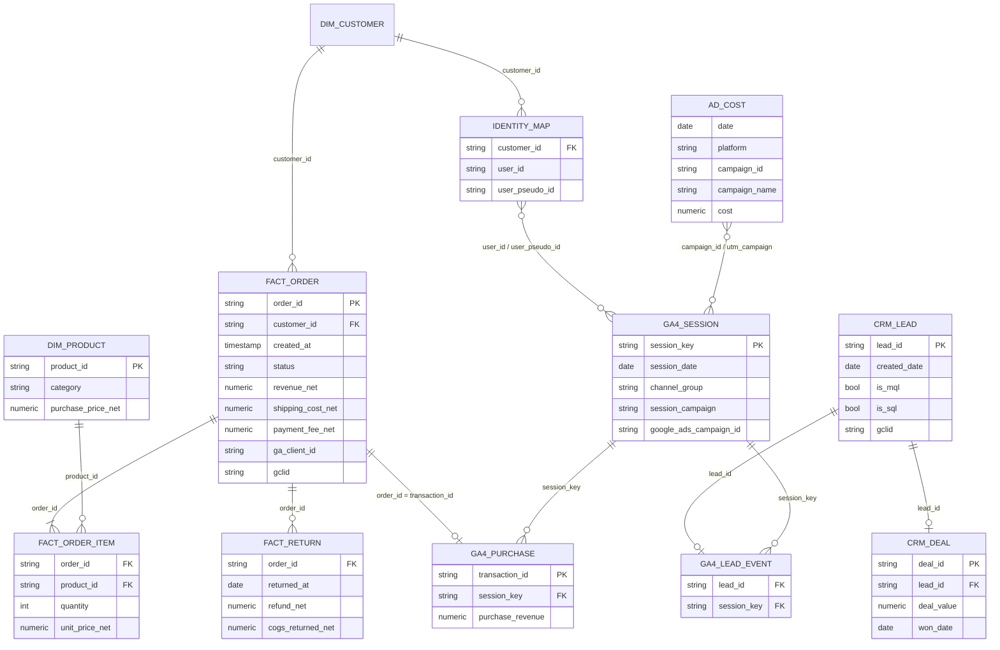
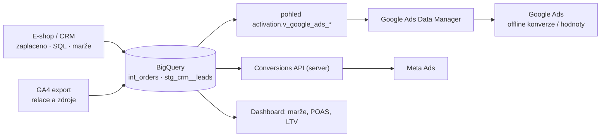

# F4: Propojení dat z e-shopu a CRM s GA4: marže, vratky a hodnota zákazníka v jednom modelu – brief
> Cluster: F – BigQuery & zpracování dat · URL: /blog/propojeni-dat-eshop-crm-ga4 · Formát: průvodce (datový model + postup) · Priorita: měsíc 2 · Cílová LP: /sluzby/bigquery (sekundárně /reseni/e-shopy, /reseni/b2b-a-lead-generation) · Rozsah: 2 800–3 300 slov + kód

---

## 1. Meta

| Prvek | Návrh |
|---|---|
| H1 | Propojení e-shopu a CRM s GA4: marže, vratky a LTV |
| SEO title | Data e-shopu a CRM v GA4: marže, vratky, LTV \| datalayer.cz (59 zn.) |
| Meta description | Jak spojit objednávky z e-shopu, ERP a CRM s daty GA4 přes transaction_id a user_id, spočítat marži, POAS a LTV a poslat offline konverze zpět do reklam. (153 zn.) |
| URL | /blog/propojeni-dat-eshop-crm-ga4 |
| Autor | Vít Novotný · revize 6 měsíců (offline importy Google Ads a Mety se mění) |

**Klíčová slova** (Ahrefs CZ):

| Typ | Klíčové slovo | Objem |
|---|---|---|
| Hlavní | propojení dat (e-shop, CRM, GA4) | 0 (strategické) |
| Vedlejší | crm integrace | 50 |
| Vedlejší | crm analytics · crm analytics tool | 10 · 10 |
| Vedlejší | poas · marže v google ads · ltv · customer lifetime value | 0 (zmínky v SERP konkurence – datimo, nextanalytica) |
| Long-tail | pipedrive to bigquery (10) · power bi crm integration (10) · offline konverze google ads crm (SERP) · import marží | 0–10 |
| Otázky (z praxe) | Proč GA4 ukazuje jiné tržby než e-shop? · Jak dostat marži do Google Ads? · Jak měřit vratky v GA4? · Jak spočítat LTV zákazníka? · Jak poslat kvalifikované leady z CRM do Google Ads? | – |

**Záměr:** řešení problému („chci řídit marketing podle zisku, ne podle obratu“).
**Čtenář:** majitel / e-commerce manažer / CFO středního e-shopu; marketingový ředitel B2B firmy s CRM; analytik, který to bude stavět. Segmenty: e-shop (marže, vratky, LTV) · B2B (lead → obchod) · velká firma (identity, governance, právo).

---

## 2. Analýza SERP a konkurence

- **„offline konverze google ads crm“** (Google.cz): support.google.com, tmrw.marketing, reklamix.sk – návody na import, bez datového modelu.
- **Konkurence:** datimo.ai (blog „Import marží“ ~1 300 slov, modul maržového řízení), nextanalytica.cz (Profit Import / POAS LP ~380 slov, finanční a retenční reporty CM1–CM3, LTV), revolt.bi (FAQ „GA4 nestačí, vratky“, RFM, CLV reporty – enterprise), DA (PPC analytika „od konverzí k marži“).
- **Co chybí:** nikdo česky nepopisuje **propojovací klíče** (co přesně musí být v dataLayer a v objednávce, aby šlo data spojit), **datový model** (ER diagram), **jak zacházet s vratkami** (GA4 `refund` vs. data z ERP), **podíl spárovaných objednávek** jako metriku kvality, ani aktuální **změny offline importů 2025–2026** (Google Ads Data Manager, konec Offline Conversions API u Mety).
- **Čím přeskočíme:** tabulka klíčů, ER diagram v Mermaidu, funkční SQL (párování, marže/POAS, LTV kohorty, B2B lead → obchod, export offline konverzí), rozhodovací tabulka „kam poslat jaká data“, právní poznámky. Produktoví konkurenti prodávají krabici – my ukazujeme, jak to funguje, a vlastnictví dat zůstává klientovi.

---

## 3. Otázky, na které musí článek odpovědět

1. Proč GA4 nestačí k řízení podle zisku a proč se jeho tržby liší od e-shopu?
2. Jakými klíči spojit GA4 s objednávkami a CRM (transaction_id, user_id, client_id, gclid, hash e-mailu)?
3. Co smím poslat do GA4 a co jen do reklamních systémů?
4. Jak má vypadat datový model (tabulky a vazby)?
5. Jak spočítat marži (CM1, CM2, CM3), PNO, ROAS a POAS podle kanálů a kampaní?
6. Jak zacházet s vratkami a storny (GA4 refund vs. ERP)?
7. Jak spočítat LTV a LTV:CAC a proč na to nestačí `user_pseudo_id`?
8. Jak propojit B2B leady z webu s obchodními případy v CRM?
9. Jak poslat offline konverze a marže zpět do Google Ads a Mety v roce 2026?
10. Jak měřit, kolik objednávek se podařilo spárovat (match rate)?
11. Jaká jsou rizika z pohledu GDPR a souhlasu?
12. Jak takový projekt probíhá a co od vás potřebujeme?

---

## 4. Rychlá odpověď (hotový text, 59 slov)

> Data z e-shopu a CRM propojíte s GA4 v BigQuery přes společné klíče: číslo objednávky (`transaction_id`), interní ID zákazníka (`user_id`) a u leadů ID leadu a click ID z reklam. Z e-shopu a ERP doplníte marže a vratky, z reklam náklady. Výsledkem jsou tržby, marže, POAS a LTV podle kanálů – a podklad pro offline konverze.

---

## 5. Osnova s obsahem odpovědí

### H2 1: Proč GA4 k řízení podle zisku nestačí
**Klíčové sdělení:** GA4 vidí chování a zdroj návštěvy, ale ne marži, vratky, storna, platby ani to, jestli se lead stal zakázkou. Zdrojem pravdy pro peníze je e-shop/ERP/CRM.

- GA4 zaznamená `purchase` v okamžiku objednávky s hodnotou, kterou mu pošle web – bez nákupních cen, dopravy, poplatků, vratek a storen.
- GA4 nevidí všechny objednávky: bez souhlasu (basic Consent Mode), blokátory, chyby měření, objednávky po telefonu → **tržby GA4 < tržby e-shopu** je normální (→ D2).
- U B2B je `generate_lead` jen začátek; o hodnotě rozhoduje kvalifikace a obchod v CRM.
- **Princip „dvou pravd“:** peníze (tržby, marže, počty zákazníků) z e-shopu/ERP/CRM; chování a zdroje z GA4; propojení přes klíče.

### H2 2: Propojovací klíče – co musí být v datech už při měření
**Klíčové sdělení:** Data se dají spojit jen tehdy, když stejný identifikátor existuje na obou stranách. To se rozhoduje při implementaci datové vrstvy, ne v BigQuery.

**Tabulka klíčů (kompletní):**

| Klíč | Kde vzniká | Kam ho poslat / uložit | K čemu | Pozor |
|---|---|---|---|---|
| `transaction_id` = číslo objednávky | e-shop | dataLayer `purchase` → GA4 (`ecommerce.transaction_id`); objednávka v DB | spárovat objednávku s relací a zdrojem v GA4 | musí být **totožné** s číslem v e-shopu/ERP; nikdy prázdné; jedinečné (→ C2) |
| `user_id` = interní ID zákazníka | e-shop/CRM po přihlášení či objednávce | GA4 `user_id`; objednávka | propojit chování napříč zařízeními, LTV | nesmí z něj jít identifikovat osobu třetí stranou (Google); **neposílat e-mail ani jeho hash** – použít interní ID |
| `client_id` / `user_pseudo_id` (cookie `_ga`) | GA4 v prohlížeči (jen se souhlasem) | uložit k objednávce/leadu (skryté pole, backend) | spárovat i objednávky, kde selhal `purchase` tag; Measurement Protocol (refund) | existuje jen se souhlasem s analytickými cookies |
| `lead_id` | formulář / CRM | dataLayer `generate_lead` (vlastní parametr) → GA4; CRM | B2B: lead → MQL → SQL → obchod podle kanálu | generovat na serveru, ne náhodně v prohlížeči (→ E1) |
| `gclid`, `gbraid`, `wbraid` | URL po prokliku z Google Ads | uložit k leadu/objednávce (cookie + skryté pole → CRM) | offline konverze do Google Ads | `gbraid`/`wbraid` se do exportu GA4 neexportují → ukládat sami |
| `fbclid` / `_fbc`, `_fbp` | Meta | uložit k leadu/objednávce | Conversions API (offline události) | jen se souhlasem s marketingovými cookies |
| Hash e-mailu/telefonu (SHA-256, normalizovaný) | backend | **jen** do reklamních systémů (rozšířené konverze, Data Manager, CAPI) | párování v reklamních systémech | nikdy do GA4 jako parametr; právní titul a souhlas `ad_user_data` (→ A1, A3, E2) |

**Ukázka dataLayer (doplnit do C2/E1, zde zkráceně):**
```js
// Děkovací stránka – číslo objednávky shodné s e-shopem, ID zákazníka jen interní
window.dataLayer = window.dataLayer || [];
window.dataLayer.push({ ecommerce: null });
window.dataLayer.push({
  event: 'purchase',
  user_id: 'C-104233',                 // interní ID zákazníka, žádný e-mail
  ecommerce: {
    transaction_id: '2026-100245',      // přesně číslo objednávky z e-shopu
    value: 2480.00,                     // definujte: bez DPH, bez dopravy (a držte všude stejně)
    currency: 'CZK',
    items: [{ item_id: 'SKU-123', item_name: 'Batoh Trek 30 l', price: 1240.00, quantity: 2 }]
  }
});
```

### H2 3: Datový model: jak tabulky do sebe zapadají
**Klíčové sdělení:** Objednávka z e-shopu je středem modelu; GA4 k ní přidává relaci a zdroj, ERP marži a vratky, reklamy náklady, CRM kvalitu leadu.

- Popis tabulek (stručně, tabulka v článku): `dim_customer`, `fact_order`, `fact_order_item`, `dim_product` (nákupní cena), `fact_return`, `ga4_session` (= `int_sessions` z F3), `ga4_purchase` (= deduplikované nákupy, F2 dotaz 10b), `ad_cost` (sjednocené náklady), `identity_map` (customer_id ↔ user_id ↔ user_pseudo_id), `crm_lead`, `crm_deal`, `ga4_lead_event`.
- ER diagram viz kap. 6.1.
- **Pravidla:** stejná měna a stejná definice tržby (bez DPH) ve všech tabulkách; časové pásmo `Europe/Prague`; historie změn statusu objednávky (ne jen aktuální stav).

### H2 4: Podíl spárovaných objednávek (match rate) – první kontrola
**Klíčové sdělení:** Než začnete počítat marže podle kanálů, změřte, kolik objednávek z e-shopu najdete v GA4. To je vaše „pokrytí“.

```sql
-- Kolik objednávek z e-shopu najdeme v GA4 (podle transaction_id)
WITH eshop AS (
  SELECT
    order_id,
    DATE(created_at, 'Europe/Prague') AS den,
    revenue_net
  FROM `vas-projekt.stg.stg_eshop__orders`
  WHERE DATE(created_at, 'Europe/Prague') BETWEEN DATE '2026-09-01' AND DATE '2026-09-30'
    AND status NOT IN ('cancelled', 'test')
),
ga4 AS (
  SELECT DISTINCT transaction_id
  FROM `vas-projekt.int.int_purchases`
  WHERE den BETWEEN DATE '2026-08-31' AND DATE '2026-10-01'   -- rezerva ±1 den
)
SELECT
  e.den,
  COUNT(*) AS objednavky_eshop,
  COUNTIF(g.transaction_id IS NOT NULL) AS sparovane_v_ga4,
  ROUND(SAFE_DIVIDE(COUNTIF(g.transaction_id IS NOT NULL), COUNT(*)), 3) AS match_rate,
  ROUND(SUM(e.revenue_net), 0) AS trzby_eshop,
  ROUND(SUM(IF(g.transaction_id IS NOT NULL, e.revenue_net, 0)), 0) AS trzby_sparovane
FROM eshop AS e
LEFT JOIN ga4 AS g
  ON g.transaction_id = e.order_id
GROUP BY e.den
ORDER BY e.den;
```
**Interpretace:** nespárované objednávky = bez souhlasu (basic Consent Mode), blokátory, nefunkční tag, jiný formát čísla objednávky, objednávky z jiných kanálů (telefon, marketplace). Prudký propad match rate v jeden den = rozbité měření (→ D3, monitoring F3). [DOPLNIT: typické rozpětí match rate z auditů klienta – jen pokud má data]

### H2 5: Marže, PNO, ROAS a POAS podle kanálů
**Klíčové sdělení:** Řízení podle obratu odměňuje kampaně, které prodávají levné nebo nízkomaržové zboží. POAS ukáže, kolik marže přinese 1 Kč v reklamě.

**Definice (tabulka v článku):**

| Metrika | Vzorec | Pozn. |
|---|---|---|
| CM1 (hrubá marže) | čistá tržba bez DPH − nákupní cena prodaného zboží | po odečtu vratek |
| CM2 | CM1 − variabilní náklady objednávky (doprava, balné, platební poplatky) | |
| CM3 | CM2 − marketingové náklady | |
| PNO | marketingové náklady / tržby bez DPH × 100 % | česká metrika, nižší = lepší |
| ROAS | tržby / náklady | inverze PNO |
| POAS | marže (CM1 nebo CM2) / náklady | > 1 = kampaň vydělává na marži (při zvolené úrovni marže) |
| Bod zvratu PNO | = marže v % tržeb | např. marže 30 % → PNO nad 30 % je ztrátové (ilustrativní) |

> Pojmy CM1–CM3 a POAS jsou zavedené v praxi e-commerce (ne oficiální standard) – v článku vždy uvést, jakou úroveň marže používáte.

**Kód – objednávka s marží a vratkami (`int_orders`):**
```sql
WITH polozky AS (
  SELECT
    oi.order_id,
    SUM(oi.quantity * oi.unit_price_net) AS trzby_polozek,
    SUM(oi.quantity * p.purchase_price_net) AS naklady_zbozi
  FROM `vas-projekt.stg.stg_eshop__order_items` AS oi
  LEFT JOIN `vas-projekt.stg.stg_erp__products` AS p USING (product_id)
  GROUP BY oi.order_id
),
vratky AS (
  SELECT
    order_id,
    SUM(refund_net) AS vraceno,
    SUM(cogs_returned_net) AS naklady_vraceneho_zbozi
  FROM `vas-projekt.stg.stg_eshop__returns`
  GROUP BY order_id
)
SELECT
  o.order_id,
  o.customer_id,
  DATE(o.created_at, 'Europe/Prague') AS den,
  o.status,
  pl.trzby_polozek,
  COALESCE(v.vraceno, 0) AS vraceno,
  pl.trzby_polozek - COALESCE(v.vraceno, 0) AS cista_trzba,
  (pl.trzby_polozek - COALESCE(v.vraceno, 0))
    - (pl.naklady_zbozi - COALESCE(v.naklady_vraceneho_zbozi, 0)) AS cm1,
  (pl.trzby_polozek - COALESCE(v.vraceno, 0))
    - (pl.naklady_zbozi - COALESCE(v.naklady_vraceneho_zbozi, 0))
    - COALESCE(o.shipping_cost_net, 0)
    - COALESCE(o.payment_fee_net, 0) AS cm2
FROM `vas-projekt.stg.stg_eshop__orders` AS o
JOIN polozky AS pl USING (order_id)
LEFT JOIN vratky AS v USING (order_id)
WHERE o.status NOT IN ('cancelled', 'test')
```

**Kód – PNO, ROAS a POAS podle kampaní (měsíc):**
```sql
WITH prirazeni AS (
  -- objednávka -> kampaň relace s nákupem (GA4, last non-direct click)
  SELECT p.transaction_id, s.channel_group, s.session_campaign
  FROM `vas-projekt.int.int_purchases` AS p
  JOIN `vas-projekt.int.int_sessions` AS s USING (session_key)
),
objednavky AS (
  SELECT
    COALESCE(a.session_campaign, '(nespárováno / bez kampaně)') AS kampan,
    ANY_VALUE(COALESCE(a.channel_group, 'Nespárováno s GA4')) AS kanal,
    COUNT(*) AS objednavky,
    SUM(o.cista_trzba) AS trzby,
    SUM(o.cm2) AS marze_cm2
  FROM `vas-projekt.int.int_orders` AS o
  LEFT JOIN prirazeni AS a ON a.transaction_id = o.order_id
  WHERE o.den BETWEEN DATE '2026-09-01' AND DATE '2026-09-30'
  GROUP BY kampan
),
naklady AS (
  SELECT campaign_name AS kampan, SUM(cost) AS naklady
  FROM `vas-projekt.int.int_ad_costs`
  WHERE date BETWEEN DATE '2026-09-01' AND DATE '2026-09-30'
  GROUP BY kampan
)
SELECT
  COALESCE(o.kampan, n.kampan) AS kampan,
  o.kanal,
  o.objednavky,
  ROUND(o.trzby, 0) AS trzby,
  ROUND(o.marze_cm2, 0) AS marze_cm2,
  ROUND(n.naklady, 0) AS naklady,
  ROUND(SAFE_DIVIDE(n.naklady, o.trzby), 3) AS pno,
  ROUND(SAFE_DIVIDE(o.trzby, n.naklady), 2) AS roas,
  ROUND(SAFE_DIVIDE(o.marze_cm2, n.naklady), 2) AS poas
FROM objednavky AS o
FULL OUTER JOIN naklady AS n
  ON o.kampan = n.kampan
ORDER BY naklady DESC NULLS LAST
```
**Pozor (v textu):** `int_purchases` = deduplikované nákupy z F2 (dotaz 10b) doplněné o sloupec `session_key` (`user_pseudo_id` + `ga_session_id`). Párování kampaní přes název funguje jen s disciplinovanými UTM (→ D5); u Google Ads je spolehlivější `campaign_id` (F3). Nespárované objednávky nepřiřazujte kanálům „odhadem“ – ukažte je jako samostatný řádek. Atribuce = GA4 last non-direct (jeden z pohledů, → D6).

**Jak dostat marži do reklamních systémů (stručně, odkaz na B-cluster):**
- Neposílat nákupní ceny ani marži přes dataLayer do prohlížeče (vidí je kdokoli v DevTools).
- Varianty: (a) obohacení hodnoty konverze o marži na **server-side GTM** z interní tabulky/API (→ B1, B2), (b) **import konverzí s hodnotou marže** z BigQuery přes Google Ads Data Manager (→ H2 9), (c) úpravy hodnot konverzí po vratkách (Google Ads conversion adjustments – **ověřit aktuální podporu v Data Manageru vs. Google Ads API**).

### H2 6: Vratky a storna
**Klíčové sdělení:** Vratky patří do modelu z ERP/e-shopu. GA4 `refund` je doplněk pro reporty v GA4, ne zdroj pravdy.

- **GA4 `refund`:** plná vratka (jen `transaction_id`) nebo částečná (s `items`). Z backendu přes **Measurement Protocol** (API secret, `client_id` uložené u objednávky; události lze antedatovat max. 72 h; max. 25 událostí na požadavek). Ukázka payloadu:
```json
{
  "client_id": "1234567890.1759900000",
  "events": [{
    "name": "refund",
    "params": {
      "currency": "CZK",
      "transaction_id": "2026-100245",
      "value": 1240.00,
      "items": [{ "item_id": "SKU-123", "price": 1240.00, "quantity": 1 }]
    }
  }]
}
```
  (POST na `https://www.google-analytics.com/mp/collect?measurement_id=G-XXXX&api_secret=…`; API secret nikdy v prohlížeči.)
- **V BigQuery:** `fact_return` z ERP (datum vratky, položky, částka, náklad vráceného zboží) → `int_orders` (H2 5). Rozhodnout, ke kterému datu vratku počítat (datum objednávky = správná marže kampaně; datum vratky = cash-flow) – v reportu uvést.
- **Storna a nezaplacené objednávky:** status historie; „hrubé“ vs. „čisté“ objednávky jako dva řádky v dashboardu (→ G3).
- **Reklamní systémy:** vysoká míra vratek v kategorii (móda) → zvážit optimalizaci na hodnotu po vratkách (úpravy konverzí, ověřit), nebo aspoň reportovat PNO po vratkách.

### H2 7: LTV a hodnota zákazníka
**Klíčové sdělení:** LTV se počítá ze zákazníků v e-shopu (customer_id), ne z cookies v GA4. GA4 přidá, odkud zákazník přišel poprvé.

- `user_pseudo_id` = prohlížeč; cookie se maže, zákazník nakupuje z více zařízení → LTV podle GA4 je podhodnocená a roztříštěná. Export uživatelských dat GA4 obsahuje `user_ltv` a predikce (pravděpodobnost nákupu, odchodu) – užitečný doplněk, ne náhrada.
- **Kohortní LTV (marže na zákazníka podle měsíce první objednávky):**
```sql
WITH objednavky AS (
  SELECT customer_id, den, cm2
  FROM `vas-projekt.int.int_orders`
  WHERE customer_id IS NOT NULL
),
prvni AS (
  SELECT customer_id, DATE_TRUNC(MIN(den), MONTH) AS kohorta
  FROM objednavky
  GROUP BY customer_id
),
velikost AS (
  SELECT kohorta, COUNT(*) AS zakaznici
  FROM prvni
  GROUP BY kohorta
),
mesicne AS (
  SELECT
    p.kohorta,
    DATE_DIFF(DATE_TRUNC(o.den, MONTH), p.kohorta, MONTH) AS mesic,
    SUM(o.cm2) AS marze
  FROM objednavky AS o
  JOIN prvni AS p USING (customer_id)
  GROUP BY 1, 2
)
SELECT
  m.kohorta,
  v.zakaznici,
  m.mesic AS mesic_od_prvni_objednavky,
  ROUND(SUM(m.marze) OVER (PARTITION BY m.kohorta ORDER BY m.mesic) / v.zakaznici, 0)
    AS kumulativni_marze_na_zakaznika
FROM mesicne AS m
JOIN velikost AS v USING (kohorta)
ORDER BY m.kohorta, m.mesic
```
- **LTV podle akvizičního kanálu:** první objednávka zákazníka → `transaction_id` → relace v GA4 → kanál. Pak LTV (marže za 6/12 měsíců) vs. **CAC** (náklady kanálu / noví zákazníci z kanálu) → LTV:CAC.
- Upozornit: noví vs. vracející se **zákazníci** = podle historie objednávek v e-shopu, ne podle `ga_session_number` (→ F2 dotaz 7, G3).

### H2 8: B2B: od leadu k obchodu
**Klíčové sdělení:** U B2B je cílem spojit každý lead z webu s jeho osudem v CRM. Pak teprve uvidíte cenu za kvalifikovaný lead a pipeline podle kanálů.

- Formulář → `generate_lead` s `lead_id` (generováno serverem po uložení do CRM) + uložit do CRM: `lead_id`, GA4 `client_id`, `gclid`/`gbraid`/`wbraid`, UTM, vstupní stránku (→ E1).
- CRM poskytne fáze a data přechodů (MQL, SQL, obchod, hodnota). V BigQuery: `stg_crm__leads` (s příznaky `is_mql`, `is_sql`, `is_won`), `int_leads_ga4` (lead_id → session_key).
```sql
-- Leady, MQL, SQL a obchody podle kanálu (posledních 90 dní)
SELECT
  COALESCE(s.channel_group, 'Nespárováno s GA4') AS kanal,
  COUNT(DISTINCT l.lead_id) AS leady,
  COUNT(DISTINCT IF(l.is_mql, l.lead_id, NULL)) AS mql,
  COUNT(DISTINCT IF(l.is_sql, l.lead_id, NULL)) AS sql_leady,
  COUNT(DISTINCT IF(l.is_won, l.lead_id, NULL)) AS obchody,
  ROUND(SUM(IF(l.is_won, l.deal_value, 0)), 0) AS hodnota_obchodu
FROM `vas-projekt.stg.stg_crm__leads` AS l
LEFT JOIN `vas-projekt.int.int_leads_ga4` AS g USING (lead_id)
LEFT JOIN `vas-projekt.int.int_sessions` AS s USING (session_key)
WHERE l.created_date >= DATE_SUB(CURRENT_DATE('Europe/Prague'), INTERVAL 90 DAY)
GROUP BY kanal
ORDER BY leady DESC
```
- Přidat náklady (F3) → CPL, cena za SQL, cena za obchod; délka cyklu (dny od leadu do obchodu) → G3.

### H2 9: Offline konverze zpět do reklam (stav 10/2026)
**Klíčové sdělení:** Data o skutečné hodnotě (zaplacená objednávka, kvalifikovaný lead, marže) vracejte do reklamních systémů – algoritmy pak optimalizují na to, co vám vydělává.

**Tabulka „kam poslat co“ (kompletní):**

| Cíl | Doporučená cesta (10/2026) | Klíč | Pozn. |
|---|---|---|---|
| Google Ads | **Data Manager** – Google ho uvádí jako doporučenou metodu; jako zdroj podporuje mj. BigQuery, Google Sheets, Cloud Storage, SFTP, HubSpot, Salesforce, Zoho CRM, Snowflake, MySQL/PostgreSQL | GCLID / GBRAID / WBRAID nebo údaje poskytnuté uživatelem (hash) + čas konverze | rozšířené konverze (od 4/2026 přijímá uživatelská data z tagu, Data Manageru i API současně, od 6/2026 je pro web i leady jeden přepínač); API `UploadClickConversions` se pro část účtů od 15. 6. 2026 vypíná → Data Manager API (zdroj: Search Engine Land, **ověřit rozsah v dokumentaci Google**) |
| Google Ads – výměna konverzní akce | po importu přepnout nabídky na novou akci „po delší z: 3 konverzní cykly nebo 4 týdny“ (Google) | – | |
| Meta | **Conversions API** (podporuje offline události; starší Offline Conversions API od Graph API v17.0 offline události nepřijímá a dokumentace Mety ji vede jako legacy) | hash e-mailu/telefonu, `external_id`, `fbc`; `event_id` pro deduplikaci | detail v B5 |
| Sklik | Seznam Event Measurement – **S2S události** ze serveru (detail B6) | ID události/objednávky dle specifikace Seznamu | Seznam: S2S neposílat současně s frontendovou verzí téže události – deduplikace je „v přípravě“; možnost importu historických offline konverzí [OVĚŘIT v B6/nápovědě Skliku] |
| GA4 | Measurement Protocol (do 72 h zpětně) nebo Data Import „Události“ (CSV/SFTP, zpracování při sběru, max. 120 nahrání/den) | `client_id`, `transaction_id` | pro reporty v GA4; pro řízení kampaní lepší přímý import do reklamních systémů |

**Kód – pohled pro Data Manager (kvalifikované leady za posledních 7 dní):**
```sql
CREATE OR REPLACE VIEW `vas-projekt.activation.v_google_ads_sql_leads` AS
SELECT
  l.lead_id AS order_id,
  l.gclid,
  l.gbraid,
  l.wbraid,
  -- normalizace před hashováním podle dokumentace Google (malá písmena, bez mezer; u gmail.com ověřit tečky)
  TO_HEX(SHA256(LOWER(TRIM(l.email)))) AS hashed_email,
  'Kvalifikovaný lead (SQL)' AS conversion_name,
  FORMAT_TIMESTAMP('%Y-%m-%d %H:%M:%S%Ez', l.sql_at, 'Europe/Prague') AS conversion_time,
  l.expected_value AS conversion_value,
  'CZK' AS currency_code
FROM `vas-projekt.stg.stg_crm__leads` AS l
WHERE l.is_sql
  AND l.sql_at >= TIMESTAMP_SUB(CURRENT_TIMESTAMP(), INTERVAL 7 DAY)
  AND (l.gclid IS NOT NULL OR l.gbraid IS NOT NULL OR l.wbraid IS NOT NULL OR l.email IS NOT NULL)
```
(Mapování sloupců a požadovaný formát času/hashování se nastavuje v Data Manageru – **ověřit podle aktuální dokumentace**; zda Data Manager přijímá i nehashovaná data a hashuje sám – ověřit.)

**Diagram toku viz kap. 6.2.**

### H2 10: Osobní údaje a souhlas
**Klíčové sdělení:** Propojování dat je zpracování osobních údajů. Minimalizujte, hashujte, dokumentujte a respektujte souhlas.

- Do GA4 žádné přímé identifikátory (e-mail, telefon, jméno) – ani v URL, ani v parametrech; `user_id` jen interní a nečitelné (Google: nesmí umožnit třetí straně určit identitu).
- Reklamní systémy: hashované kontakty jen s právním titulem; v EHP signál `ad_user_data` v Consent Mode v2 (→ A1); smluvní podmínky zpracování dat Google Ads / Meta.
- `client_id`, `gclid`, `fbc` ukládat k objednávce/leadu jen tehdy, když existují (tj. se souhlasem) – bez „obcházení“.
- Uchování: stejné lhůty jako v CRM; mazání na žádost i v BigQuery a v aktivačních pohledech.
- Disclaimer: „Nejsme advokátní kancelář; právní titul a informační povinnost posoudí váš právník.“

### H2 11: Jak projekt probíhá (bez cen, podle architektury webu)
1. Audit klíčů (dataLayer, číslo objednávky, user_id, ukládání click ID) – [DOPLNIT délku].
2. Napojení zdrojů do BigQuery (e-shop/ERP/CRM, náklady) – [DOPLNIT].
3. Modely `int_orders`, `int_purchases`, identity, match rate – [DOPLNIT].
4. Dashboard marže/POAS/LTV (→ G3) – [DOPLNIT].
5. Aktivace: offline konverze / hodnoty do Google Ads a Mety – [DOPLNIT].
**Co od vás potřebujeme:** přístup k exportům/API e-shopu a CRM, číselník nákupních cen, definici tržby a marže od financí, kontakt na vývojáře e-shopu, souhlas právníka s tokem dat do reklam.

---

## 6. Vizuály

### 6.1 ER diagram datového modelu (hlavní vizuál, H2 3)

**Finální SVG:** tři barevně odlišené zóny – *E-shop/ERP* (karty s okrajem `#00b0b0`), *GA4* (cyan `#00ffff`), *Reklamy a CRM* (oranžový akcent `#ff7400` jen u klíčů). Klíče (`transaction_id`, `user_id`, `lead_id`, `gclid`) zvýraznit jako „konektory“ – malé monospace štítky na spojnicích. Interaktivní varianta: najetí na klíč zvýrazní všechny vazby, kde se používá (`diagram_interaction`). Mobil: zjednodušená verze (jen 6 hlavních entit) + odkaz na plnou verzi (PNG/SVG ke stažení).

### 6.2 Diagram aktivace (H2 9)

**Finální SVG:** styl hero; šipky aktivace (do reklam) oranžové, šipky reportingu cyan; u šipky do reklam ikonka zámku „hash SHA-256 + souhlas“.

### 6.3 Tabulky
Klíče (H2 2), metriky CM1–CM3/PNO/ROAS/POAS (H2 5), kam poslat co (H2 9) – kompletní obsah výše.

### 6.4 Ilustrativní příklad „obrat vs. marže“ (infografika, H2 5)
Dvě kampaně vedle sebe (fiktivní, jasně označit „ukázkový příklad“):
- Kampaň A: náklady 20 000 Kč, tržby 200 000 Kč (PNO 10 %, ROAS 10), marže CM2 16 000 Kč → **POAS 0,8** (prodělává).
- Kampaň B: náklady 20 000 Kč, tržby 120 000 Kč (PNO 16,7 %, ROAS 6), marže CM2 36 000 Kč → **POAS 1,8**.
Sdělení: „Podle PNO vyhrává A, podle marže B.“ Formát 1080×1350 + responzivní verze.

---

## 7. Fakta a zdroje

| Tvrzení | Zdroj | Ověřeno | Riziko zastarání |
|---|---|---|---|
| User-ID nesmí obsahovat informace, podle kterých by třetí strana určila identitu; max. 256 znaků | https://support.google.com/analytics/answer/9213390 | 8. 10. 2026 | nízké |
| GA4 deduplikuje nákupy se stejným transaction_id (web); prázdné ID nepoužívat | https://support.google.com/analytics/answer/12313109 | 8. 10. 2026 | nízké |
| Measurement Protocol: api_secret, client_id, antedatace max. 72 h, 25 událostí/požadavek, session_id | https://developers.google.com/analytics/devguides/collection/protocol/ga4/sending-events | 8. 10. 2026 | střední |
| GA4 Data Import: typy, CSV/SFTP, 1 GB, 120 nahrání/den, události zpracované při sběru se exportují do BigQuery | https://support.google.com/analytics/answer/10071301 | 8. 10. 2026 | střední |
| wbraid/gbraid se do exportu GA4 neexportují | https://support.google.com/analytics/answer/9358801 | 8. 10. 2026 | střední |
| Data Manager = doporučená metoda offline importu; GCLID není nutný při tagu s údaji od uživatele; výměna akcí po 3 cyklech/4 týdnech; od 4/2026 data z více zdrojů, od 6/2026 jeden přepínač rozšířených konverzí | https://support.google.com/google-ads/answer/15479791 | 8. 10. 2026 | **vysoké** |
| Zdroje Data Manageru (BigQuery, Sheets, GCS, SFTP, HubSpot, Salesforce, Zoho, Snowflake…) | https://support.google.com/google-ads-data-manager/table/13860693 | 8. 10. 2026 | vysoké |
| Vypínání `UploadClickConversions` v Google Ads API od 15. 6. 2026 pro část účtů → Data Manager API | https://searchengineland.com/google-is-moving-offline-conversion-imports-out-of-the-google-ads-api-477669 (sekundární) | 8. 10. 2026 | **vysoké – ověřit v Google Ads API docs** |
| Meta: starší Offline Conversions API od Graph API v17.0 nepřijímá offline události (legacy), náhrada Conversions API s podporou offline událostí | https://developers.facebook.com/docs/graph-api/changelog/version17.0/ ; https://developers.facebook.com/docs/marketing-api/conversions-api/offline-events | 8. 10. 2026 | střední |
| Export uživatelských dat GA4 obsahuje user_ltv a predikce | https://support.google.com/analytics/answer/12769371 | 8. 10. 2026 | střední |
| Sklik S2S události, zákaz souběhu S2S a frontendu, deduplikace v přípravě | https://napoveda.sklik.cz/merici-skripty/seznam-event-measurement/zaciname-se-sem/co-je-dobre-vedet/ | 8. 10. 2026 | vysoké |

---

## 8. Interní odkazy a CTA

**Cílová LP:** /sluzby/bigquery (box) · sekundárně /reseni/e-shopy a /reseni/b2b-a-lead-generation (v textu)

**Kontextový CTA box** (za H2 5 – POAS):
- Nadpis: **Chcete vidět marži podle kampaní, ne jen obrat?**
- Text: Propojíme objednávky z e-shopu a ERP s GA4 a náklady z reklam v BigQuery. Uvidíte PNO, POAS a LTV podle kanálů a připravíme podklady pro optimalizaci kampaní na zisk.
- Tlačítko: `[ Konzultovat propojení dat ]` → /sluzby/bigquery#kontakt

**Související články:** F1 · F2 (dotaz 10 deduplikace) · F3 (modely, náklady) · F5 · C2 GA4 e-commerce dataLayer · E1 Měření formulářů a leadů (/blog/mereni-formularu-a-leadu) · E2 Rozšířené konverze (/blog/rozsirene-konverze) · E3 Offline konverze z CRM · E4 First-party data (/blog/first-party-data) · B5 Meta CAPI (/blog/meta-conversions-api) · B6 Seznam Event Measurement · D2 Proč nesedí čísla · A3 Osobní údaje v analytice · G3 Marketingový dashboard.
**Slovník:** User-ID · Client ID · GCLID / gbraid / wbraid · Offline konverze · Rozšířené konverze · Conversions API · Deduplikace (event_id) · Measurement Protocol.

**Zkrácený kontaktní blok:** `form_id: blog` · témata `BigQuery & dashboardy`, `Konverze v Ads / Meta / Sklik` · H2 „Řešíte totéž u sebe?“ · placeholder „Např. chceme řídit kampaně podle marže a posílat kvalifikované leady z CRM do Google Ads…“

---

## 9. FAQ pro schema

**Proč se tržby v GA4 liší od tržeb v e-shopu?**
GA4 zaznamená jen objednávky, u kterých se úspěšně odeslala událost purchase – chybí objednávky bez souhlasu s cookies, s blokátory nebo při chybě měření. GA4 navíc nezná storna a vratky. Pro finanční čísla proto používejte e-shop nebo ERP a GA4 jen pro rozdělení podle zdrojů návštěvnosti.

**Co je POAS a jak se liší od ROAS a PNO?**
ROAS je poměr tržeb a nákladů na reklamu, PNO je jeho převrácená hodnota v procentech. POAS dělí náklady marží, ne tržbami, takže ukáže, kolik zisku přinesla každá koruna v reklamě. POAS nad 1 znamená, že kampaň na zvolené úrovni marže vydělává.

**Mohu do GA4 posílat e-mail zákazníka jako User-ID?**
Nedoporučujeme to. Google uvádí, že User-ID nesmí obsahovat informace, podle kterých by třetí strana mohla určit identitu uživatele. Použijte interní ID zákazníka z e-shopu nebo CRM. Hashované kontakty patří jen do reklamních systémů v rámci rozšířených konverzí, a to s právním titulem.

**Jak poslat kvalifikované leady z CRM do Google Ads?**
Ke každému leadu ukládejte GCLID, GBRAID nebo WBRAID a čas vzniku. Kvalifikované leady pak importujte do Google Ads – Google doporučuje nástroj Data Manager, který umí číst data třeba z BigQuery, HubSpotu nebo Salesforce. Alternativou jsou rozšířené konverze pro leady s hashovaným e-mailem.

**Jak spočítat LTV zákazníka?**
Nejspolehlivěji z dat e-shopu: ke každému zákazníkovi sečtěte marži ze všech jeho objednávek za zvolené období (např. 12 měsíců) a průměrujte podle kohort první objednávky. GA4 k tomu přidá kanál, ze kterého zákazník poprvé přišel. Cookies v GA4 samy o sobě na LTV nestačí.

---

## 10. Poznámky pro autora

- **Nejrychleji zastarávající část:** H2 9 (Data Manager, Google Ads API, Meta CAPI, Sklik). Před publikací ověřit v primární dokumentaci; revize každé 3 měsíce.
- **SQL:** zkontrolováno parserem (BigQuery dialekt); názvy tabulek e-shopu/ERP/CRM jsou ilustrativní – upozornit čtenáře. Formát pro Data Manager ověřit.
- **Právo:** H2 10 s disclaimerem; nepoužívat formulace „GDPR compliant“.
- **Co dodá klient:** [DOPLNIT: anonymizovaná případovka (např. „po zavedení POAS se změnilo rozdělení rozpočtu…“ – jen reálná čísla)], [DOPLNIT: typické délky kroků projektu], [DOPLNIT: zda nabízí aktivaci (Data Manager/CAPI) jako službu, nebo jen data], [DOPLNIT: rozpětí match rate z auditů, pokud existuje].
- **Ilustrativní příklad** v 6.4 musí být jasně označen jako fiktivní.
- Recenzent: Vít Novotný; u H2 9 ideálně PPC specialista.
