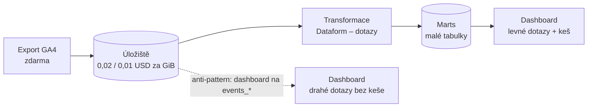

# F5: Kolik stojí BigQuery pro marketing: ceny 2026 a modelové výpočty – brief
> Cluster: F – BigQuery & zpracování dat · URL: /blog/bigquery-cena · Formát: výpočet / průvodce cenou · Priorita: měsíc 3 · Cílová LP: /sluzby/bigquery · Rozsah: 2 400–2 900 slov

> Pozn.: Klient ceny **svých služeb** neuvádí. Článek uvádí **veřejné ceny Google Cloud** (USD, ověřeno 8. 10. 2026) a modelové výpočty s jasnými předpoklady. Na konci „z čeho se skládá cena projektu“ bez čísel.

---

## 1. Meta

| Prvek | Návrh |
|---|---|
| H1 | Kolik stojí BigQuery pro marketing: ceny a modelové výpočty |
| SEO title | Kolik stojí BigQuery: ceny a modelové výpočty \| datalayer.cz (60 zn.) |
| Meta description | Ceny BigQuery 2026 v EU: dotazy, úložiště, streaming, bezplatná úroveň a sandbox. Modelové výpočty pro malý, střední a velký web a jak náklady hlídat. (150 zn.) |
| URL | /blog/bigquery-cena |
| Autor | Vít Novotný · **revize každé 3 měsíce** (ceny) · v článku viditelně „Ceny ověřeny k 8. 10. 2026“ |

**Klíčová slova** (Ahrefs CZ):

| Typ | Klíčové slovo | Objem |
|---|---|---|
| Hlavní | bigquery cena | 0 |
| Vedlejší | bigquery pricing | 20 |
| Vedlejší | bigquery sandbox | 10 |
| Vedlejší | bigquery slots pricing · bigquery free tier · bigquery cost per tb · google analytics 4 data retention bigquery cena (SERP) | 0 |
| Otázky (PAA) | Can I use BigQuery for free? · Is Google BigQuery free? · Is BigQuery SQL? · is big query free · is bigquery free to use | 0 |
| Související hledání (Google) | BigQuery pricing calculator · BigQuery cost optimization · BigQuery free tier · BigQuery cost per TB · BigQuery query cost per GB · Slot time consumed BigQuery cost | – |

**Záměr:** informační s rozhodovacím podtextem („vyplatí se nám to? kolik budeme platit Googlu?“).
**Čtenář:** e-commerce manažer / CFO / IT, který schvaluje export GA4 a BigQuery; analytik, který potřebuje odhad pro vedení. Segmenty: malý web (zdarma?), střední e-shop (jednotky USD), velká firma (desítky USD+, editions, kontrola útraty).

---

## 2. Analýza SERP a konkurence

- **„google analytics 4 data retention bigquery cena“:** 1. cloud.google.com/bigquery/pricing, 2. mightandmetrics.io (cena exportu GA4), 3. cypressnorth.com, 4. discuss.google.dev, 5. surowiecki.org (kalkulačka pro GA4), 6. embertribe.com, 7. support.google.com (nastavení exportu, česky), 8. posthog.com, 9. seresa.io. → Vše anglicky, často **US ceny bez rozlišení regionů**, bez kontroly útraty v praxi.
- Česky: datimo.ai má pojem „BigQuery“ (cena podle proskenovaných dat) a uvádí „náklady Google Cloud zvlášť“; nikdo neukazuje výpočet pro české weby v EU regionu.
- **Mezera / jak přeskočit:** (1) ceny pro **EU multiregion vs. Frankfurt/Varšava** (rozdíl 30 % u dotazů), (2) převod událostí GA4 na GB podle údaje Google, (3) tři modelové scénáře + „anti-pattern“ scénáře, které ukážou, kde vznikají účty v desítkách a stovkách USD, (4) praktická kontrola nákladů: vlastní kvóty (výchozí strop je 200 TiB/den!), dry run, `INFORMATION_SCHEMA`, (5) volitelně jednoduchá kalkulačka na webu (`/nastroje`).

---

## 3. Otázky, na které musí článek odpovědět

1. Je BigQuery zdarma? Co přesně je v bezplatné úrovni?
2. Co je BigQuery sandbox a proč se nehodí pro trvalý export GA4?
3. Z čeho se skládá cena (dotazy, úložiště, streaming, přenosy)?
4. Kolik stojí 1 TiB dotazů a 1 GiB úložiště v EU?
5. Jak velký bude export GA4 mého webu?
6. Kolik zaplatí malý web, střední e-shop a velký e-shop?
7. Kdy se vyplatí editions (sloty) místo platby za dotazy?
8. Co nejčastěji náklady zvedne?
9. Jak nastavit strop a upozornění, aby nepřišel nečekaný účet?
10. Kolik stojí ostatní části stacku (Data Studio, Dataform, konektory)?
11. Je BigQuery SQL? (krátce)

---

## 4. Rychlá odpověď (hotový text, 58 slov)

> BigQuery účtuje hlavně dotazy (v EU multiregionu 6,25 USD za 1 TiB zpracovaných dat) a úložiště (0,02 USD za GiB měsíčně, starší data 0,01 USD). Každý měsíc je zdarma 1 TiB dotazů a 10 GiB úložiště. Export GA4 malého webu se do bezplatné úrovně obvykle vejde, střední e-shop platí jednotky dolarů měsíčně.

---

## 5. Osnova s obsahem odpovědí

### H2 1: Z čeho se skládá cena BigQuery
**Klíčové sdělení:** Platíte za dvě věci – výpočet (dotazy) a úložiště. Ostatní položky (streaming, konektory, BI Engine) jsou volitelné.

**Tabulka „Ceník v kostce“ (USD, ověřeno 8. 10. 2026 na cloud.google.com/bigquery/pricing; ceny bez DPH):**

| Položka | EU (multiregion) | Frankfurt (europe-west3) / Varšava (europe-central2) | US (multiregion) | Poznámka |
|---|---|---|---|---|
| Dotazy on-demand | **6,25 USD / TiB** | 8,125 USD / TiB | 6,25 USD / TiB | první 1 TiB měsíčně zdarma; min. 10 MB na dotaz a na každou použitou tabulku; chybové a kešované dotazy se neúčtují |
| Úložiště – aktivní logické | **0,02 USD / GiB / měs.** | 0,023 | 0,02 | prvních 10 GiB měsíčně zdarma |
| Úložiště – dlouhodobé logické (tabulka/oddíl 90 dní beze změny) | **0,01 USD / GiB / měs.** | 0,016 | 0,01 | automaticky, bez vlivu na výkon |
| Úložiště – aktivní fyzické (komprimované) | 0,044 | 0,052 | 0,04 | volitelný model účtování datasetu; započítává se i time travel |
| Úložiště – dlouhodobé fyzické | 0,022 | 0,026 | 0,02 | |
| Streaming do BigQuery (Storage Write API, REST) | [ověřit pro EU multiregion] | 0,013 USD / 200 MiB | 0,01 USD / 200 MiB (us-central1) | řádek min. 1 KB |
| Storage Write API (gRPC) | [ověřit] | 0,0325 USD / GiB | 0,025 USD / GiB (us-central1) | prvních 2 TiB měsíčně zdarma |
| **Streamovaný export GA4** | 0,05 USD / GB | 0,05 USD / GB | 0,05 USD / GB | podle nápovědy GA4; ≈ 600 000 událostí na 1 GB |
| Načítání dávkově, kopírování, export | zdarma (sdílené sloty) | zdarma | zdarma | |
| BI Engine (paměť) | 0,0499 USD / GiB-hod. | 0,0541 | 0,0416 (us-central1) | jen pokud zrychlujete dashboardy |
| Editions – Standard / Enterprise / Enterprise Plus (slot-hodina, pay-as-you-go) | [ověřit v kalkulačce] | Enterprise 0,078 | 0,04 / 0,06 / 0,10 | účtování po sekundách, min. 1 minuta; závazky 1 a 3 roky levnější |
| Data Transfer Service – Google Ads, GA4, Merchant Center, CM360, SA360, YouTube, DV360 | orchestrace zdarma | zdarma | zdarma | platí se úložiště a dotazy |
| Data Transfer Service – placené konektory (Facebook Ads, Salesforce, MySQL, PostgreSQL, Oracle…) | dle slot-hodin | dle slot-hodin | 0,06 USD/slot-hod. (us-central1) | Google odhaduje až 20 slot-hodin na hodinu běhu (≈ 1,20 USD/h); preview konektory se zatím neúčtují |

> Pro autora: ceny jsou v USD; přepočet na Kč uvést kurzem ČNB k datu publikace [DOPLNIT kurz] a označit jako orientační.

### H2 2: Co je zdarma (a co ne): bezplatná úroveň vs. sandbox
**Klíčové sdělení:** Bezplatná úroveň platí pro každý účet i s kartou. Sandbox je „zkouška bez karty“ – pro export GA4 jen na pár týdnů.

**Tabulka:**

| | Bezplatná úroveň (free tier) | Sandbox |
|---|---|---|
| Platební karta | ano (billing účet) | ne |
| Dotazy | 1 TiB měsíčně | 1 TiB měsíčně |
| Úložiště | 10 GiB měsíčně (pro každý typ úložiště) | 10 GiB **doživotně** (smazání limit nevrací) |
| Expirace tabulek | žádná | tabulky, pohledy a oddíly **vyprší po 60 dnech** |
| Streaming, DML (UPDATE/DELETE), Data Transfer Service | ano | **ne** |
| Export GA4 | ano, vše | jen denní; data starší 60 dnů zmizí |

- Odpověď na PAA „Can I use BigQuery for free?“: Ano – sandbox bez karty na vyzkoušení, a bezplatná úroveň (1 TiB dotazů a 10 GiB úložiště měsíčně), do které se malé projekty vejdou trvale.
- **Opravit vlastní tvrzení stagingu** („Export je zdarma v rámci sandbox limitů“) – viz F1.

### H2 3: Jak se počítá cena dotazu
**Klíčové sdělení:** Platíte za objem dat ve sloupcích, které dotaz přečte – ne za počet vrácených řádků.

- Sloupcové úložiště: `SELECT *` přečte všechny sloupce; `LIMIT 10` cenu **nesníží**.
- Partitioning a `_TABLE_SUFFIX`: čtou se jen potřebné dny (→ F2, F3).
- Clustering: méně bloků; odhad před spuštěním je u clusterovaných tabulek jen horní mez.
- Keš: opakovaný identický dotaz do 24 h zdarma – **kromě dotazů přes zástupné tabulky** (`events_*`), ty se nekešují nikdy.
- Minimum 10 MB na dotaz a na tabulku → tisíce drobných dotazů z dashboardu nejsou „zadarmo“.
- Odhad: editor BigQuery ukáže „This query will process X GB“ (dry run); v CLI `bq query --dry_run`.

### H2 4: Jak velký bude export GA4 vašeho webu
**Klíčové sdělení:** Orientačně 1 GB na 600 000 událostí (údaj Google pro streamovaný export). Skutečnost záleží na počtu parametrů a položkách v e-commerce událostech.

**Tabulka převodu (předpoklad 600 000 událostí/GB):**

| Událostí denně | Událostí měsíčně | Export měsíčně | Za 12 měsíců | Za 36 měsíců |
|---|---|---|---|---|
| 5 000 | 150 000 | 0,25 GB | 3 GB | 9 GB |
| 30 000 | 900 000 | 1,5 GB | 18 GB | 54 GB |
| 100 000 | 3 mil. | 5 GB | 60 GB | 180 GB |
| 300 000 | 9 mil. | 15 GB | 180 GB | 540 GB |
| 800 000 | 24 mil. | 40 GB | 480 GB | 1,44 TB |

- Jak zjistit svůj objem: GA4 → Reporty → Zapojení → Události (počet za 30 dní), nebo po zapnutí exportu dotazem na `INFORMATION_SCHEMA.TABLE_STORAGE` (kód v H2 8).
- Standardní GA4 má limit denního exportu **1 mil. událostí/den** (→ F1).

### H2 5: Modelové výpočty: malý, střední a velký web
**Klíčové sdělení:** Úložiště je levné; účet určují dotazy – tedy architektura reportingu.

**Společné předpoklady (uvést v rámečku):** EU multiregion; 1 GB = 600 000 událostí; logické účtování úložiště; poslední 3 měsíce aktivní úložiště, starší dlouhodobé (export se po 72 h nemění); odečtena bezplatná úroveň (1 TiB dotazů, 10 GiB úložiště); ceny k 8. 10. 2026; **ilustrativní výpočet, ne nabídka**.

**Scénář A – malý B2B web (≈ 5 000 událostí/den)**
- Export 0,25 GB/měs.; po 3 letech 9 GB → úložiště **0 USD** (pod 10 GiB).
- Dotazy: dashboard nad agregovanými tabulkami + občasná analýza < 0,1 TiB/měs. → **0 USD**.
- **Celkem ≈ 0 USD/měsíc.** Billing účet je přesto potřeba (kvůli expiraci v sandboxu).

**Scénář B – střední e-shop (≈ 100 000 událostí/den)**
- Export 5 GB/měs.; po 12 měsících 60 GB (15 aktivní + 45 dlouhodobé) → **≈ 0,45 USD/měs.**; po 24 měsících 120 GB → **≈ 1,05 USD/měs.** S kopií ve staging vrstvě (F3) zhruba dvojnásobek (≈ 2 USD).
- Volitelný streaming: 5 GB × 0,05 = **0,25 USD/měs.**
- Dotazy při správné architektuře (inkrementální modely, dashboard nad marts, analytik): ≈ 0,3–0,8 TiB/měs. → **0 USD** (v bezplatné úrovni).
- **Celkem ≈ 1–3 USD/měsíc.**
- ⚠ **Anti-pattern:** dashboard v Data Studiu napojený přímo na `events_*` – 10 grafů, každý čte ~1,4 GB (28 dní, vybrané sloupce), 20 zobrazení denně, bez keše → ≈ 8 TiB/měs. → **≈ 45 USD/měs.** jen za jeden report.

**Scénář C – velký e-shop (≈ 800 000 událostí/den)**
- Export 40 GB/měs.; po 24 měsících 960 GB → **≈ 10,5 USD/měs.**; se staging kopií ≈ 20 USD.
- Streaming: 40 GB × 0,05 = **2 USD/měs.** (doporučeno i jako pojistka pro dny nad 1 mil. událostí, např. Black Friday).
- Dotazy optimalizované: inkrementální modely, týdenní přepočet marts, dashboardy, 2–3 analytici ≈ 3–5 TiB/měs. → **12,50–25 USD**.
- **Celkem ≈ 35–50 USD/měsíc.**
- ⚠ **Anti-pattern:** analytici spouštějí `SELECT *` přes 12 měsíců surových dat 2× denně ≈ 28 TiB/měs. → **≈ 170 USD/měs. navíc**.

**Region Frankfurt/Varšava:** dotazy × 1,3 (8,125 USD/TiB), úložiště 0,023/0,016 USD.

**Shrnující tabulka (pro infografiku):**

| Scénář | Události/den | Úložiště po 24 měs. | Dotazy | Celkem/měs. (správně) | Celkem/měs. (anti-pattern) |
|---|---|---|---|---|---|
| A – malý web | 5 000 | 6 GB → 0 USD | < 0,1 TiB → 0 USD | ≈ 0 USD | – |
| B – střední e-shop | 100 000 | 120 GB → ≈ 1 USD | 0,3–0,8 TiB → 0 USD | ≈ 1–3 USD | ≈ 45–50 USD |
| C – velký e-shop | 800 000 | 960 GB → ≈ 10,5 USD | 3–5 TiB → 12,5–25 USD | ≈ 35–50 USD | ≈ 200+ USD |

### H2 6: On-demand, nebo editions (sloty)?
**Klíčové sdělení:** Pro marketingové datové sklady je výchozí volbou on-demand (platba za TiB). Editions dávají smysl při velkém a stálém objemu dotazů nebo potřebě funkcí Enterprise.

- On-demand: až cca 2 000 souběžných slotů na projekt, platíte jen zpracovaná data.
- Editions: platíte kapacitu (slot-hodiny) bez ohledu na objem dat; Standard 0,04 USD, Enterprise 0,06 USD, Enterprise Plus 0,10 USD za slot-hodinu (US; v EU ověřit); účtování po sekundách s minimem 1 minuta; autoscaling; závazky na 1 nebo 3 roky jsou levnější.
- **Ilustrace (označit):** Standard edition se 100 sloty vytíženými 2 h denně = 100 × 2 × 30 × 0,04 = **240 USD/měs.** – to odpovídá ≈ 38 TiB on-demand dotazů. Marketingové sklady z kap. 5 jsou hluboko pod tím.
- Rozhodnutí podložit daty: `INFORMATION_SCHEMA.JOBS` (sloupce `total_bytes_billed`, `total_slot_ms`) za 30 dní.

### H2 7: Co náklady zvedá nejčastěji
1. Dashboard přímo na `events_*` (bez keše, každé zobrazení se platí).
2. `SELECT *` a dotazy bez filtru data.
3. Plný přepočet celé historie při každém běhu (místo inkrementu, → F3).
4. Vypočítaná pole a blendy v Data Studiu nad velkými tabulkami.
5. Placené konektory spouštěné zbytečně často.
6. Region Frankfurt/Varšava bez důvodu (+30 % u dotazů).
7. Zapomenuté pokusné tabulky (řešení: výchozí expirace v sandbox datasetech).

### H2 8: Jak náklady hlídat (checklist s návodem)
**Klíčové sdělení:** Výchozí bezpečnostní strop je vysoký – 200 TiB dotazů denně na projekt, tj. teoreticky přes 1 000 USD denně. Nastavte si vlastní.

1. **Vlastní kvóty** (IAM & Admin → Quotas & System Limits → BigQuery API): *Query usage per day* (projekt; výchozí 200 TiB) a *Query usage per day per user* (výchozí neomezeno). Doporučení: projekt např. 1–2 TiB/den, uživatel 0,5 TiB/den (upravit podle scénáře). Kvóta je proaktivní – dotaz, který by ji překročil, se nespustí; reset o půlnoci pacifického času. Google upozorňuje, že kvóty jsou přibližné.
2. **Maximální účtované bajty** u plánovaných dotazů a skriptů (nastavení dotazu / `--maximum_bytes_billed`) – dotaz nad limitem selže místo účtování.
3. **Rozpočet a upozornění v Cloud Billing** (např. 50/90/100 % z 20 USD). Pozor: upozornění útratu **nezastaví**.
4. **Dry run** před každým ručním dotazem nad surovými daty.
5. **Měsíční kontrola útraty** – dotaz nad `INFORMATION_SCHEMA.JOBS_BY_PROJECT` (kód v F3, H2 14).
6. **Kontrola úložiště** a srovnání logického vs. fyzického účtování:
```sql
-- Objem úložiště po datasetech: logické vs. fyzické (pro rozhodnutí o modelu účtování)
SELECT
  table_schema AS dataset,
  ROUND(SUM(active_logical_bytes) / POW(1024, 3), 1) AS aktivni_logicke_gib,
  ROUND(SUM(long_term_logical_bytes) / POW(1024, 3), 1) AS dlouhodobe_logicke_gib,
  ROUND(SUM(active_physical_bytes) / POW(1024, 3), 1) AS aktivni_fyzicke_gib,
  ROUND(SUM(long_term_physical_bytes) / POW(1024, 3), 1) AS dlouhodobe_fyzicke_gib,
  ROUND(SUM(time_travel_physical_bytes) / POW(1024, 3), 1) AS time_travel_gib
FROM `region-eu`.INFORMATION_SCHEMA.TABLE_STORAGE
GROUP BY dataset
ORDER BY aktivni_logicke_gib DESC;
```
   Fyzické (komprimované) účtování může být u dat GA4 levnější i přes vyšší cenu za GiB – rozhodnout podle výsledku dotazu (time travel se u fyzického modelu účtuje). [Kompresní poměr neuvádět bez měření na datech klienta.]
7. **Data Studio:** zdroje dat s pověřením vlastníka, čerstvost dat 12 h (výchozí u BigQuery), napojení na marts, případně extrakty (→ G1).
8. **Štítky (labels)** na projektech/úlohách pro rozpad nákladů (marketing vs. ostatní).

### H2 9: Kolik stojí zbytek stacku
**Tabulka (ověřeno 8. 10. 2026):**

| Část | Cena | Zdroj |
|---|---|---|
| Export GA4 → BigQuery | zdarma (streaming 0,05 USD/GB) | support.google.com/analytics/answer/9358801 |
| Dataform | zdarma; platí se dotazy, Cloud Logging, případně Scheduler/Workflows | cloud.google.com/dataform/pricing |
| Data Studio (dříve Looker Studio) | zdarma; **Data Studio Pro 9 USD / uživatel / projekt / měsíc** (cena se může lišit podle délky předplatného), 30denní zkušební verze | cloud.google.com/data-studio, docs.cloud.google.com/data-studio/about-pro |
| Power BI | Desktop zdarma; Pro 14 USD/uživatel/měs.; Premium Per User 24 USD (roční závazek) | microsoft.com/power-platform/products/power-bi/pricing |
| DTS Google Ads / GA4 | zdarma | cloud.google.com/bigquery/pricing |
| Konektory třetích stran (Meta, Sklik…) | podle dodavatele | weby dodavatelů |
| Práce analytika / dodavatele | typicky největší položka (návrh, modely, údržba) | – |

**Z čeho se skládá cena projektu (bez čísel, podle rozhodnutí klienta):** počet zdrojů dat, kvalita stávajícího měření (oprava datové vrstvy?), počet modelů a dashboardů, požadavky na historii a backfill, governance (prostředí dev/prod, přístupová práva), údržba a monitoring. Náklady Google Cloudu platí klient napřímo svému účtu (žádná přirážka – [DOPLNIT: potvrdit u klienta]).

### H2 10: Je BigQuery SQL? (krátká PAA sekce)
Ano – BigQuery je bezserverový datový sklad v Google Cloudu, dotazujete se v SQL (dialekt GoogleSQL). Platíte za zpracovaná data a úložiště, ne za běžící server. (→ F2)

---

## 6. Vizuály

### 6.1 Infografika „Kolik zaplatíte“ (hlavní vizuál pod rychlou odpovědí)
Tři karty vedle sebe (mobil pod sebou): **Malý web · Střední e-shop · Velký e-shop**. Každá: počet událostí/den (velké číslo Roboto Mono), ikonky „úložiště“ a „dotazy“ s částkou, dole celková částka/měsíc (cyan) a pod ní červeně/oranžově „Anti-pattern: … USD“. Patička: „Ceny Google Cloud, EU multiregion, ověřeno 8. 10. 2026; ilustrativní výpočet.“ Formát 1080×1350 + responzivní.

### 6.2 Diagram „Kde vzniká účet“

**Finální SVG:** hlavní cesta cyan, anti-pattern přerušovaná oranžová s ikonou varování; u každého uzlu malý cenovkový štítek v Roboto Mono.

### 6.3 Tabulky
Ceník v kostce (H2 1), free tier vs. sandbox (H2 2), převod událostí na GB (H2 4), shrnutí scénářů (H2 5), cena zbytku stacku (H2 9) – kompletní obsah výše.

### 6.4 Interaktivní kalkulačka (volitelně, fáze 2 – `/nastroje`)
Vstupy: události/den (slider), měsíce historie, region (EU / Frankfurt), počet zobrazení dashboardu denně, „dashboard na surová data ano/ne“. Výstup: úložiště, dotazy, celkem (USD), poznámka „orientačně“. Měřit `tool_use` (`tool: bq_cost_calc`). Vzorce z kap. 5; ceny v konfiguraci (snadná aktualizace).

### 6.5 Mockup obrazovky kvót
Stylizovaný výřez Google Cloud Console „Quotas & System Limits“ s řádkem „Query usage per day – 1 TiB (custom)“ a „Query usage per day per user – 0,5 TiB“; zvýraznit tlačítko Edit. Fiktivní projekt.

---

## 7. Fakta a zdroje

| Tvrzení | Zdroj | Ověřeno | Riziko zastarání |
|---|---|---|---|
| On-demand 6,25 USD/TiB (EU, US, us-central1), 8,125 USD/TiB (europe-west3, europe-central2); 1 TiB zdarma; min. 10 MB | https://cloud.google.com/bigquery/pricing | 8. 10. 2026 | **vysoké** |
| Úložiště EU 0,02/0,01 (logické), 0,044/0,022 (fyzické); Frankfurt 0,023/0,016 a 0,052/0,026; US 0,02/0,01 a 0,04/0,02; 10 GiB zdarma; dlouhodobé po 90 dnech | https://cloud.google.com/bigquery/pricing | 8. 10. 2026 | **vysoké** |
| Streaming inserts 0,01 USD/200 MiB (us-central1), 0,013 (Frankfurt); Storage Write API 0,025 USD/GiB, 2 TiB zdarma | https://cloud.google.com/bigquery/pricing | 8. 10. 2026 | vysoké |
| Editions 0,04 / 0,06 / 0,10 USD za slot-hodinu (US), Enterprise Frankfurt 0,078; per-second, min. 1 min | https://cloud.google.com/bigquery/pricing | 8. 10. 2026 | vysoké |
| BI Engine 0,0416 (us-central1), 0,0499 (EU), 0,0541 (Frankfurt) USD/GiB-hod. | https://cloud.google.com/bigquery/pricing | 8. 10. 2026 | střední |
| DTS: Google Ads, GA4 a další zdarma; placené konektory 0,06 USD/slot-hod., ~20 slot-h/h; preview neúčtováno | https://cloud.google.com/bigquery/pricing | 8. 10. 2026 | vysoké |
| Sandbox: 10 GiB doživotně, 1 TiB/měs., expirace 60 dní, bez streamingu/DML/DTS | https://docs.cloud.google.com/bigquery/docs/sandbox | 8. 10. 2026 | nízké |
| Streaming export GA4 0,05 USD/GB, ≈600 000 událostí/GB; limit 1 mil./den | https://support.google.com/analytics/answer/9358801 | 8. 10. 2026 | střední |
| Vlastní kvóty: výchozí 200 TiB/den/projekt, per-user neomezeno, proaktivní, reset o půlnoci PT | https://docs.cloud.google.com/bigquery/docs/custom-quotas | 8. 10. 2026 | střední |
| Zástupné tabulky se nekešují | https://docs.cloud.google.com/bigquery/docs/querying-wildcard-tables | 8. 10. 2026 | nízké |
| Clustering: odhad před spuštěním není přesný | https://docs.cloud.google.com/bigquery/docs/clustered-tables | 8. 10. 2026 | nízké |
| Dataform zdarma | https://cloud.google.com/dataform/pricing | 8. 10. 2026 | nízké |
| Data Studio Pro 9 USD/uživatel/projekt/měsíc, liší se podle délky předplatného; 30 dní zdarma | https://cloud.google.com/data-studio, https://docs.cloud.google.com/data-studio/about-pro | 8. 10. 2026 | vysoké |
| Power BI Pro 14 USD, PPU 24 USD (roční platba) | https://www.microsoft.com/en-us/power-platform/products/power-bi/pricing | 8. 10. 2026 | vysoké |
| Výchozí čerstvost dat BigQuery v Data Studiu 12 h | https://docs.cloud.google.com/data-studio/manage-data-freshness | 8. 10. 2026 | nízké |

---

## 8. Interní odkazy a CTA

**Cílová LP:** /sluzby/bigquery

**Kontextový CTA box** (za H2 5 – scénáře):
- Nadpis: **Spočítáme náklady na vašich datech**
- Text: Podíváme se na objem vašeho GA4, navrhneme region, architekturu a limity útraty tak, aby BigQuery stálo jednotky dolarů, ne stovky. Náklady Google Cloudu platíte napřímo – bez přirážky.
- Tlačítko: `[ Konzultovat BigQuery ]` → /sluzby/bigquery#kontakt
- [DOPLNIT: potvrdit formulaci „bez přirážky“ u klienta]

**Související články:** F1 Export GA4 do BigQuery · F2 SQL pro GA4 · F3 Zpracování dat v BigQuery (inkrement, monitoring) · G1 Data Studio (dříve Looker Studio) · G2 Looker Studio vs. Power BI · H1 Jak vybrat dodavatele měření (/blog/jak-vybrat-dodavatele-mereni).
**Slovník:** BigQuery · Datový sklad · Data Studio (dříve Looker Studio) · Power BI.

**Zkrácený kontaktní blok:** `form_id: blog` · téma `BigQuery & dashboardy` · H2 „Řešíte totéž u sebe?“ · placeholder „Např. zvažujeme export GA4 do BigQuery a potřebujeme odhad nákladů pro vedení…“

---

## 9. FAQ pro schema

**Je BigQuery zdarma?**
Částečně. Každý měsíc je zdarma 1 TiB zpracovaných dotazů a 10 GiB úložiště. Nad tento rámec platíte v EU multiregionu 6,25 USD za TiB dotazů a 0,02 USD za GiB aktivního úložiště, data nezměněná 90 dní stojí 0,01 USD. Ceny ověřujte na cloud.google.com/bigquery/pricing.

**Můžu BigQuery používat bez platební karty?**
Ano, v režimu BigQuery sandbox. Má limit 10 GiB úložiště, 1 TiB dotazů měsíčně a tabulky v něm po 60 dnech vyprší. Nepodporuje streaming, příkazy UPDATE a DELETE ani Data Transfer Service. Pro trvalý export GA4 je proto potřeba připojit platební účet.

**Kolik stojí export GA4 do BigQuery u středního e-shopu?**
Při zhruba 100 000 událostech denně vznikne asi 5 GB dat měsíčně. Úložiště po dvou letech vyjde zhruba na 1 USD měsíčně a dotazy se při správné architektuře vejdou do bezplatné úrovně. Desítky dolarů měsíčně obvykle znamenají, že dashboard čte surová data.

**Vyplatí se BigQuery editions místo platby za dotazy?**
U marketingových datových skladů obvykle ne. Editions účtují kapacitu v slot-hodinách, například 0,04 USD za slot-hodinu ve Standard edition (US). Vyplatí se při velkém a stálém objemu dotazů nebo potřebě funkcí Enterprise. Rozhodnutí podložte daty o využití z INFORMATION_SCHEMA.JOBS.

**Jak zabránit nečekanému účtu za BigQuery?**
Nastavte vlastní denní kvóty dotazů pro projekt i uživatele (výchozí strop je 200 TiB denně), u plánovaných dotazů maximální účtované bajty, rozpočtová upozornění v Cloud Billing a dashboardy napojte na agregované tabulky. Upozornění útratu nezastaví, kvóty ano.

---

## 10. Poznámky pro autora

- **Ceny jsou nejrizikovější část celého clusteru** – v textu uvádět datum ověření, revize čtvrtletně; zvážit tabulku cen jako komponentu s jedním zdrojem dat (snadná aktualizace i pro F1).
- Ceny pro **EU multiregion** u streamingu (Storage Write API) a editions se nepodařilo z ceníku jednoznačně vyčíst – **ověřit v cenové kalkulačce Google Cloud** před publikací (v tabulce označeno).
- Zajímavost k ověření: us-central1 má logické úložiště 0,023/0,016 USD, zatímco US multiregion 0,02/0,01 – neplést regiony.
- Modelové výpočty jsou ilustrativní; nepoužívat je jako příslib. Ideálně doplnit **reálný anonymizovaný příklad** z projektu klienta [DOPLNIT: např. „e-shop s X událostmi/den platí Y USD měsíčně“].
- Kurz USD/CZK [DOPLNIT k datu publikace].
- Recenzent: Vít Novotný.
