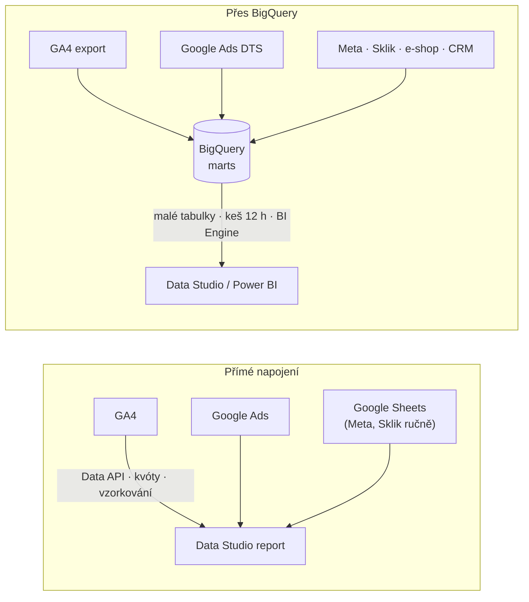
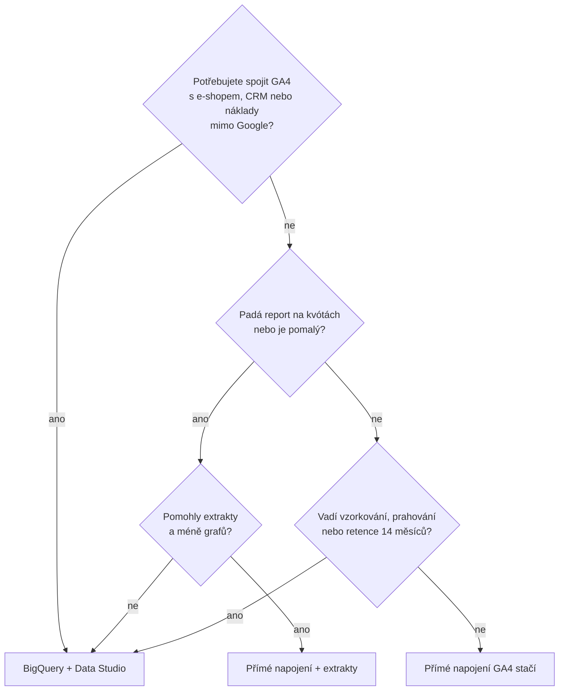

# G1: Looker Studio (nově Data Studio) pro marketing: kdy stačí přímé napojení a kdy potřebujete BigQuery – brief
> Cluster: G – Dashboardy & reporting (pilíř) · URL: /blog/looker-studio-pruvodce · Formát: pilíř / průvodce · Priorita: měsíc 1 · Cílová LP: /sluzby/dashboardy-a-reporting · Rozsah: 3 300–3 800 slov

> **Zásadní aktualita pro celý cluster G:** Google v dubnu 2026 přejmenoval Looker Studio **zpět na Data Studio** (Google Cloud Blog 10. 4. 2026, release notes 16. 4. 2026; aplikace na datastudio.google.com, nápověda přesunuta na docs.cloud.google.com/data-studio). Lidé ale dál hledají „looker studio“ (1 400/měs.) a „looker studio vs data studio“ (2 100/měs.). Článek proto **cílí na obě jména** a jako jediný v CZ jasně vysvětlí, co se stalo. Doporučení: upravit i LP /sluzby/dashboardy-a-reporting („Data Studio (dříve Looker Studio)“).

---

## 1. Meta

| Prvek | Návrh |
|---|---|
| H1 | Looker Studio, nově Data Studio: průvodce pro marketing |
| SEO title | Looker Studio (nově Data Studio): průvodce \| datalayer.cz (57 zn.) |
| Meta description | Looker Studio se od dubna 2026 opět jmenuje Data Studio. Co se změnilo, kolik stojí Pro, limity napojení GA4 a kdy reporty stavět nad BigQuery. (143 zn.) |
| URL | /blog/looker-studio-pruvodce (ponechat – hledanost „looker studio“) |
| Autor | Vít Novotný · revize 6 měsíců |

**Klíčová slova** (Ahrefs CZ, `kw_mapovani_na_stranky.tsv`, topic `dashboardy-reporting`):

| Typ | Klíčové slovo | Objem/měs. |
|---|---|---|
| Hlavní | looker studio | 1 400 |
| Hlavní (informační) | looker studio vs data studio | 2 100 |
| Vedlejší | google looker studio vs data studio | 900 |
| Vedlejší | google looker data studio · google looker studio | 500 · 500 |
| Vedlejší | looker data studio · looker studio google · google data studio · data studio | 250 · 200 · 200 · 150 |
| Vedlejší (CZ zdroje) | sklik data studio · collabim data studio | 100 · 100 |
| Vedlejší | google data studio návod | 90 |
| Long-tail | google analytics dashboard (50) · data studio seo report (40) · looker studio dashboard (20) · data studio šablony (20) · ga4 looker studio template · looker vs looker studio · looker studio pro · looker studio pricing · looker studio free · napojení na google data studio (10) | 10–50 |
| Otázky (PAA) | Is Looker Studio the same as Data Studio? · Is Looker Studio now called Data Studio? · What are the limitations of Data Studio? · Co je looker studio? · Is Google Looker Studio free? · What is Looker Studio used for? · Is Google Looker similar to Tableau? · How much does Looker Studio cost? · Is Data Studio free to use? · Is Google Data Studio the same as Looker? | – |
| Otázky (Ahrefs) | how to blend data in looker studio · how to refresh data in looker studio · why is looker studio so slow · how to make looker studio faster · how to connect meta ads to looker studio · how to use looker studio with google sheets | 0 |

**Záměr:** smíšený – informační („co to je, jak se jmenuje, kolik stojí“) + návodový („jak napojit, proč je pomalé“) + rozhodovací („kdy BigQuery“).
**Čtenář:** marketér / PPC specialista / e-commerce manažer, který reporty v Looker Studiu už dělá nebo začíná; vedoucí marketingu, který řeší „proč report padá na kvótách“. Segmenty: e-shop (GA4 + Ads + Meta + Sklik), B2B (leady, CRM), velká firma (oprávnění, Pro, governance).

---

## 2. Analýza SERP a konkurence

**„looker studio“ (Google.cz, 8. 10. 2026):** 1. datastudio.google.com („Data Studio Overview“), AI přehled, 3. digitalniarchitekti.cz – „Looker Studio (Google Data Studio): Co to je a jak funguje?“, 5. cs.wikipedia, 6. cloud.google.com/blog – *Looker Studio is Data Studio*, videa, 8. jirifranek.cz, 9. support.ecomail.cz.
**„google looker studio“:** AI přehled, webglobe.cz, videa, dreamitcompany.cz, zaklik.cz, **vojtechaudy.cz – „Google přejmenovává Looker Studio zpět na Data Studio“** (+ LinkedIn), profitmetrics, medium, leadinfo.
**„looker studio vs data studio“ (Ahrefs top):** graphed.com, zacinamsai.cz, techeasify, medium, responsemine, lets-viz.com (Looker vs. Looker Studio), impressiondigital (rebrand 2022), searchengineland (2022), swydo („Data Studio (formerly Looker Studio)“), trustradius (vs. Power BI)… – většina článků popisuje **jen rebrand 2022**.
**„looker studio dashboard na míru“:** grou.cz, digikurz.cz, mariemullerova.cz, pavelszabo.cz, wemarket.cz, DA, bradacmartin.com (dashboard pro e-shop), dreamitcompany.cz, jirifranek.cz (šablona zdarma) – freelanceři a kurzy, **žádná datová agentura s technickou hloubkou**.

**Co chybí:**
1. Česky jen jeden zdroj (vojtechaudy.cz, krátká zpráva) vysvětluje přejmenování 2026; DA i ostatní mají „Looker Studio (Google Data Studio)“ ve smyslu roku 2022.
2. Nikdo nevysvětluje **kvóty GA4 Data API** v číslech (tokeny za den/hodinu, souběžné požadavky) a proč reporty padají.
3. Chybí rozhodovací rámec **„přímé napojení vs. BigQuery“** a nastavení BigQuery zdroje tak, aby nebyl drahý (keš, zástupné tabulky, partitioning).
4. Chybí oprávnění a sdílení z pohledu firmy (pověření vlastníka = riziko, vlastnictví reportů po odchodu zaměstnance, Pro).

**Čím přeskočíme:** časová osa jmen (2016 → 2022 → 2026) s primárními zdroji; srovnání Data Studio / Pro / Looker; tabulka kvót GA4 API; rozhodovací strom; best practices BigQuery zdroje; checklist výkonu a sdílení; FAQ přesně na PAA otázky.

---

## 3. Otázky, na které musí článek odpovědět

1. Je Looker Studio totéž co Data Studio? Proč se jmenuje znovu Data Studio a od kdy?
2. Co se změnilo pro uživatele (reporty, URL, Pro, AI)?
3. Je Looker Studio / Data Studio zdarma? Kolik stojí Pro a co přináší?
4. Jaký je rozdíl mezi Data Studiem a Lookerem? Je podobné Tableau?
5. K čemu se v marketingu používá a jaké má konektory (GA4, Ads, Search Console, Sheets, Meta, Sklik)?
6. Jak funguje přímé napojení GA4 a jaké má limity (kvóty, vzorkování, segmenty)?
7. Proč report hlásí chybu kvóty nebo je pomalý a jak to zrychlit?
8. Kdy přímé napojení stačí a kdy potřebujete BigQuery?
9. Jak napojit BigQuery, aby report nebyl drahý?
10. Jak blendovat data a kde jsou limity blendů?
11. Šablony: kde je vzít a na co si dát pozor?
12. Jak bezpečně sdílet reporty a nastavit oprávnění?
13. Jak často se data obnovují a jak je obnovit ručně?

---

## 4. Rychlá odpověď (hotový text, 59 slov)

> Looker Studio a Data Studio jsou tentýž bezplatný nástroj Googlu na reporty a dashboardy – v roce 2022 se Data Studio přejmenovalo na Looker Studio a v dubnu 2026 zpět na Data Studio. Reporty fungují dál beze změny. Pro menší weby stačí přímé napojení GA4; při více zdrojích, kvótách nebo velkých datech reportujte nad BigQuery.

---

## 5. Osnova s obsahem odpovědí

### H2 1: Looker Studio vs. Data Studio: co se stalo s názvem
**Klíčové sdělení:** Je to jeden produkt se třemi jmény v deseti letech. Od dubna 2026 se oficiálně jmenuje **Data Studio**, placená verze **Data Studio Pro**.

**Časová osa (infografika, viz 6.1):**
- **2016:** Google Data Studio [ověřit přesný rok/měsíc spuštění před publikací].
- **Říjen 2022:** přejmenování na **Looker Studio** (Google Cloud Next ’22) a představení Looker Studio Pro (zdroj: sekundární – Search Engine Journal, Search Engine Land; Google 2026 uvádí, že Data Studio bylo „přivedeno do rodiny Google Cloud před pěti lety“).
- **10. 4. 2026:** Google Cloud Blog – „reintroducing … Data Studio (formerly Looker Studio)“; **16. 4. 2026** release notes: „We’ve rebranded Looker Studio as Data Studio“; Gemini in Looker → Gemini in Data Studio.

**Co to znamená pro vás (odrážky):**
- Reporty, zdroje dat, uživatelé a oprávnění byly převedeny automaticky, „bez jakékoli akce z vaší strany“ (Google).
- Aplikace běží na **datastudio.google.com**, dokumentace na **docs.cloud.google.com/data-studio** (staré odkazy support.google.com/looker-studio přesměrovávají). Funkčnost starých odkazů lookerstudio.google.com na reporty – [ověřit před publikací].
- **Looker** (bez „Studio“) zůstává samostatná enterprise BI platforma se sémantickým modelem; Google ho staví vedle Data Studia „nezávisle“.
- Nová domovská stránka sdružuje reporty, **konverzační agenty nad BigQuery** a datové aplikace z Colabu; Conversational Analytics je od 30. 7. 2026 obecně dostupná (dotazy v přirozeném jazyce nad daty, agenti se vytvářejí v BigQuery).
- V článku dál používat oba názvy: „Data Studio (dříve Looker Studio)“.

### H2 2: Data Studio, Data Studio Pro a Looker: co je co
**Klíčové sdělení:** Pro většinu marketingových týmů stačí bezplatné Data Studio. Pro dává smysl, když reporty musí patřit firmě, ne jednotlivcům. Looker je jiná liga (a jiná cena).

**Tabulka (kompletní, ověřeno 8. 10. 2026):**

| | Data Studio | Data Studio Pro | Looker |
|---|---|---|---|
| Cena | zdarma | **9 USD / uživatel / projekt / měsíc** (podle délky předplatného se může lišit); 30 dní zdarma | na vyžádání (enterprise) |
| Pro koho | jednotlivci, ad-hoc reporty, menší týmy | týmy a firmy | firmy s datovým týmem a „jednou pravdou“ přes sémantický model |
| Vlastnictví obsahu | uživatel, který report vytvořil | organizace (obsah navázaný na Google Cloud projekt, oprávnění přes IAM) | organizace |
| Týmové prostory | ne | ano (role Manager, Content Manager, Contributor) | ano |
| Plánované rozesílání | ano (PDF e-mailem) | až 200 plánů na report, doručení do Google Chat, Slack, hodinové doručování a upozornění | ano |
| Osobní odkazy na report (kopie pro průzkum) | – | ano | – |
| Zabezpečení | standard Google | CMEK, vlastní úložiště pro nahrané soubory a extrakty, data residency, audit logy | enterprise |
| AI | Conversational Analytics (od 7/2026 GA) | + Gemini in Data Studio (otázky nad daty, vypočítaná pole z přirozeného jazyka, export do Slides) | Gemini in Looker |
| Podpora | komunita | Cloud Customer Care (vyžaduje i plán podpory Google Cloud) | ano |
| Datový model | zdroj dat = tabulka / blend | stejně | LookML sémantický model |

**PAA „Is Google Looker similar to Tableau?“:** krátký odstavec – Looker je enterprise BI se sémantickou vrstvou (LookML), Tableau je vizualizačně orientované BI; Data Studio je lehčí, webový nástroj zaměřený na rychlé reporty nad (hlavně Google) daty.

### H2 3: K čemu se Data Studio v marketingu hodí (a k čemu ne)
**Klíčové sdělení:** Je skvělé na rychlé, sdílené reporty nad Google daty. Slabší je v modelování dat – to patří do BigQuery.

- **Hodí se:** reporty kampaní (GA4 + Google Ads + Search Console), týdenní report pro vedení, SEO report, report pro klienta agentury, rychlé ad-hoc vizualizace, vložení do intranetu.
- **Méně se hodí:** složité datové modely s více vazbami (není relační model – jen blendy do 5 zdrojů), výpočty nad miliony řádků bez BigQuery, přísné řízení oprávnění na řádky v bezplatné verzi (lze částečně přes „Filtrovat podle e-mailové adresy“).
- Srovnání s Power BI → G2.

### H2 4: Konektory: jak dostat data do reportu
**Klíčové sdělení:** Google zdroje jsou nativní a zdarma. Sklik má vlastní konektor od Seznamu (zatím bez rozpadu konverzí). Meta a další přes partnerské konektory (obvykle placené) nebo přes BigQuery / Google Sheets.

**Tabulka (kompletní):**

| Zdroj | Jak | Cena | Pozn. |
|---|---|---|---|
| Google Analytics 4 | nativní konektor (GA4 Data API) | zdarma | kvóty, viz H2 5 |
| Google Ads, Search Ads 360, CM360, DV360, Ad Manager, YouTube Analytics | nativní | zdarma | obnova dat každých 12 h |
| Search Console | nativní | zdarma | pro velké weby lepší hromadný export do BigQuery |
| BigQuery | nativní | platí se dotazy v BigQuery (→ F5) | doporučená cesta pro větší projekty |
| Google Sheets, Excel, CSV upload | nativní | zdarma | ruční data (plány, náklady offline kanálů) |
| MySQL, PostgreSQL, MS SQL, Cloud SQL, Spanner, Redshift | nativní | zdarma (databázi platíte vy) | |
| Meta Ads, Microsoft Ads, Reddit Ads, Salesforce, … | partnerské konektory (galerie má podle Google přes 1 300 komunitních konektorů; celkem přes 1 400 zdrojů) | obvykle placené u partnera | ověřit spolehlivost a GDPR dodavatele |
| Sklik | **Sklik Google Data Studio konektor** (Seznam, odkaz z nápovědy Skliku) | zdarma [ověřit] | po přechodu na Seznam Event Measurement zatím **bez rozpadu na konverze a typy konverzí** (termín neznámý) → konverze přes BigQuery; „sklik data studio“ 100 hledání/měs.; detail B6 |
| Collabim, Ecomail | konektory/integrace dodavatelů | – | Ecomail má návod na integraci (support.ecomail.cz) |
| Heureka, Zboží.cz | přes Sheets / BigQuery | – | |

### H2 5: Přímé napojení GA4: jak funguje a kde jsou limity
**Klíčové sdělení:** Každý graf v reportu je samostatný dotaz do GA4 Data API. Proto platí kvóty GA4 – a čím víc grafů, uživatelů a dlouhých období, tím dřív narazíte.

**H3 5.1 Kvóty GA4 Data API (tabulka – Core requests, ověřeno 8. 10. 2026):**

| Kvóta | Standardní GA4 | GA4 360 |
|---|---|---|
| Tokeny na vlastnost za den | 200 000 | 2 000 000 |
| Tokeny na vlastnost za hodinu | 40 000 | 400 000 |
| Tokeny na projekt a vlastnost za hodinu | 14 000 | 140 000 |
| Souběžné požadavky na vlastnost | 10 | 50 |
| Chyby serveru na projekt a vlastnost za hodinu | 10 | 50 |
| Požadavky s možným prahováním na vlastnost za hodinu | 120 | 120 |

- Data Studio podle dokumentace podléhá kvótám GA4 Data API; při překročení report zobrazí chybu.
- Z praxe (ověřit, uvést jako zkušenost): všechny reporty Data Studia nad jednou vlastností se počítají do jednoho „projektu“ → limit 14 000 tokenů za hodinu se sdílí mezi všemi reporty a diváky.
- Spotřebu zvyšují: dlouhá období, mnoho dimenzí, filtry na vypočítaná pole, tabulky s tisíci řádky, souběžní diváci.

**H3 5.2 Další limity přímého napojení:**
- **Vzorkování:** Data Studio používá stejné vzorkování jako GA4; míru vzorkování nelze ovlivnit a **Data Studio nezobrazuje, že jsou data vzorkovaná** (Google). Zahrnutí dnešního dne může vzorkování ovlivnit.
- **Prahování (thresholding):** s Google signály nebo demografií GA4 skrývá malé hodnoty – v reportu chybí řádky (→ slovník Thresholding).
- **Segmenty a porovnání GA4 nejsou v konektoru dostupné.**
- Data odpovídají standardním reportům GA4, ne průzkumům (explorations).
- **Součty v tabulkách:** při filtru na vypočítané pole konektor nezobrazí souhrnný řádek / grand total je null.
- **Nadhodnocené relace:** ve skládaných sloupcových grafech s ISO týdnem a složitými filtry může dojít ke zdvojenému počítání relací – Google sám doporučuje řešit přes BigQuery nebo jiné datumové dimenze.
- **Čerstvost dat:** GA4 lze nastavit na 1, 4 nebo 12 h (výchozí 12 h); ostatní Google marketingové zdroje 12 h; editoři (a od 6/2026 i diváci, pokud to editor povolí) mohou data obnovit ručně.

**H3 5.3 Jak snížit spotřebu kvót (checklist):**
1. Méně grafů na stránce, víc stránek.
2. Kratší výchozí období (např. posledních 28 dní místo 12 měsíců).
3. **Extrahovaná data** (konektor Extract Data): statický snímek až **100 MB / 750 000 řádků**, plánovaná aktualizace – dotazy jdou do snímku, ne do GA4.
4. Znovupoužitelné zdroje dat s pověřením vlastníka (sdílená keš).
5. Vyhnout se filtrům na vypočítaná pole a velkým tabulkám s „kompletními“ daty.
6. Pokud nic z toho nestačí → BigQuery (H2 6–7).

### H2 6: Kdy stačí přímé napojení a kdy potřebujete BigQuery
**Klíčové sdělení:** BigQuery není „pro velké“. Je pro situace, kdy potřebujete spojovat zdroje, mít jednotné definice nebo report padá na limitech GA4.

**Rozhodovací tabulka (naše doporučení, označit jako heuristiku):**

| Situace | Přímé napojení GA4 | BigQuery |
|---|---|---|
| Malý/střední web, 1–3 reporty, do ~10 diváků | ✅ stačí | – |
| Jen GA4 + Google Ads + Search Console | ✅ (blendy) | volitelně |
| Report hlásí chyby kvót / je pomalý | ⚠ zkusit extrakt | ✅ |
| Potřeba spojit GA4 s e-shopem, ERP, CRM (marže, vratky, kvalita leadů) | ❌ | ✅ (→ F4) |
| Náklady Meta, Sklik, srovnávačů v jednom reportu s GA4 | ⚠ placené konektory + blendy | ✅ jedna tabulka nákladů (→ F3) |
| Historie delší než retence GA4, uživatelská data | ❌ (průzkumy omezené retencí) | ✅ |
| Jednotné definice KPI napříč reporty a týmy | ⚠ obtížné | ✅ |
| Vlastní seskupení kanálů, atribuce, deduplikace nákupů | ⚠ omezeně | ✅ |
| Desítky diváků, management, klientské reporty | ⚠ | ✅ + BI Engine |
| Vzorkování/prahování vadí | ❌ | ✅ (export nevzorkovaný, bez prahování) |

**Mezistupeň:** GA4 + Ads přímo, ostatní zdroje přes Google Sheets/partnerské konektory, extrakty pro zrychlení – vhodné pro start; počítat s tím, že definice metrik se „rozlezou“ do vypočítaných polí v reportech.

### H2 7: Napojení přes BigQuery tak, aby report nebyl drahý
**Klíčové sdělení:** Data Studio nad BigQuery je rychlé a levné, pokud čte malé agregované tabulky. Nad surovým exportem GA4 je pomalé a drahé.

- **Nenapojovat `events_*`:** dotazy přes zástupné tabulky se v BigQuery nekešují; každé zobrazení a změna filtru = nový placený dotaz (→ F5 anti-pattern ≈ 45 USD/měs. za jeden report středního e-shopu). Data Studio sice u tabulek s příponou `YYYYMMDD` automaticky dotazuje jen posledních 28 dní, ale i to je zbytečně mnoho dat.
- **Napojit marts** (`mart_channel_daily`, `mart_campaign_daily`… → F3): partitionované podle data – Data Studio umí partition sloupec použít jako hlavní datumový filtr (rychlejší, levnější).
- **Vlastní SQL dotaz s parametry:** Data Studio předává datum do dotazu přes parametry (`@DS_START_DATE`, `@DS_END_DATE` – [ověřit názvy v dokumentaci „Use parameters in a custom query“]):
```sql
-- Vlastní dotaz v BigQuery konektoru: čte jen zvolené období z partitionované tabulky
SELECT
  den,
  channel_group,
  SUM(relace) AS relace,
  SUM(nakupy) AS nakupy,
  SUM(trzby) AS trzby,
  SUM(naklady) AS naklady
FROM `vas-projekt.mart.mart_channel_daily`
WHERE den BETWEEN PARSE_DATE('%Y%m%d', @DS_START_DATE) AND PARSE_DATE('%Y%m%d', @DS_END_DATE)
GROUP BY den, channel_group
```
- **Fakturační projekt:** BigQuery konektor vyžaduje projekt s fakturací; lze číst data v jednom projektu a účtovat jinému.
- **Role:** `roles/bigquery.dataViewer` (čtení) + `roles/bigquery.jobUser` (spouštění dotazů) – podle typu pověření je potřebuje vlastník zdroje, každý divák, nebo servisní účet.
- **Výkon:** čerstvost dat (výchozí 12 h), **BI Engine** (in-memory akcelerace; platí se rezervace paměti, → F5), materializace složitých pohledů do tabulek (Google výslovně doporučuje místo „těžkých“ pohledů), BigQuery Storage Read API (oprávnění `bigquery.readsessions.create/getData`).
- **Kontrola útraty:** dotazy z reportu s pověřením vlastníka se v `INFORMATION_SCHEMA.JOBS` objeví pod e-mailem vlastníka/servisního účtu (→ F3).

### H2 8: Blendy (spojování dat) a jejich limity
- Blend spojí až **5 zdrojů dat** (tabulek); před spojením se každá tabulka seskupí podle svých dimenzí. Typy spojení: left/right/inner/full outer/cross.
- Typické použití: GA4 relace + Google Ads náklady podle data a kampaně.
- Úskalí: neshodné klíče (název kampaně vs. utm_campaign), agregace poměrových metrik, výkon a kvóty (každá tabulka = dotaz do zdroje). Když blendujete víc než 2–3 zdroje pravidelně → přesunout spojení do BigQuery.

### H2 9: Šablony
- Zdroje: galerie reportů (Report Gallery), „Vytvořit report ze šablony“, šablony komunity a agentur (např. jirifranek.cz, mariemullerova.cz – uvést neutrálně jako příklad trhu, bez odkazu, nebo vynechat).
- Na co si dát pozor: šablona = kopie reportu; zdroje dat při kopírování nahraďte vlastními; zkontrolujte vypočítaná pole (definice metrik!), filtry a výchozí období; u komunitních konektorů v šabloně kontrolujte, komu dáváte přístup k datům.
- [DOPLNIT: zda klient nabídne vlastní šablonu „GA4 + Google Ads pro e-shop“ jako lead magnet – výměnou za e-mail by šlo o samostatný formulář, ne `form_id: blog`.]

### H2 10: Sdílení a oprávnění
**Klíčové sdělení:** Největší riziko není hacker, ale pověření vlastníka: kdo vidí report, vidí data – i když do GA4 přístup nemá.

**Tabulka typů pověření (kompletní):**

| Pověření zdroje dat | Kdo vidí data | Kdy použít | Riziko |
|---|---|---|---|
| Vlastníka (výchozí) | každý, s kým sdílíte report | reporty pro vedení, klienty | sdílení odkazu = sdílení dat; při odchodu vlastníka může zdroj přestat fungovat |
| Diváka | jen ten, kdo má sám přístup ke zdroji (GA4/BigQuery) | interní citlivé reporty | každý divák potřebuje oprávnění; u BigQuery role dataViewer + jobUser |
| Servisního účtu | podle oprávnění servisního účtu | firemní reporty nad BigQuery | správa klíčů/oprávnění v Google Cloudu |

**Možnosti sdílení:** pozvat osoby/Google skupiny (zobrazit/upravit; úprava vždy vyžaduje Google účet), sdílení odkazem (v organizaci nebo komukoli na webu – i bez Google účtu), plánované doručování PDF e-mailem, stažení PDF, krátký odkaz s aktuálními filtry, vložení (iframe, Google Sites), osobní odkaz na kopii reportu (Pro).
**Doporučení pro firmy:** reporty a zdroje vlastní firemní účet nebo Pro (obsah navázaný na projekt), ne osobní účet zaměstnance; citlivé reporty s pověřením diváka; pravidelný audit „kdo má přístup“; datová kontrola (data control) pro výběr účtu u agenturních reportů.

### H2 11: Výkon: proč je report pomalý a jak ho zrychlit
**Checklist (kompletní):** (1) méně grafů na stránku; (2) kratší výchozí období; (3) čerstvost dat 12 h, kde stačí; (4) extrakty pro GA4/Ads; (5) BigQuery: napojit agregované partitionované tabulky; (6) materializovat složité pohledy; (7) BI Engine u reportů s mnoha diváky; (8) méně blendů a vypočítaných polí nad velkými zdroji; (9) znovupoužitelný zdroj s pověřením vlastníka (sdílená keš); (10) fázované zpřístupnění u velkého počtu diváků (Google doporučuje sledovat kapacitu zdrojů – samotné Data Studio limit souběžných diváků nemá, výkon určuje zdroj).

### H2 12: Nejčastější chyby
1. Jeden report = celé GA4 na jedné stránce (kvóty). 2. Dashboard nad surovým exportem GA4 v BigQuery. 3. Definice metrik ve vypočítaných polích každého reportu zvlášť. 4. Pověření vlastníka u citlivých dat sdílených odkazem. 5. Reporty v osobním účtu zaměstnance. 6. Porovnávání GA4 v Data Studiu s průzkumy v GA4 (jiný zdroj dat). 7. Ignorování vzorkování/prahování – report „chybí data“.

---

## 6. Vizuály

### 6.1 Infografika „Tři jména, jeden nástroj“ (hlavní vizuál pod rychlou odpovědí)
Vodorovná časová osa: **2016** „Google Data Studio“ [ověřit rok] → **10/2022** „Looker Studio“ (+ Looker Studio Pro) → **4/2026** „Data Studio“ (+ Data Studio Pro, Conversational Analytics). Na každém bodě logo-like štítek v Roboto Mono (bez oficiálních log Google – jen text), pod osou poznámka „Reporty a oprávnění se při změnách přenesly automaticky“. Barvy: osa cyan, aktuální bod oranžový. Formát 1200×630 (OG obrázek článku) + 1080×1350.

### 6.2 Diagram „Dvě architektury“ (H2 6)

**Finální SVG:** dva sloupce vedle sebe (mobil pod sebou); vlevo u šipky z GA4 ikonka „semaforu“ (kvóty), vpravo u BigQuery štítek `mart_channel_daily`. Pod každým sloupcem 3 odrážky „kdy“ (z tabulky H2 6).

### 6.3 Rozhodovací strom (H2 6)


### 6.4 Tabulky
Data Studio vs. Pro vs. Looker (H2 2), konektory (H2 4), kvóty GA4 API (H2 5.1), rozhodovací tabulka (H2 6), typy pověření (H2 10) – kompletní obsah výše.

### 6.5 Mockup „chyba kvóty“ (H2 5)
Stylizovaný výřez reportu: 6 dlaždic, 2 z nich s ikonou ⚠ a textem „Quota error“ (fiktivní, vlastní grafika, ne screenshot Google UI); vedle callout „1 graf = 1 dotaz do GA4 API“. Druhá verze stejného reportu „po“ – 3 dlaždice, extrakt, vše načteno.

### 6.6 Screenshoty od klienta
[DOPLNIT: anonymizovaný dashboard z projektu klienta nad BigQuery (1–2 obrázky) – zvýší důvěru více než mockup.]

---

## 7. Fakta a zdroje

| Tvrzení | Zdroj | Ověřeno | Riziko zastarání |
|---|---|---|---|
| Přejmenování na Data Studio, automatický převod obsahu, Pro přes Cloud console / Workspace Admin, Looker jako enterprise BI „nezávisle“ (10. 4. 2026) | https://cloud.google.com/blog/products/data-analytics/looker-studio-is-data-studio | 8. 10. 2026 | nízké |
| Release notes: rebrand 16. 4. 2026, Gemini in Data Studio, Conversational Analytics GA 30. 7. 2026, viewer refresh 18. 6. 2026, partnerské konektory (Meta, Salesforce 24. 9. 2026) | https://docs.cloud.google.com/data-studio/release-notes | 8. 10. 2026 | střední |
| Data Studio Pro 9 USD/uživatel/projekt/měsíc, liší se podle délky předplatného; >1 400 zdrojů, >1 300 komunitních konektorů; app datastudio.google.com | https://cloud.google.com/data-studio | 8. 10. 2026 | **vysoké** |
| Funkce Pro (vlastnictví, týmové prostory, 200 plánů, Chat, osobní odkazy, CMEK, data residency, Customer Care, Gemini, 30denní trial) | https://docs.cloud.google.com/data-studio/about-pro | 8. 10. 2026 | střední |
| Kvóty GA4 Data API (200 000 / 40 000 / 14 000 tokenů; 10 souběžných; 360 hodnoty) | https://developers.google.com/analytics/devguides/reporting/data/v1/quotas | 8. 10. 2026 | střední |
| GA4 konektor: kvóty Data API, segmenty/porovnání nedostupné, součty u filtrů na vypočítaná pole, zdvojení relací ve skládaných grafech, shoda se standardními reporty | https://docs.cloud.google.com/data-studio/connect-to-google-analytics | 8. 10. 2026 | střední |
| Vzorkování stejné jako GA4, Data Studio vzorkování neindikuje | https://docs.cloud.google.com/data-studio/google-analytics-4-sampling | 8. 10. 2026 | nízké |
| Čerstvost dat (GA 1/4/12 h, BigQuery 1–50 min / 1–12 h, výchozí 12 h), keš, pověření a keš | https://docs.cloud.google.com/data-studio/manage-data-freshness | 8. 10. 2026 | nízké |
| Extrakty 100 MB / 750 000 řádků, plánovaná aktualizace | https://docs.cloud.google.com/data-studio/extract-data-for-faster-performance | 8. 10. 2026 | nízké |
| Blend až 5 zdrojů | https://docs.cloud.google.com/data-studio/how-blends-work | 8. 10. 2026 | nízké |
| BigQuery konektor: billing projekt, role dataViewer + jobUser, tabulky YYYYMMDD → posledních 28 dní, partitioned tabulky, vlastní SQL | https://docs.cloud.google.com/data-studio/connect-to-google-bigquery | 8. 10. 2026 | nízké |
| Výkon: BI Engine, Storage Read API, materializace, Data Studio bez limitu souběžných diváků | https://docs.cloud.google.com/data-studio/improve-performance, https://docs.cloud.google.com/data-studio/bigquery-performance | 8. 10. 2026 | nízké |
| Způsoby sdílení, pověření vlastníka/diváka/servisního účtu | https://docs.cloud.google.com/data-studio/ways-to-share-your-reports, https://docs.cloud.google.com/data-studio/data-credentials | 8. 10. 2026 | nízké |
| Zástupné tabulky se nekešují | https://docs.cloud.google.com/bigquery/docs/querying-wildcard-tables | 8. 10. 2026 | nízké |
| Rebrand 10/2022 na Looker Studio | sekundární (searchenginejournal.com, searchengineland.com) | 8. 10. 2026 | nízké |
| Sklik Google Data Studio konektor existuje; bez rozpadu na konverze a typy konverzí (SEM) | https://napoveda.sklik.cz/merici-skripty/seznam-event-measurement/zaciname-se-sem/co-je-dobre-vedet/ | 8. 10. 2026 | vysoké |
| Rok spuštění Google Data Studio (2016), přesměrování lookerstudio.google.com, názvy parametrů @DS_START_DATE/@DS_END_DATE | – | **ověřit před publikací** | – |

---

## 8. Interní odkazy a CTA

**Cílová LP:** /sluzby/dashboardy-a-reporting

**Kontextový CTA box** (za H2 6 – rozhodovací tabulka):
- Nadpis: **Report, který nepadá na kvótách a sedí s tržbami**
- Text: Postavíme dashboard v Data Studiu (dříve Looker Studio) nebo v Power BI nad daty, kterým věříte – od přímého napojení GA4 po BigQuery s náklady, marží a daty z CRM.
- Tlačítko: `[ Konzultovat dashboard ]` → /sluzby/dashboardy-a-reporting#kontakt

**Související články:** G2 Looker Studio vs. Power BI (/blog/looker-studio-vs-power-bi) · G3 Marketingový dashboard (/blog/marketingovy-dashboard) · F1 Export GA4 do BigQuery · F3 Zpracování dat v BigQuery · F5 Kolik stojí BigQuery · D2 Proč nesedí čísla · D5 UTM parametry · D1 Nastavení GA4.
**Slovník:** Looker Studio (Data Studio) · BigQuery · Thresholding (prahování dat) · Power BI · (not set) / Unassigned.
**Související LP:** /sluzby/bigquery · /reseni/e-shopy.

**Zkrácený kontaktní blok:** `form_id: blog` · téma `BigQuery & dashboardy` · H2 „Řešíte totéž u sebe?“ · placeholder „Např. náš report v Looker Studiu padá na kvótách GA4 a chceme v něm vidět i náklady ze Skliku…“

---

## 9. FAQ pro schema

**Je Looker Studio totéž co Data Studio?**
Ano. Jde o jeden nástroj Googlu na reporty a dashboardy. Původně se jmenoval Google Data Studio, v roce 2022 byl přejmenován na Looker Studio a v dubnu 2026 Google vrátil název Data Studio. Existující reporty, zdroje dat i oprávnění se převedly automaticky, uživatelé nemuseli nic dělat.

**Je Data Studio (Looker Studio) zdarma?**
Základní verze je zdarma a stačí na většinu marketingových reportů. Placená verze Data Studio Pro stojí podle Googlu 9 USD za uživatele a projekt měsíčně a přidává firemní vlastnictví reportů, týmové prostory, pokročilé rozesílání, podporu a funkce Gemini. Platit se může i za konektory třetích stran a dotazy v BigQuery.

**Jaký je rozdíl mezi Data Studiem a Lookerem?**
Data Studio je webový nástroj na rychlé reporty a vizualizace, hlavně nad daty Googlu. Looker je samostatná enterprise BI platforma se sémantickým modelem LookML, který zajišťuje jednotné definice metrik v celé firmě. Looker je placený a určený pro firmy s datovým týmem.

**Proč report v Data Studiu hlásí chybu kvóty GA4?**
Každý graf napojený na GA4 posílá dotaz do GA4 Data API, které má limity, například 40 000 tokenů za hodinu a 10 souběžných požadavků na standardní vlastnost. Pomůže méně grafů na stránce, kratší období, extrahovaná data nebo napojení reportu na data GA4 v BigQuery.

**Kdy potřebuji pro reporty BigQuery?**
Když chcete spojit GA4 s daty mimo Google (e-shop, CRM, Meta, Sklik), potřebujete jednotné definice metrik napříč reporty, vadí vám vzorkování nebo prahování, nebo report padá na kvótách. Pro menší weby s jedním reportem nad GA4 a Google Ads obvykle stačí přímé napojení.

**Jak často se data v Data Studiu obnovují?**
U Google Analytics si můžete zvolit obnovu po 1, 4 nebo 12 hodinách, výchozí je 12 hodin. Ostatní marketingové zdroje Googlu se obnovují každých 12 hodin, BigQuery lze nastavit až na minuty. Editor může data obnovit ručně a od června 2026 může tuto možnost povolit i divákům.

---

## 10. Poznámky pro autora

- **Klíčové rozhodnutí:** článek staví na přejmenování 2026 – v titulku i rychlé odpovědi. Pozor na konzistenci napříč webem: v textech LP a slovníku používat „Data Studio (dříve Looker Studio)“; slovníkové heslo „Looker Studio“ ponechat (hledanost) s vysvětlením.
- **Ověřit před publikací:** rok spuštění Data Studia (2016), přesměrování starých URL lookerstudio.google.com, názvy datumových parametrů vlastního dotazu, cena a stav Sklik konektoru (existuje, viz nápověda Skliku), rozsah „Filter by email address“ v bezplatné verzi, zda osobní odkazy jsou jen v Pro.
- **Rychle zastarává:** ceny Pro, AI funkce (Gemini, Conversational Analytics), kvóty GA4 API, seznam partnerských konektorů. Revize 6 měsíců (AI části 3 měsíce).
- **Neuvádět loga Google** (brand pravidla) – jen text.
- **Co dodá klient:** [DOPLNIT: 1–2 anonymizované dashboardy], [DOPLNIT: mini-případovka „report padal na kvótách → BigQuery“ s reálnými čísly], [DOPLNIT: zda nabízí šablonu jako lead magnet].
- Recenzent: Vít Novotný.
