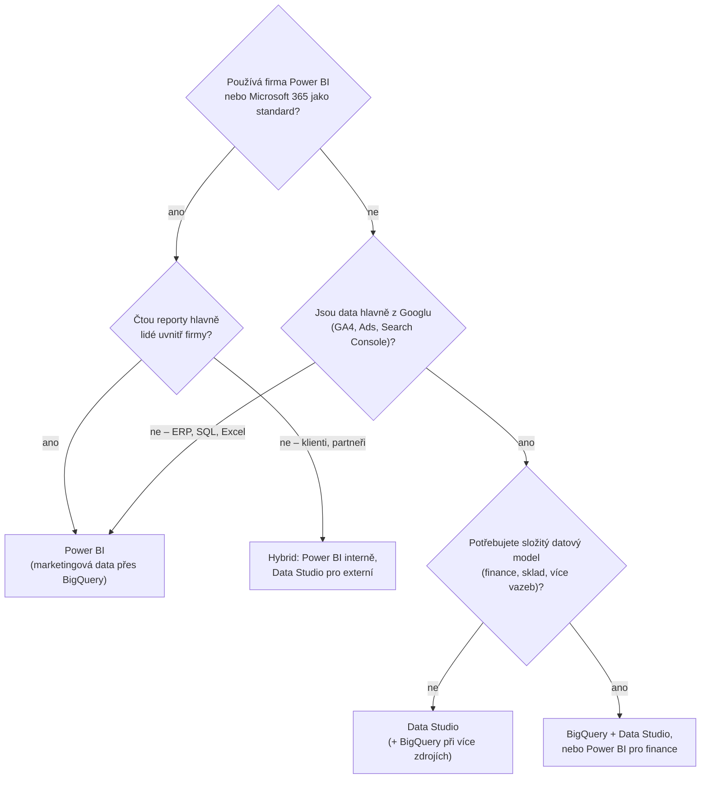
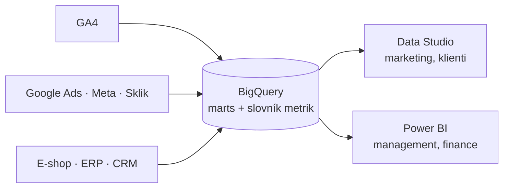

# G2: Looker Studio vs. Power BI: co vybrat pro marketingový a e-commerce reporting – brief
> Cluster: G – Dashboardy & reporting · URL: /blog/looker-studio-vs-power-bi · Formát: srovnání + rozhodovací strom · Priorita: měsíc 2 · Cílová LP: /sluzby/dashboardy-a-reporting · Rozsah: 2 500–3 000 slov

> **Pozor na název:** Looker Studio se od dubna 2026 opět jmenuje **Data Studio** (→ G1). V titulku ponechat „Looker Studio“ (tak lidé hledají), v textu „Data Studio (dříve Looker Studio)“.

---

## 1. Meta

| Prvek | Návrh |
|---|---|
| H1 | Looker Studio (Data Studio) vs. Power BI pro marketing |
| SEO title | Looker Studio vs. Power BI pro marketing \| datalayer.cz (55 zn.) |
| Meta description | Data Studio (dříve Looker Studio), nebo Power BI? Srovnání ceny, konektorů, modelování dat, sdílení a náročnosti pro e-shopy a B2B + rozhodovací strom. (151 zn.) |
| URL | /blog/looker-studio-vs-power-bi |
| Autor | Vít Novotný · revize 6 měsíců (ceny, licence) |

**Klíčová slova** (Ahrefs CZ):

| Typ | Klíčové slovo | Objem |
|---|---|---|
| Hlavní | looker studio vs power bi | 0 (EN SERP existuje: trustradius, alphabold, LinkedIn) |
| Vedlejší (navigační, nelze vyhrát – jen zachytit informační část) | power bi | 8 900 |
| Vedlejší | power bi desktop | 350 |
| Vedlejší | power bi co to je · co je power bi · co je to power bi · what is power bi | 150 · 80 · 20 · 30 |
| Vedlejší | microsoft power bi · power bi dashboard · power bi report · power bi service | 150 · 100 · 100 · 100 |
| Vedlejší | power bi mac · power bi for mac | 40 · 30 |
| Vedlejší | power bi pricing · power bi pro | 30 · 30 |
| Long-tail | tableau vs power bi · power bi vs tableau (10 · 10) · how to connect ga4 to power bi (0) · power bi crm integration (10) | 0–10 |
| Otázky (PAA) | Na co je Power BI? · Kolik stojí Power BI? · Je Power BI zdarma? · Jak spustit Power BI? · Is Google Looker Studio free? · How much does Looker Studio cost? | – |

**Záměr:** srovnávací / rozhodovací (komerční investigace).
**Čtenář:** vedoucí marketingu/e-commerce, CFO nebo IT, kteří vybírají nástroj pro reporting; firma, která má Microsoft 365 a zvažuje, zda marketing „smí“ zůstat v Google nástrojích. Segmenty: e-shop (Google stack), B2B (často Microsoft stack + CRM), velká firma (governance, licence, jeden BI nástroj).

---

## 2. Analýza SERP a konkurence

- **„power bi“** (Google.cz): app.powerbi.com, AI přehled, microsoft.com/cs-cz, cs.wikipedia, videa, learn.microsoft.com (Co je Power BI?), playground.powerbi.com, ci.vse.cz, Google Play, coursera – **navigační dotaz**, článek ho nevyhraje; cílit na informační varianty („power bi co to je“, „kolik stojí“, „power bi mac“) a hlavně na srovnání.
- **Srovnání Looker Studio vs. Power BI** v SERP (mezi výsledky „looker studio vs data studio“): trustradius.com, linkedin.com (osobní zkušenosti, 2025), alphabold.com (pro NetSuite), gcloudvn.com (vietnamsky) – nic česky a nic pro marketing/e-commerce.
- **Konkurence CZ:** revolt.bi („Tableau nebo Power BI“, LP Power BI ~410 slov), datamind.cz (knowledgebase „Dashboardy v Power BI“ ~2 400 slov, Microsoft partner), digitalniarchitekti.cz (vizualizace, školení Looker Studio), itnetwork.cz (kurz Power BI, marketingový dashboard).
- **Mezera:** nikdo nesrovnává nástroje z pohledu **marketingových dat** (GA4, Google Ads, Meta, Sklik, BigQuery), s **ověřenými cenami 2026** a s aktuálním názvem Data Studio. BI agentury (Revolt, Data Mind) jsou zaměřené na Power BI/Tableau a firemní data, freelanceři na Looker Studio.
- **Čím přeskočíme:** neutrální srovnání („oba nástroje děláme“), tabulka s fakty a zdroji, modelové licenční scénáře, rozhodovací strom, doporučená hybridní architektura (BigQuery jako společná vrstva) a odpověď na „jak dostat GA4 do Power BI“.

---

## 3. Otázky, na které musí článek odpovědět

1. Co je Power BI a na co je? Co je Data Studio (dříve Looker Studio)?
2. Kolik stojí Power BI a Data Studio? Jsou zdarma?
3. Jaké konektory mají pro marketingová data (GA4, Google Ads, Meta, Sklik, BigQuery, CRM)?
4. Který nástroj lépe zvládá modelování dat (vazby, výpočty)?
5. Jak je to s výkonem a obnovou dat?
6. Jak se reporty sdílejí a kdo potřebuje licenci?
7. Který je jednodušší na naučení?
8. Co když firma používá Microsoft 365 / Dynamics / Azure?
9. Jde Power BI na Macu?
10. Jak napojit GA4 do Power BI?
11. Dá se používat obojí?
12. Jak se rozhodnout (rozhodovací strom)?

---

## 4. Rychlá odpověď (hotový text, 59 slov)

> Data Studio (dříve Looker Studio) je zdarma, běží v prohlížeči a nejlépe pracuje s daty Googlu – hodí se pro marketingové reporty a e-shopy. Power BI je silnější v modelování dat a zapadá do firem s Microsoft 365, ale sdílení vyžaduje placené licence. Pro marketingová data se oba nejlépe napojují přes BigQuery.

---

## 5. Osnova s obsahem odpovědí

### H2 1: Dva nástroje, dvě filozofie
**Klíčové sdělení:** Data Studio je „Google Docs pro reporty“ – rychlé, sdílené, zdarma. Power BI je „Excel na steroidech“ – datový model, DAX, firemní governance.

- **Data Studio:** webový nástroj Googlu, report = sada grafů nad zdroji dat; logika jednoduchá (vypočítaná pole, blendy do 5 zdrojů); nativní napojení na Google produkty. (→ G1)
- **Power BI:** Power BI Desktop (aplikace pro Windows, zdarma, aktualizace každý měsíc) pro tvorbu; Power BI Service (cloud) pro sdílení; Power Query pro přípravu dat, sémantický model s relacemi a jazyk DAX pro výpočty. Odpověď na PAA „Na co je Power BI?“: reporty a dashboardy nad firemními daty (prodej, finance, sklad, marketing) s jednotným datovým modelem.

### H2 2: Srovnávací tabulka
**Klíčové sdělení:** Cena a konektory mluví pro Data Studio, modelování a firemní governance pro Power BI.

**Tabulka (kompletní; ceny jen ověřené, USD bez DPH, 8. 10. 2026):**

| Kritérium | Data Studio (dříve Looker Studio) | Power BI |
|---|---|---|
| **Cena / licence** | zdarma; **Data Studio Pro 9 USD / uživatel / projekt / měsíc** (může se lišit podle délky předplatného), 30 dní zkušebně | **Desktop zdarma**; **Pro 14 USD / uživatel / měsíc**, **Premium Per User 24 USD** (roční platba); kapacita Microsoft Fabric dle velikosti (cena variabilní) |
| Kdo potřebuje licenci ke sdílení | autor i divák mohou být zdarma (Google účet; čtení i přes odkaz bez účtu) | sdílet a číst sdílený obsah mohou uživatelé Pro/PPU; bezplatní uživatelé jen obsah v kapacitě **Fabric F64+ nebo Premium (P)** |
| **Konektory – Google** | nativně GA4, Google Ads, Search Console, BigQuery, Sheets, CM360, SA360, DV360, YouTube | nativně Google Analytics (GA4 přes Data API, jen Import), Google BigQuery (Import i DirectQuery), Google Sheets; **Google Ads nativně ne** (seznam konektorů Power Query) |
| **Konektory – ostatní marketing** | Meta, Microsoft Ads, Salesforce aj. přes partnerské konektory (obvykle placené); Sklik má konektor od Seznamu (zatím bez rozpadu konverzí) | Meta, Sklik, Google Ads přes konektory třetích stran nebo přes BigQuery; Salesforce nativně |
| Firemní data (ERP, SQL, Excel) | MySQL, PostgreSQL, MS SQL, Sheets, Excel, CSV | stovky konektorů vč. SQL Server, Excel, SharePoint, Dataverse/Dynamics, SAP; on-premise brána |
| **Modelování dat** | zdroj = jedna tabulka nebo blend (max. 5 zdrojů); vypočítaná pole; žádný relační model | Power Query (transformace), sémantický model s relacemi (hvězdicové schéma), DAX míry, znovupoužitelné modely |
| **Výkon** | závisí na zdroji (kvóty GA4 API, BigQuery + BI Engine); extrakty do 100 MB / 750 000 řádků; samo Data Studio nelimituje počet diváků | režim Import v paměti = rychlé interakce; limity velikosti modelu podle licence/kapacity; DirectQuery závisí na zdroji |
| **Obnova dat** | GA4 1/4/12 h, BigQuery od minut, ostatní Google zdroje 12 h; ruční obnova | Pro (sdílená kapacita): **8 plánovaných obnov denně**; PPU/Premium/Fabric: **až 48 denně** |
| **Sdílení** | jako Google Docs: osoby, skupiny, odkaz (i veřejný), vložení iframe, plánované PDF e-mailem; Pro: týmové prostory, Chat/Slack | pracovní prostory, aplikace, odběry e-mailem, Teams/SharePoint; veřejné „publish to web“ (bez zabezpečení) |
| **Řízení přístupu k datům** | pověření vlastníka/diváka/servisního účtu; filtrování podle e-mailu | role a zabezpečení na úrovni řádků v datovém modelu, integrace s Microsoft Entra ID [doplnit odkaz] |
| **Náročnost naučení** | nízká – marketér zvládne první report za hodinu | střední až vyšší – Power Query + DAX; silná komunita a kurzy v ČR („power bi kurz“ 200 hledání/měs.) |
| **Platforma** | prohlížeč (Windows, Mac, Linux), mobilní aplikace | Desktop jen **Windows** (Windows 10 / Server 2016+); Mac jen přes webovou službu (omezené úpravy) nebo virtualizaci |
| **AI** | Conversational Analytics (GA od 7/2026); Gemini in Data Studio (Pro) | Copilot v Power BI [ověřit licenční podmínky – vyžaduje kapacitu] |
| **Vhodnost pro Microsoft stack** | funguje, ale mimo Microsoft identitu a governance | **nativní** (Microsoft 365, Teams, SharePoint, Entra ID, Fabric, Excel) |
| **Vhodnost pro Google stack** | **nativní** (GA4, Ads, BigQuery, Workspace) | přes konektory GA4/BigQuery |

### H2 3: Kolik to stojí v praxi (licenční scénáře)
**Klíčové sdělení:** Data Studio je zdarma i pro desítky diváků. U Power BI platíte každého, kdo report čte – dokud nemáte kapacitu F64 a vyšší.

**Tabulka (ilustrativní výpočet, ceníkové ceny 10/2026, označit):**

| Scénář | Data Studio | Power BI |
|---|---|---|
| 2 marketéři tvoří, 3 manažeři čtou | 0 USD (nebo Pro pro 2 tvůrce: 18 USD/měs. – [ověřit, zda Pro licenci potřebují i diváci Pro obsahu]) | 5 × Pro = 70 USD/měs. |
| 5 tvůrců, 30 čtenářů | 0 USD (Pro pro tvůrce 45 USD/měs.) | 35 × Pro = 490 USD/měs.; od určitého počtu čtenářů se počítá kapacita Fabric F64+ (cena dle kalkulačky Microsoftu) |
| Agentura: 20 klientských reportů pro externí klienty | 0 USD, sdílení odkazem | každý externí čtenář potřebuje licenci nebo kapacitu; alternativně Power BI Embedded |
| Firma už má Power BI Pro (např. v rámci Microsoft 365 licencí) | – | marginální náklad 0 [ověřit, které plány M365 Pro obsahují] |

- Odpověď na PAA „Je Power BI zdarma?“: Power BI Desktop ano (tvorba reportů pro sebe); sdílení a spolupráce vyžadují Pro/PPU nebo kapacitu.
- „Kolik stojí Power BI?“: Pro 14 USD, PPU 24 USD za uživatele měsíčně při roční platbě (Microsoft uvádí, že ceny na webu jsou marketingové a skutečný ceník se může lišit). Ceny Pro/PPU Microsoft zvýšil od dubna 2025 (dříve 10/20 USD).
- Doplnit: náklady na data (BigQuery, konektory třetích stran) jsou u obou nástrojů stejné (→ F5).

### H2 4: Marketingová data: GA4, Google Ads, Meta, Sklik
**Klíčové sdělení:** Pro samotné Google marketingové zdroje je Data Studio pohodlnější. Jakmile chcete spojit více zdrojů, je lepší dát data do BigQuery – a pak je jedno, který nástroj reporty kreslí.

- **GA4 → Data Studio:** nativní konektor, kvóty GA4 Data API (200 000 tokenů/den, 40 000/h u standardní vlastnosti), vzorkování jako v GA4 (→ G1).
- **GA4 → Power BI (odpověď na „how to connect GA4 to Power BI“):**
  1. *Konektor Google Analytics* (GA, Implementation 2.0 = GA4 Data API, jen Import, přihlášení Google účtem). Agregovaná data, stejné kvóty GA4 API; u velkých rozsahů dat Microsoft doporučuje dělit období.
  2. **Doporučeno:** GA4 → BigQuery export → modely (relace, objednávky, kanály) → Power BI konektor Google BigQuery. Pozor: vnořená pole konektor načte jako JSON text → zploštit už v BigQuery; nastavit Billing Project; konektor používá BigQuery Storage API (oprávnění `bigquery.readsessions.*`).
  3. **Import vs. DirectQuery:** pro marketingové reporty doporučit Import (8/48 obnov denně stačí); DirectQuery posílá dotaz do BigQuery při každé interakci → náklady a latence (→ F5).
- **Google Ads:** Data Studio nativně; Power BI přes BigQuery (DTS Google Ads zdarma) nebo třetí strany.
- **Meta, Sklik, srovnávače:** v obou nástrojích přes konektory třetích stran nebo BigQuery (→ F3).

### H2 5: Modelování dat a definice metrik
**Klíčové sdělení:** Power BI má datový model, Data Studio ne. Pokud ale definice metrik držíte v BigQuery, rozdíl se zmenší.

- Data Studio: vypočítaná pole v každém zdroji/reportu → riziko, že „tržby“ budou v každém reportu jinak. Řešení: definice v SQL (marts), znovupoužitelné zdroje dat.
- Power BI: hvězdicové schéma (fakta + dimenze), DAX míry (např. PNO, POAS, LTV), jeden sémantický model pro více reportů; vyžaduje dovednosti.
- Příklad míry (ukázka DAX, okomentovat):
```dax
PNO % =
DIVIDE (
    SUM ( 'naklady'[naklady] ),
    SUM ( 'objednavky'[trzby_bez_dph] )
)
```
  (Ekvivalent v Data Studiu: vypočítané pole `SUM(naklady) / SUM(trzby_bez_dph)` ve zdroji dat – funguje, ale jen v rámci jednoho zdroje/blendu.)

### H2 6: Výkon, obnova a limity
- Data Studio: rychlost = rychlost zdroje; GA4 konektor naráží na kvóty; nad BigQuery pomáhá keš (čerstvost 12 h), BI Engine, agregované tabulky; extrakty 100 MB / 750 000 řádků.
- Power BI: Import model je rychlý; limity velikosti modelu podle licence (Pro menší, PPU a kapacity větší – [doplnit čísla z dokumentace Microsoftu, např. kapacita F64 max. 25 GB paměti]); plánované obnovy 8× (Pro) / 48× (PPU, Premium, Fabric) denně.

### H2 7: Sdílení, oprávnění a governance
- Data Studio: snadné sdílení i mimo firmu (agentury, klienti); riziko pověření vlastníka; reporty v osobních účtech (řeší Pro: obsah patří organizaci, týmové prostory).
- Power BI: firemní identita (Entra ID), pracovní prostory, aplikace, zabezpečení na úrovni řádků, auditovatelnost v Microsoft 365; externí sdílení složitější a licenčně náročnější; „Publish to web“ zveřejní report komukoli – nepoužívat pro interní data.

### H2 8: Kdy co vybrat (rozhodovací strom + scénáře)
**Klíčové sdělení:** Nejde o to, který nástroj je lepší, ale kde už firma je a kdo bude reporty číst.

**Scénáře (tabulka):**

| Firma | Doporučení | Proč |
|---|---|---|
| E-shop na Shoptetu/Upgates, marketing v Google Ads, Sklik, Meta; malý tým | **Data Studio** (+ BigQuery, až bude potřeba spojovat zdroje) | zdarma, nativně Google, rychlý start |
| B2B firma s Microsoft 365, CRM Dynamics/HubSpot, finance v Excelu | **Power BI** (marketingová data přes BigQuery) | jedna platforma pro obchod i marketing, firemní identita |
| Velká firma s BI týmem a standardem Power BI | **Power BI** pro firemní reporting; marketing dodává data do sdíleného modelu přes BigQuery | governance, jedna pravda |
| Agentura / reporty pro externí klienty | **Data Studio** | sdílení bez licencí |
| Firma, kde marketing chce Data Studio a finance Power BI | **Hybrid:** BigQuery jako společná datová vrstva, oba nástroje čtou stejné marts | stejné definice, různé nástroje |

**Rozhodovací strom:** viz 6.1.

### H2 9: Hybrid: BigQuery jako společný základ
**Klíčové sdělení:** Spor „Data Studio, nebo Power BI“ často zmizí, když jsou data a definice metrik v BigQuery. Vizualizační nástroj se pak dá vyměnit bez přepisování logiky.
- Architektura: GA4 + Ads + Meta + Sklik + e-shop + CRM → BigQuery (marts, F3) → Data Studio (marketing, rychlé reporty) + Power BI (management, finance).
- Pravidlo: žádná byznys logika jen ve vizualizačním nástroji; slovník metrik (→ G3).

---

## 6. Vizuály

### 6.1 Rozhodovací strom (hlavní vizuál pod rychlou odpovědí)

**Finální SVG:** svislý strom, otázky jako kosočtverce s tenkým cyan obrysem, výsledky jako karty s piktogramem `report` (Data Studio – cyan, Power BI – tlumená cyan `#00b0b0`, hybrid – oranžový okraj). Interaktivní verze: klikací odpovědi s animovaným průchodem (měřit `diagram_interaction`). Mobil: krok za krokem (jedna otázka na obrazovku).

### 6.2 Diagram hybridní architektury (H2 9)


### 6.3 Srovnávací tabulka (H2 2) – v článku jako „sticky“ tabulka se dvěma sloupci; na mobilu přepínač Data Studio / Power BI (karta pro každý nástroj se stejným pořadím řádků). Kompletní obsah výše.

### 6.4 Mockup „stejný report ve dvou nástrojích“
Dvě vedle sebe stylizované obrazovky (fiktivní data): tržby, PNO, POAS po kanálech – vlevo styl Data Studia (světlé karty), vpravo styl Power BI (panel filtrů vpravo). Popisek: „Stejná data z BigQuery, dva nástroje.“ Nepoužívat originální loga ani přesné kopie UI.

---

## 7. Fakta a zdroje

| Tvrzení | Zdroj | Ověřeno | Riziko zastarání |
|---|---|---|---|
| Data Studio zdarma, Pro 9 USD/uživatel/projekt/měsíc (liší se dle délky předplatného) | https://cloud.google.com/data-studio | 8. 10. 2026 | vysoké |
| Přejmenování Looker Studio → Data Studio (4/2026) | https://cloud.google.com/blog/products/data-analytics/looker-studio-is-data-studio, https://docs.cloud.google.com/data-studio/release-notes | 8. 10. 2026 | nízké |
| Power BI Desktop zdarma; Pro 14 USD, PPU 24 USD (roční platba); ceny „pro marketingové účely“ | https://www.microsoft.com/en-us/power-platform/products/power-bi/pricing | 8. 10. 2026 | **vysoké** |
| Zvýšení cen Pro/PPU od 1. 4. 2025 (z 10/20 USD) | https://community.fabric.microsoft.com/t5/Power-BI-Updates-Blog/Important-update-to-Microsoft-Power-BI-pricing/ba-p/5174341 | 8. 10. 2026 (zdroj nalezen, obsah ověřit) | nízké |
| Licence Free/Pro/PPU, sdílení s bezplatnými uživateli jen v kapacitě F64+ / P | https://learn.microsoft.com/en-us/power-bi/fundamentals/service-features-license-type | 8. 10. 2026 | střední |
| Power BI Desktop: Windows 10 / Server 2016+, zdarma, měsíční aktualizace | https://learn.microsoft.com/en-us/power-bi/fundamentals/desktop-get-the-desktop | 8. 10. 2026 | nízké |
| Plánované obnovy: 8/den (sdílená kapacita), 48/den (Premium, PPU, Fabric) | https://learn.microsoft.com/en-us/power-bi/connect-data/refresh-data | 8. 10. 2026 | střední |
| Konektor Google Analytics: GA, GA4 přes Data API (Implementation 2.0), Import | https://learn.microsoft.com/en-us/power-query/connectors/google-analytics | 8. 10. 2026 | střední |
| Konektor Google BigQuery: GA, Import + DirectQuery, Storage API, nested pole jako JSON, Billing Project | https://learn.microsoft.com/en-us/power-query/connectors/google-bigquery | 8. 10. 2026 | střední |
| Seznam konektorů Power Query (Google Analytics, BigQuery, Sheets, Salesforce; bez Google Ads/Meta) | https://learn.microsoft.com/en-us/power-query/connectors/ (aktualizováno 18. 12. 2025) | 8. 10. 2026 | střední |
| Paměťové limity kapacit F2–F8192 (F64 = 25 GB) | https://learn.microsoft.com/en-us/power-bi/enterprise/service-premium-what-is | 8. 10. 2026 | střední |
| Kvóty GA4 Data API | https://developers.google.com/analytics/devguides/reporting/data/v1/quotas | 8. 10. 2026 | střední |
| Blend max. 5 zdrojů, extrakty 100 MB / 750 000 řádků, čerstvost dat | https://docs.cloud.google.com/data-studio/how-blends-work, …/extract-data-for-faster-performance, …/manage-data-freshness | 8. 10. 2026 | nízké |
| Limity velikosti modelu Pro (≈1 GB) a PPU (≈100 GB), Copilot licence, Power BI Pro v plánech Microsoft 365, RLS dokumentace | learn.microsoft.com | **ověřit před publikací** | – |

---

## 8. Interní odkazy a CTA

**Cílová LP:** /sluzby/dashboardy-a-reporting

**Kontextový CTA box** (za H2 8 – scénáře):
- Nadpis: **Nevíte, který nástroj zvolit? Rozhodneme podle vašich dat**
- Text: Postavíme reporting v Data Studiu i v Power BI – a hlavně datovou vrstvu v BigQuery, díky které nebudete svázaní jedním nástrojem. Začneme krátkou konzultací nad vašimi zdroji dat.
- Tlačítko: `[ Konzultovat reporting ]` → /sluzby/dashboardy-a-reporting#kontakt

**Související články:** G1 Data Studio (dříve Looker Studio) – průvodce · G3 Marketingový dashboard · F1 Export GA4 do BigQuery · F3 Zpracování dat v BigQuery · F5 Kolik stojí BigQuery · F4 Propojení e-shopu a CRM.
**Slovník:** Power BI · Looker Studio (Data Studio) · BigQuery · Datový sklad.
**Související LP:** /sluzby/bigquery · /reseni/velke-firmy · /reseni/b2b-a-lead-generation.

**Zkrácený kontaktní blok:** `form_id: blog` · téma `BigQuery & dashboardy` · H2 „Řešíte totéž u sebe?“ · placeholder „Např. marketing používá Looker Studio, vedení chce Power BI a čísla se nám rozcházejí…“

---

## 9. FAQ pro schema

**Je Power BI zdarma?**
Aplikace Power BI Desktop je zdarma a můžete v ní vytvářet reporty pro vlastní potřebu. Sdílení reportů a spolupráce vyžadují licenci Power BI Pro (14 USD za uživatele měsíčně při roční platbě), Premium Per User (24 USD), nebo firemní kapacitu Microsoft Fabric, ve které mohou obsah číst i bezplatní uživatelé.

**Kolik stojí Looker Studio (Data Studio)?**
Základní Data Studio (dříve Looker Studio) je zdarma včetně sdílení reportů. Placená verze Data Studio Pro stojí podle Googlu 9 USD za uživatele a projekt měsíčně a přidává firemní vlastnictví obsahu, týmové prostory, rozšířené rozesílání a podporu. Platit můžete i za konektory třetích stran a dotazy v BigQuery.

**Jak napojit GA4 do Power BI?**
Power BI má konektor Google Analytics, který načítá agregovaná data GA4 přes Data API v režimu Import a podléhá kvótám GA4. Spolehlivější je exportovat GA4 do BigQuery, data tam převést na tabulky relací a objednávek a připojit je konektorem Google BigQuery. Vnořená pole je lepší zploštit už v BigQuery.

**Funguje Power BI na Macu?**
Power BI Desktop podle Microsoftu podporuje jen Windows. Na Macu můžete používat webovou službu Power BI v prohlížeči, kde lze reporty prohlížet a částečně upravovat, nebo spustit Desktop ve virtualizovaném Windows. Data Studio běží v prohlížeči na jakémkoli systému.

**Můžeme používat Data Studio i Power BI současně?**
Ano, a často to dává smysl: marketing pracuje v Data Studiu, vedení a finance v Power BI. Podmínkou je společná datová vrstva, typicky BigQuery, kde jsou spočítané tabulky a jednotné definice metrik. Oba nástroje pak ukazují stejná čísla.

---

## 10. Poznámky pro autora

- **Neutralita:** klient dělá oba nástroje – nepsat „Power BI je lepší/horší“, ale „pro koho“. Nepoužívat oficiální loga.
- **Ceny a licence:** nejrychleji zastarávají (Power BI ceny se měnily 4/2025; Data Studio Pro „se může lišit“). Revize 6 měsíců, v textu datum ověření.
- **Ověřit před publikací:** zda Data Studio Pro licenci potřebují i diváci Pro obsahu; limity velikosti modelu Pro/PPU; licenční podmínky Copilota; které plány Microsoft 365 obsahují Power BI Pro; dokumentace RLS a Entra ID (odkaz); konkrétní konektory třetích stran pro Sklik/Meta do Power BI.
- **Co dodá klient:** [DOPLNIT: reálný příklad projektu v Power BI a v Data Studiu (anonymizovaný)], [DOPLNIT: preferovaná doporučení klienta pro B2B s Microsoft stackem].
- Recenzent: Vít Novotný; u Power BI částí ideálně Power BI specialista.
