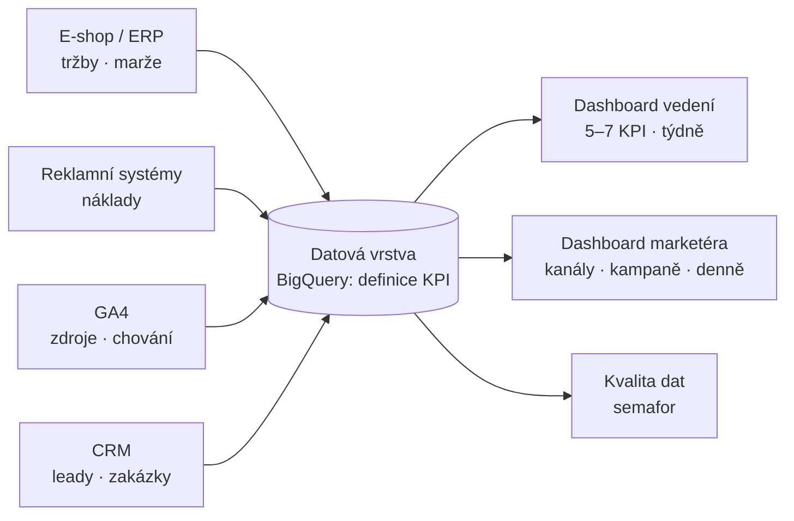

# G3: Marketingový dashboard: jaké KPI sledovat v e-shopu a v B2B (s ukázkami) – brief
> Cluster: G – Dashboardy & reporting · URL: /blog/marketingovy-dashboard · Formát: průvodce + galerie wireframů · Priorita: měsíc 2 · Cílová LP: /sluzby/dashboardy-a-reporting · Rozsah: 2 800–3 300 slov

---

## 1. Meta

| Prvek | Návrh |
|---|---|
| H1 | Marketingový dashboard: jaké KPI sledovat v e-shopu a B2B |
| SEO title | Marketingový dashboard: KPI pro e-shop i B2B \| datalayer.cz (59 zn.) |
| Meta description | Které KPI patří do marketingového dashboardu e-shopu a B2B, jak je počítat (PNO, POAS, CAC, LTV, CPL) a 6 ukázkových dashboardů pro vedení i marketéry. (151 zn.) |
| URL | /blog/marketingovy-dashboard |
| Autor | Vít Novotný · revize 12 měsíců (téma stálé; nástroje odkazovat na G1/G2) |

**Klíčová slova** (Ahrefs CZ):

| Typ | Klíčové slovo | Objem |
|---|---|---|
| Hlavní | marketingový dashboard | 0 (SERP existuje, 8. 10. 2026) |
| Vedlejší (informační) | dashboard co to je · co je dashboard · co je to dashboard | 200 · 150 · 40 |
| Vedlejší | kpi dashboard | 50 |
| Vedlejší | google analytics dashboard · dashboard google analytics · kpi google analytics | 50 · 20 · 20 |
| Vedlejší | ppc reporting · reporting ppc kampaní | 80 · 70 |
| Vedlejší | kpi reporting · co je kpi report · what is kpi reporting | 20 · 10 · 10 |
| Long-tail | digital marketing analytics dashboard (10) · reporting a analytika e-shop (10) · power bi dashboard examples (20) · dashboard template (20) | 10–20 |
| Otázky (PAA) | What is a dashboard? · What is a business dashboard? · What is another term for dashboard? | – |

**Záměr:** informační/návodový („co sledovat, jak to vypadá“) s přechodem na službu („postavte nám to“).
**Čtenář:** majitel/CEO menšího e-shopu, marketingový ředitel, e-commerce manažer, obchodní ředitel B2B firmy; marketér, který má reporting připravit pro vedení. Segmenty: e-shop · B2B/lead-gen · velká firma (více značek/zemí).

---

## 2. Analýza SERP a konkurence

**„marketingový dashboard“ (Google.cz, 8. 10. 2026):** 1. clickup.com/cs (obecný návod, produkt), 2. pavelszabo.cz – „Co je dashboard“, 3. observix.ai/cs – „Marketingový KPI dashboard, který funguje“, 4. itnetwork.cz – kurz Power BI, 5. aitom.cz – slovník, 6. reddit, 7. **revolt.bi – Businessové dashboardy** (LP), 8. jirkont.cz – slovník.
**„looker studio dashboard na míru“:** grou.cz, digikurz.cz, mariemullerova.cz, pavelszabo.cz, wemarket.cz, DA, bradacmartin.com (dashboard pro e-shop), dreamitcompany.cz, jirifranek.cz.
**Konkurence – reporty:** nextanalytica.cz (samostatné LP marketingový/finanční/manažerský/retenční report, lead-gen report s CPL, CPO, lead-to-deal), datimo.ai (PNO report, marketingový reporting, RFM), revolt.bi (galerie typových reportů: Marketing Topline, RFM, CLV), DA (e-commerce a B2B reporty).

**Co chybí:**
1. **Definice a vzorce KPI v českém kontextu** (PNO bez DPH, srovnávače, Sklik) na jednom místě, s tím, *odkud* se která metrika bere.
2. Rozlišení **dashboard pro vedení vs. pro marketéra** (jiná otázka, frekvence, hloubka).
3. **Konkrétní rozvržení** dashboardů (wireframy) pro e-shop i B2B – konkurence ukazuje screenshoty svých produktů, ne principy.
4. **Kvalita dat jako součást dashboardu** (match rate, consent, výpadky) – nikdo.

**Čím přeskočíme:** tabulky KPI se vzorci, zdrojem a „pastmi“, tabulka „vedení vs. marketér“, 6 popsaných wireframů (včetně dashboardu kvality dat), tabulka datových zdrojů a checklist designu. Odkazy na G1/G2 (nástroj) a F3/F4 (data).

---

## 3. Otázky, na které musí článek odpovědět

1. Co je dashboard a čím se liší od reportu? (PAA)
2. Jaké KPI sledovat v e-shopu? Jak se počítá PNO, ROAS, POAS, CAC, LTV, AOV, konverzní poměr?
3. Jaké KPI sledovat v B2B? Co je MQL, SQL, CPL, CPO, lead-to-deal, pipeline, doba konverze?
4. Jak se liší dashboard pro vedení a pro marketéra?
5. Kolik KPI na jedné obrazovce? Jak ukazovat cíle a srovnání?
6. Odkud se data berou (GA4, e-shop, reklamní systémy, CRM) a proč nebrat tržby z GA4?
7. Jak často dashboard aktualizovat?
8. Jak může vypadat konkrétní dashboard (ukázky)?
9. Jak poznat, že data v dashboardu jsou v pořádku?
10. V čem dashboard postavit (Data Studio, Power BI)?

---

## 4. Rychlá odpověď (hotový text, 57 slov)

> Marketingový dashboard ukazuje na jedné obrazovce několik klíčových ukazatelů výkonu marketingu a jejich vývoj proti cíli. E-shop sleduje hlavně tržby, marži, PNO/POAS, CAC a podíl nových zákazníků; B2B leady, kvalifikované leady, cenu za lead a zakázku a pipeline. Vedení potřebuje 5–7 čísel, marketér detail po kanálech a kampaních.

---

## 5. Osnova s obsahem odpovědí

### H2 1: Co je (marketingový) dashboard
**Klíčové sdělení:** Dashboard odpovídá na otázku „jsme na tom dobře, nebo ne?“ během 30 sekund. Report vysvětluje proč.

- Definice (odpověď na „dashboard co to je“): přehledová obrazovka s klíčovými ukazateli (KPI), jejich trendem a srovnáním s cílem nebo minulým obdobím, napojená na data, která se aktualizují automaticky.
- Dashboard vs. report: dashboard = monitorování (málo čísel, často); report = analýza (víc detailů, méně často). Další názvy: přehled, „cockpit“, KPI report (PAA „another term“).
- Business dashboard (PAA) = dashboard pro vedení firmy; marketingový dashboard je jeho část nebo samostatný pohled.
- Tři pravidla dobrého dashboardu: (1) každé číslo má definici a vlastníka; (2) každé číslo má srovnání (cíl, minulé období); (3) z každého čísla vede cesta k detailu.

### H2 2: KPI pro e-shop (s výpočtem a zdrojem)
**Klíčové sdělení:** Peníze z e-shopu/ERP, náklady z reklamních systémů, chování a zdroje z GA4. Řiďte se marží, ne obratem.

**Tabulka KPI e-shop (kompletní):**

| KPI | Vzorec | Zdroj dat | Frekvence | Past |
|---|---|---|---|---|
| Tržby | součet objednávek bez DPH po stornech (volitelně po vratkách) | e-shop / ERP | denně | tržby z GA4 jsou nižší (souhlas, blokátory) – nepoužívat jako finanční číslo (→ F4) |
| Počet objednávek | zaplacené/nestornované objednávky | e-shop | denně | definovat „objednávku“ (zaplacená vs. vytvořená) |
| AOV (průměrná hodnota objednávky) | tržby / objednávky | e-shop | týdně | sledovat i medián (velké objednávky zkreslují) |
| Marže (CM1, CM2) | CM1 = tržby − nákupní cena; CM2 = CM1 − doprava, platby, balné | ERP + e-shop | týdně | nákupní ceny aktuální k datu prodeje |
| Marketingové náklady | součet nákladů Google Ads, Sklik, Meta, srovnávače, affiliate, agentura | reklamní systémy, faktury | denně | DPH, měny, poplatky srovnávačů, fixní náklady (agentura) zvlášť |
| PNO | náklady / tržby × 100 % | náklady + e-shop | týdně | stejný základ (bez DPH) jako u tržeb |
| ROAS | tržby / náklady | dtto | týdně | v reklamním systému je ROAS z jeho atribuce – jiné číslo |
| POAS | marže (CM1/CM2) / náklady | ERP + náklady | týdně/měsíčně | uvádět, kterou marži používáte |
| Konverzní poměr | objednávky / relace (GA4) | GA4 (BigQuery) | týdně | relace bez souhlasu GA4 nevidí; sledovat trend, ne absolutní hodnotu |
| Noví vs. vracející se zákazníci | podle historie objednávek zákazníka (e-mail / ID) | e-shop | měsíčně | ne podle GA4 cookie („nový uživatel“ ≠ nový zákazník) |
| CAC | marketingové náklady / noví zákazníci | náklady + e-shop | měsíčně | rozhodnout, zda do nákladů patří i fixní položky |
| LTV | kumulovaná marže na zákazníka za 6/12 měsíců (kohortně) | e-shop/ERP | měsíčně/kvartálně | počítat z marže, ne z tržeb (→ F4) |
| LTV : CAC | LTV / CAC | dtto | kvartálně | potřebuje dostatečně starou kohortu |
| Míra vratek | vrácené tržby / tržby | ERP | měsíčně | u módy klíčové pro PNO po vratkách |
| (kvalita dat) Podíl spárovaných objednávek | objednávky nalezené v GA4 / objednávky e-shopu | BigQuery | denně | propad = rozbité měření (→ F4) |

### H2 3: KPI pro B2B a lead-gen
**Klíčové sdělení:** Počet leadů je vstup, ne výsledek. Měřte až po obchod – jinak optimalizujete na formuláře, které nikdo nekoupí.

**Tabulka KPI B2B (kompletní):**

| KPI | Vzorec / definice | Zdroj | Frekvence | Past |
|---|---|---|---|---|
| Leady | unikátní poptávky (formulář, telefon, chat), bez spamu a duplicit | web (GA4 `generate_lead` + `lead_id`) + CRM | denně/týdně | počítat podle CRM, ne podle odeslání formuláře |
| MQL | lead splňující marketingová kritéria (obor, velikost, zájem) | CRM | týdně | definici sepsat s obchodem |
| SQL | lead přijatý obchodem k jednání | CRM | týdně | datum přechodu do SQL ukládat |
| CPL | marketingové náklady / leady | náklady + CRM | týdně | levný lead ≠ dobrý lead |
| Cena za SQL | náklady / SQL | dtto | měsíčně | |
| CPO (cena za zakázku) | náklady / získané zakázky | dtto | měsíčně/kvartálně | zkratka CPO se používá i pro „cost per opportunity“ – v dashboardu vždy vypsat |
| Lead-to-deal (konverze leadu na zakázku) | zakázky / leady (z kohorty leadů daného období) | CRM | kvartálně | počítat kohortně (leady z března → zakázky kdykoli později) |
| MQL → SQL, SQL → zakázka | podíly přechodů | CRM | měsíčně | ukazuje, kde se ztrácí kvalita |
| Pipeline z marketingu | hodnota otevřených obchodů z marketingových leadů | CRM | týdně | vážená vs. nevážená hodnota |
| Hodnota získaných zakázek | součet uzavřených obchodů z marketingových leadů | CRM | měsíčně | marže, pokud je dostupná |
| Doba konverze (prodejní cyklus) | medián dnů od leadu do zakázky | CRM | kvartálně | medián, ne průměr |
| ROI marketingu | (hrubý zisk ze zakázek − náklady) / náklady | CRM + finance | kvartálně | dlouhý cyklus → zpoždění |

- Podmínka: propojení webu a CRM (`lead_id`, click ID, UTM v CRM – → E1, F4) a offline konverze zpět do reklam (→ E3).

### H2 4: Dashboard pro vedení vs. pro marketéra
**Klíčové sdělení:** Vedení se ptá „vyděláváme?“, marketér „co mám zítra změnit?“. Jeden dashboard pro oba nefunguje.

**Tabulka (kompletní):**

| | Vedení (CEO, CFO, obchodní ředitel) | Marketér / PPC specialista |
|---|---|---|
| Otázka | Plníme plán? Vyplácí se marketing? | Které kampaně/kanály zlepšit nebo vypnout? |
| Počet KPI | 5–7 na první obrazovce | 10–20, s filtry |
| Zrnitost | měsíc, týden; firma, kanál | den, kampaň, sestava, produkt, zařízení |
| Srovnání | plán, minulý rok, trend 13 měsíců | minulý týden, minulé období, cíle kampaní |
| Metriky | tržby, marže, náklady, PNO/POAS, noví zákazníci, CAC (B2B: SQL, pipeline, zakázky) | relace, CR, CPC, CPL, ROAS v platformách, PNO po kampaních, podíl nových |
| Frekvence | týdně (pondělí) + měsíční report s komentářem | denně |
| Forma | 1 obrazovka, mobil, PDF e-mailem | interaktivní, více stránek |
| Zdroj pravdy | e-shop/ERP/CRM + náklady | GA4, reklamní systémy, BigQuery |
| Komentář | ano – 3 věty „co se stalo a co děláme“ | poznámky ke změnám (spuštění kampaní) |

### H2 5: Ukázkové dashboardy (6 wireframů)
**Klíčové sdělení:** Ukázky jsou fiktivní – jde o rozvržení a logiku, ne o konkrétní čísla. Každý dashboard začíná otázkou, na kterou odpovídá.

> V článku každý wireframe jako obrázek (SVG/PNG) + popis „Pro koho · Na co odpovídá · Zdroje · Aktualizace“. Detailní zadání pro designéra viz kap. 6.2. Všechna data fiktivní a označená „ukázka“.

1. **Manažerský přehled e-shopu** – „Plníme plán a vyplácí se marketing?“ (vedení, týdně).
2. **Výkon kanálů a kampaní** – „Kam přesunout rozpočet?“ (marketér, denně).
3. **Produkty a kategorie** – „Které kategorie táhnou marži a které jen obrat?“ (category manažer, marketér, týdně).
4. **Zákazníci: noví vs. vracející, kohorty, LTV:CAC** – „Získáváme zákazníky, kteří se vracejí?“ (vedení, CRM marketing, měsíčně).
5. **B2B lead funnel** – „Kolik nás stojí zakázka a odkud přicházejí ty dobré leady?“ (marketing + obchod, týdně).
6. **Kvalita dat a měření** – „Můžeme dnešním číslům věřit?“ (analytik, denně; zkrácená verze jako „semafor“ na každém dashboardu).

### H2 6: Odkud se data berou
**Tabulka datových zdrojů (kompletní):**

| Zdroj | Data | Jak do dashboardu | Pozn. |
|---|---|---|---|
| E-shop (Shoptet, Upgates, WooCommerce, Shopify, vlastní) | objednávky, položky, zákazníci, storna | API/export → BigQuery | zdroj pravdy pro tržby |
| ERP / účetnictví (Pohoda, Money S3, ABRA, Helios) | nákupní ceny, vratky, faktury | export → BigQuery | marže |
| GA4 | relace, zdroje, chování, konverze na webu | BigQuery export (doporučeno) nebo přímý konektor | → F1, G1 |
| Google Ads | náklady, kliky, konverze v platformě | BigQuery DTS (zdarma) / přímý konektor Data Studia | |
| Sklik | náklady, kliky | Sklik konektor pro Data Studio (bez rozpadu konverzí) / API → BigQuery | → F3, B6 |
| Meta Ads | náklady, zobrazení | DTS konektor (placený) / třetí strany | |
| Heureka, Zboží.cz | náklady za prokliky | export / API | |
| CRM (HubSpot, Pipedrive, Raynet, Salesforce, Dynamics) | leady, fáze, obchody | API / konektory → BigQuery | B2B |
| Call tracking | hovory | API | → E5 |
| Search Console | SEO dotazy, zobrazení | přímý konektor / hromadný export do BigQuery | |
| Plán a cíle | měsíční cíle tržeb, nákladů, leadů | Google Sheets | nutné pro „vs. plán“ |

- **Pravidlo:** tržby a počty zákazníků nikdy z GA4 (→ F4, D2); GA4 jen pro rozpad podle zdrojů a chování.
- **Aktualizace:** e-shop a náklady denně ráno; GA4 export přichází odpoledne (→ F1) – dashboard musí ukazovat „data k datu“.

### H2 7: Principy designu, které zvyšují důvěru
**Checklist (kompletní):**
1. Nahoře 5–7 KPI dlaždic: hodnota, změna proti srovnání (šipka + %), cíl, mini-trend.
2. Jeden graf = jedna otázka (nadpis grafu jako otázka nebo závěr).
3. Barvy s významem (lepší/horší než cíl), ne dekorace; stejný kanál = stejná barva všude.
4. U každé metriky ikona „i“ s definicí a zdrojem (slovník metrik).
5. Viditelné datum poslední aktualizace a stav dat (semafor z dashboardu 6).
6. Filtry jen tam, kde je divák opravdu používá (vedení: žádné nebo období).
7. Mobilní verze pro vedení (svislé dlaždice).
8. Komentář lidskou řečí u manažerského přehledu.
9. Žádné „marnivé“ metriky bez akce (zobrazení stránek bez kontextu, „lajky“).
10. Data osobní povahy (jména leadů) jen v neveřejných pohledech s pověřením diváka (→ G1 sdílení).

### H2 8: V čem dashboard postavit
- Krátce: Data Studio (dříve Looker Studio) pro Google stack a externí sdílení; Power BI pro Microsoft stack a složitý model; pro více zdrojů BigQuery jako základ (→ G1, G2, F3).
- Tip: začít manažerským přehledem (dashboard 1 nebo 5) a dashboardem kvality dat (6); detailní pohledy přidávat podle otázek týmu.

---

## 6. Vizuály

### 6.1 Diagram „Od zdroje k rozhodnutí“ (pod rychlou odpovědí)

**Finální SVG:** zdroje vlevo (piktogramy `purchase`, `conversion`, `ga4`, `lead`), uprostřed „sklad“ (`bq`), vpravo tři obrazovky (`report`); semafor jako malá ikonka v rohu obou dashboardů. Mobil svisle.

### 6.2 Wireframy 6 dashboardů (zadání pro designéra)
Společné: tmavý brand (pozadí `#020d1e`, karty `#0b1a30`, text `#e6edf3`), čísla v Roboto Mono, pozitivní změna cyan `#00ffff`, negativní oranžová `#ff7400` (nepoužívat červenou/zelenou jako jediný nosič informace – doplnit šipku ▲▼). Formát 16:9 pro desktop + svislá verze (mobil). Fiktivní data, v rohu štítek „ukázka“. Každý wireframe jako statický obrázek; volitelně interaktivní HTML verze v galerii na LP Dashboardy.

**Wireframe 1 – Manažerský přehled e-shopu**
- Řádek 1 (6 dlaždic): Tržby bez DPH · Marže CM2 · Marketingové náklady · PNO · POAS · Noví zákazníci – každá: hodnota za měsíc, % vs. plán, % vs. minulý rok, mini-trend 13 měsíců.
- Řádek 2: kombinovaný graf 13 měsíců – sloupce tržby, linka náklady, druhá osa PNO.
- Řádek 3: tabulka kanálů (Google Ads, Sklik, Meta, Srovnávače, Organic, E-mail, Direct): náklady · tržby · marže · PNO · POAS, podmíněné formátování POAS < 1.
- Řádek 4: textový box „Komentář k měsíci“ (3 odrážky) + semafor kvality dat.
- Filtry: jen měsíc. Zdroje: e-shop, ERP, náklady, GA4 (rozpad kanálů). Aktualizace denně, odesílání PDF v pondělí.

**Wireframe 2 – Výkon kanálů a kampaní (marketér)**
- Horní lišta filtrů: období, kanál, zařízení, země.
- Řádek 1 (8 dlaždic): náklady, relace, CR, objednávky, tržby, PNO, ROAS, podíl nových zákazníků.
- Řádek 2: tabulka kampaní (řazení podle nákladů) se sloupci náklady, kliky, CPC, relace, objednávky (GA4), tržby (spárované s e-shopem), PNO, POAS, Δ týden; heatmapa v PNO.
- Řádek 3: bodový graf „náklady vs. POAS“ (velikost bodu = tržby) – kampaně vpravo dole = kandidáti na škrty.
- Řádek 4: denní trend relací a CR s poznámkami (spuštění kampaní).

**Wireframe 3 – Produkty a kategorie**
- Treemap kategorií (velikost = tržby, barva = marže %).
- Tabulka top/flop produktů: tržby, kusy, marže, PNO kategorie, míra vratek.
- Sloupcový graf „obrat vs. marže“ po kategoriích.
- Filtr: kategorie, značka. Zdroje: e-shop, ERP, GA4 items (zobrazení → košík → nákup).

**Wireframe 4 – Zákazníci: kohorty a LTV:CAC**
- Dlaždice: noví zákazníci, podíl tržeb od vracejících, CAC, LTV 12 m, LTV:CAC.
- Kohortní heatmapa: řádky = měsíc první objednávky, sloupce = měsíc 0–12, hodnota = kumulovaná marže na zákazníka.
- Sloupcový graf CAC a LTV podle akvizičního kanálu první objednávky.
- Poznámka: „noví“ podle historie objednávek, ne podle GA4.

**Wireframe 5 – B2B lead funnel**
- Trychtýř: leady → MQL → SQL → zakázky (počty + konverzní poměry mezi kroky).
- Tabulka kanálů: náklady, leady, CPL, SQL, cena za SQL, zakázky, CPO, hodnota zakázek, pipeline.
- Graf: medián dnů lead → zakázka podle kanálu.
- Kohortní tabulka lead-to-deal podle měsíce vzniku leadu.
- Seznam posledních SQL **bez osobních údajů** ve sdílené verzi (jen ID leadu, obor, kanál); detail jen v CRM.

**Wireframe 6 – Kvalita dat a měření**
- Semafor (zelená/oranžová/červená + ikona) pro: export GA4 dorazil (datum poslední tabulky), podíl spárovaných objednávek (match rate) vs. 30denní průměr, duplicitní nákupy, podíl událostí bez souhlasu (trend), objem klíčových událostí vs. 7denní průměr, osobní údaje v URL (počet).
- Graf match rate po dnech (cílová pásma).
- Tabulka „poslední incidenty“ (datum, co se stalo, opraveno).
- Zdroje: dotazy z F2 (10, 11, 12) a F4 (match rate).

### 6.3 Tabulky
KPI e-shop (H2 2), KPI B2B (H2 3), vedení vs. marketér (H2 4), datové zdroje (H2 6) – kompletní obsah výše.

### 6.4 Infografika „Pyramida metrik e-shopu“ (volitelně, LinkedIn 1080×1350)
Pyramida: dole „Chování (GA4): relace, CR, košík“ → „Akvizice: náklady, PNO, ROAS, CAC“ → „Peníze: tržby, marže, POAS“ → vrchol „Hodnota zákazníka: LTV, LTV:CAC“. U každé vrstvy zdroj dat (ikona).

---

## 7. Fakta a zdroje

Článek je převážně metodický (definice KPI jsou praxe oboru, ne regulace). Ověřovaná fakta se týkají nástrojů a dat:

| Tvrzení | Zdroj | Ověřeno | Riziko zastarání |
|---|---|---|---|
| GA4 neexportuje modelovaná data; rozdíly UI vs. export | https://developers.google.com/analytics/blog/2023/bigquery-vs-ui | 8. 10. 2026 | nízké |
| Denní export GA4 přichází obvykle odpoledne (časové pásmo vlastnosti), může se zpozdit | https://support.google.com/analytics/answer/9823238, https://support.google.com/analytics/answer/9358801 | 8. 10. 2026 | nízké |
| Data Studio (dříve Looker Studio): plánované doručování PDF, sdílení, pověření | https://docs.cloud.google.com/data-studio/ways-to-share-your-reports | 8. 10. 2026 | nízké |
| Google Ads DTS zdarma; Facebook Ads konektor DTS placený | https://cloud.google.com/bigquery/pricing | 8. 10. 2026 | vysoké |
| Definice PNO, POAS, CM1–CM3, CAC, LTV, MQL/SQL, CPL, CPO | oborová praxe (ne regulace); v textu uvádět jako „naše doporučená definice“ | – | nízké |
| Zkratka CPO – nejednoznačná (cost per order vs. cost per opportunity) | oborová praxe | – | – |

---

## 8. Interní odkazy a CTA

**Cílová LP:** /sluzby/dashboardy-a-reporting

**Kontextový CTA box** (za H2 5 – ukázky):
- Nadpis: **Chcete takový dashboard nad svými daty?**
- Text: Pomůžeme vybrat KPI, sepsat jejich definice s vedením a obchodem a postavit dashboard v Data Studiu nebo Power BI nad daty, která sedí s účetnictvím. Včetně hlídání kvality dat.
- Tlačítko: `[ Konzultovat dashboard ]` → /sluzby/dashboardy-a-reporting#kontakt

**Související články:** G1 Data Studio (dříve Looker Studio) · G2 Looker Studio vs. Power BI · F3 Zpracování dat v BigQuery · F4 Propojení e-shopu a CRM (marže, LTV) · F2 SQL pro GA4 (dotazy 10–12) · D2 Proč nesedí čísla · D6 Atribuce · E1 Měření formulářů a leadů · E3 Offline konverze z CRM · C5 Měřicí plán (/blog/merici-plan).
**Slovník:** Klíčová událost (konverze) · Atribuční model · Datový sklad · Data Studio (dříve Looker Studio) · Power BI · Offline konverze.
**Související LP:** /reseni/e-shopy · /reseni/b2b-a-lead-generation · /sluzby/bigquery.

**Zkrácený kontaktní blok:** `form_id: blog` · téma `BigQuery & dashboardy` · H2 „Řešíte totéž u sebe?“ · placeholder „Např. vedení chce každý týden vidět marži a PNO po kanálech a my to skládáme ručně v Excelu…“

**Lead magnet (volitelný, rozhodne klient):** „Šablona slovníku metrik (Google Sheets)“ – sloupce KPI · definice · vzorec · zdroj · vlastník · frekvence. [DOPLNIT: rozhodnutí klienta]

---

## 9. FAQ pro schema

**Co je marketingový dashboard?**
Je to přehledová obrazovka s několika klíčovými ukazateli výkonu marketingu, například tržbami, marží, náklady, PNO nebo počtem kvalifikovaných leadů. Ukazuje jejich vývoj a srovnání s cílem nebo minulým obdobím a aktualizuje se automaticky z napojených dat, takže nahrazuje ruční skládání reportů v Excelu.

**Jaké KPI sledovat v e-shopu?**
Základem jsou tržby a marže z e-shopu nebo ERP, marketingové náklady, PNO a POAS, počet nových zákazníků a cena za jejich získání (CAC). Pro řízení kampaní přidejte konverzní poměr a průměrnou hodnotu objednávky, pro dlouhodobé řízení hodnotu zákazníka (LTV) a jeho poměr k CAC.

**Jaký je rozdíl mezi PNO, ROAS a POAS?**
PNO je podíl nákladů na reklamu na tržbách v procentech, ROAS je obrácený poměr tržeb a nákladů. POAS dělí náklady marží místo tržeb, takže ukazuje ziskovost. Kampaň s nízkým PNO může prodávat nízkomaržové zboží a prodělávat – proto je pro řízení podle zisku lepší POAS.

**Jaké KPI sledovat v B2B marketingu?**
Kromě počtu leadů hlavně kvalitu: počet marketingově (MQL) a obchodně kvalifikovaných leadů (SQL), cenu za lead a za získanou zakázku, konverzi leadu na zakázku, hodnotu pipeline z marketingu a délku prodejního cyklu. K tomu je potřeba propojit web s CRM.

**Proč nebrat tržby do dashboardu z GA4?**
GA4 nevidí objednávky uživatelů bez souhlasu s cookies, s blokátory nebo při chybě měření a neví o stornech a vratkách. Tržby v GA4 jsou proto obvykle nižší než v e-shopu. Pro finanční čísla používejte e-shop nebo ERP a GA4 jen pro rozdělení podle kanálů a chování.

---

## 10. Poznámky pro autora

- **Tón:** praktický, bez buzzwordů; definice KPI formulovat jako „doporučená definice“ – firmy je mají různé.
- **Wireframy:** fiktivní data, žádná loga klientů; ideálně interaktivní galerie na LP Dashboardy (sdílené komponenty).
- **Co dodá klient:** [DOPLNIT: anonymizované reálné dashboardy z projektů (nejsilnější důkaz)], [DOPLNIT: zda nabídne šablonu slovníku metrik jako lead magnet], [DOPLNIT: mini-případovka – např. „vedení přešlo z PNO na POAS a změnilo rozpočet kampaní“ – jen s reálnými čísly].
- **Rizika:** neslibovat „100% přesná data“; u kvality dat mluvit o „hlídání a vysvětlitelných rozdílech“.
- **Aktualizace:** metodika stálá (revize 12 měsíců); odkazy na nástroje udržovat přes G1/G2.
- Recenzent: Vít Novotný + ideálně člověk z obchodu B2B (definice MQL/SQL).
