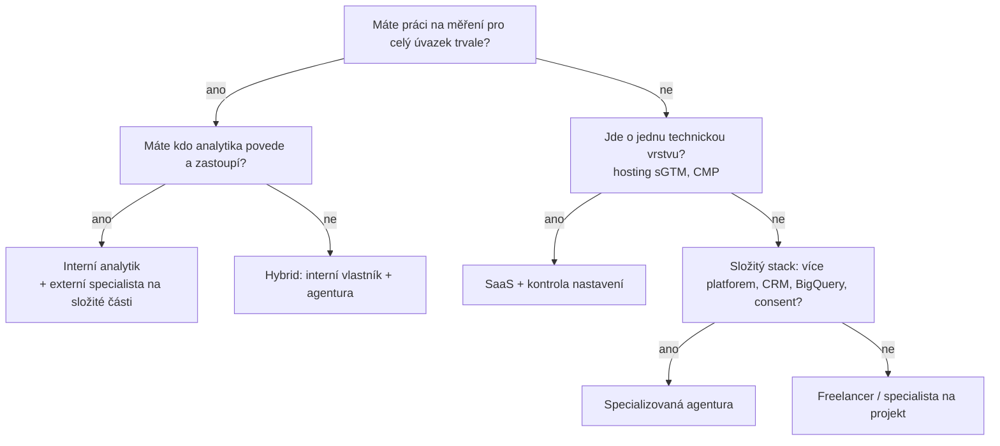

# H1: Jak vybrat dodavatele měření: interní analytik, agentura, freelancer, nebo SaaS? – brief
> Cluster: H. Audity & rozhodování · URL: /blog/jak-vybrat-dodavatele-mereni · Formát: rozhodovací článek (srovnání + checklist) · Priorita: měsíc 2 · Cílová LP: / (homepage) a /jak-pracujeme · Rozsah: 2 800–3 300 slov

---

## 1. Meta

| Prvek | Návrh |
|---|---|
| H1 | Jak vybrat dodavatele měření: interně, agentura, nebo SaaS? |
| SEO title (53 zn.) | Jak vybrat dodavatele webové analytiky \| datalayer.cz |
| Meta description (144 zn.) | Interní analytik, agentura, freelancer, nebo SaaS? Srovnání podle nákladů a kompetencí, 15 otázek pro výběr dodavatele měření a varovné signály. |
| URL | /blog/jak-vybrat-dodavatele-mereni |
| Schema | `BlogPosting` + `FAQPage` + `BreadcrumbList` |

**Klíčová slova** (Ahrefs CZ):

| Typ | Slovo | Objem/měs. | Poznámka |
|---|---|---|---|
| hlavní (komerční) | webová analytika agentura | 10 | SERP + reklamy (3 inzerenti) |
| hlavní (SERP) | google analytics agentura | – (SERP 8. 10. 2026) | PAA: „Kolik stojí reklama na Google?“, „Co je to GA4?“, „Jak funguje Google Tag Manager?“ |
| vedlejší | webová analytika | 90 | spíš definiční – jen interní odkaz |
| vedlejší | webový analytik | 150 | převážně pracovní nabídky (jobs.cz, prace.cz) → sekce „interní analytik“ |
| vedlejší | datový analytik | 300 | pracovní záměr; jen okrajově |
| vedlejší | správa měření webu | 10 | → /sluzby/sprava-webu-a-mereni |
| long-tail (0) | webová analytika konzultant, google analytics freelancer, kolik stojí webová analytika, in-house vs agentura analytika | 0 | H3/FAQ |

**Záměr:** komerční/rozhodovací (MOFU–BOFU). Čtenář ví, že potřebuje měření, a vybírá model a dodavatele.

**Cílový čtenář:** CMO, marketingový ředitel, majitel e-shopu, IT/BI manažer velké firmy, nákup. Segment: všechny tři (e-shop, B2B, velké firmy), s důrazem na střední a velké firmy (podle positioningu datalayer.cz).

---

## 2. Analýza SERP a konkurence

**„webová analytika agentura“ (8. 10. 2026):** antee.cz, visibility.cz, neogy.cz, navolnenoze.cz (katalog freelancerů), datamind.cz, digitalniarchitekti.cz, digitalka.cz, netroot.cz, datanimals.com; reklamy: seoconsult.cz, trkkn.cz, webfusion.cz. AI přehled zobrazen.
**„google analytics agentura“:** optimalizovany-web.cz, sovanet.cz, taste.cz (Google Sales Partner), lerstudio.cz (slovník), marf.cz (návod), proficio.cz (školení), avedeo.cz, adzviser.com, mediaguru.cz (certifikace TRKKN).

**Co chybí:** všechny výsledky jsou **prodejní stránky jedné agentury** nebo definice. Nikdo nenabízí **nezávislé srovnání modelů** (in-house vs. agentura vs. freelancer vs. SaaS), **otázky pro výběr**, **varovné signály** ani **orientaci v cenách**. Analýza konkurence (kap. 7) tento „rozhodovací obsah pro firmy“ uvádí jako mezeru.

**Čím je přeskočíme:** férové srovnání včetně situací, kdy datalayer.cz **není** nejlepší volba (zvyšuje důvěryhodnost a citovatelnost v AI přehledech), tabulka pracnosti v hodinách, tržní cenová rozpětí z veřejných ceníků (anonymizovaně, bez cen datalayer.cz), 15 otázek s „dobrou odpovědí“ a „varovným signálem“, red flags s vysvětlením.

---

## 3. Otázky, na které musí článek odpovědět

1. Potřebujeme interního analytika, nebo externího dodavatele?
2. Jaký je rozdíl mezi specializovanou agenturou, full-service agenturou a freelancerem?
3. Kdy dává smysl SaaS (server-side, CMP, reporting) a kdy ne?
4. Kolik stojí měření na českém trhu a z čeho se cena skládá?
5. Kolik hodin práce typicky zaberou jednotlivé části měření?
6. Jaké kompetence musí mít tým, který měření dělá?
7. Na co se dodavatele zeptat?
8. Jaké jsou varovné signály?
9. Co má být ve smlouvě a v předání?
10. Proč by agentura, která spravuje kampaně, neměla být jediná, kdo je měří?
11. Jak vypadá rozumný první krok?

---

## 4. Rychlá odpověď (hotový text, 59 slov)

> Interní analytik se vyplatí, když máte průběžnou práci pro celý úvazek a někoho, kdo ho povede. Specializovaná agentura nebo freelancer pokryje implementaci, audit a složitější technologie bez náboru. SaaS řeší jednu část. Vybírejte podle dokumentace, vlastnictví účtů a přístupu k souhlasu – ne podle slibu „100 % dat“.

---

## 5. Osnova s obsahem odpovědí

### H2 1: Čtyři modely (a jejich kombinace)
**Klíčové sdělení:** Neexistuje „nejlepší“ model – existuje model, který odpovídá rozsahu práce, interním kompetencím a riziku.

**Obsah odpovědi – popis modelů (krátce, 2–3 věty každý):**
- **Interní analytik / tým:** zná byznys, je k dispozici denně; potřebuje vedení, rozvoj a zastupitelnost; jeden člověk málokdy pokryje GA4, GTM, server-side, consent, SQL i BI.
- **Specializovaná analytická agentura / studio:** šíře technologií a zkušenost z více projektů, dokumentace a procesy; dražší hodina, méně znalosti vašeho byznysu na začátku.
- **Freelancer:** osobní přístup, nižší sazba, rychlost u menších projektů; riziko kapacity a zastupitelnosti.
- **Full-service / PPC agentura s analytikou:** pohodlné „vše v jednom“; měření bývá doplněk ke kampaním a **hodnotí výkon vlastní práce** (střet zájmů – H2 6).
- **SaaS / produkt** (server-side hosting, CMP, reportingové produkty): rychlé nasazení jedné vrstvy za měsíční poplatek; neřeší návrh měření, datovou vrstvu ani governance; riziko lock-inu u proprietárních řešení.
- **Hybrid:** interní vlastník měření + externí specialista na implementaci a audity – pro střední a velké firmy často nejlepší poměr.

### H2 2: Srovnání modelů
**Tabulka (kompletní obsah):**

| Kritérium | Interní analytik | Specializovaná agentura | Freelancer | Full-service / PPC agentura | SaaS / produkt |
|---|---|---|---|---|---|
| Jak se platí | mzda + nástroje + školení (≈ 160 h/měs. kapacity) | projekt + volitelný paušál správy | hodinová sazba / projekt | součást retaineru kampaní | měsíční předplatné (+ implementace) |
| Šíře kompetencí | závisí na člověku (typicky 1–2 oblasti do hloubky) | široká (tým) | úzká až střední | střední, důraz na reklamu | jedna oblast |
| Hloubka u složitých témat (sGTM, BigQuery, CRM) | jen pokud ji člověk má | vysoká | různá | spíš nízká | vysoká v rámci produktu |
| Znalost vašeho byznysu | nejvyšší | střední (roste) | střední | střední | nízká |
| Kapacita a zastupitelnost | 1 člověk = riziko | tým | riziko | tým | podpora produktu |
| Rychlost startu | měsíce (nábor) | týdny | dny–týdny | týdny | dny |
| Dokumentace a předání | dle disciplíny | standard (měl by být) | různé | často slabé | dokumentace produktu, ne vašeho měření |
| Vlastnictví dat a účtů | vaše | **musí být vaše** (ověřit) | **musí být vaše** (ověřit) | často na agentuře – ověřit | data v produktu – ověřit export |
| Nezávislost hodnocení kampaní | ano | ano (pokud nespravuje kampaně) | ano | **ne** | ano |
| Vhodné pro | velké firmy s průběžnou agendou | střední a velké firmy, složitější stack | menší e-shopy a firmy, jasně vymezené úkoly | firmy, které chtějí jednoho partnera na kampaně | konkrétní technická vrstva |

### H2 3: Kolik to stojí: hodiny, kompetence a tržní rozpětí
**Klíčové sdělení:** Cenu určuje rozsah (počet platforem, typ webu, stav současného měření, consent, server-side, CRM), ne „balíček“. Proto dává smysl porovnávat odhad hodin a výstupy.

**Tabulka pracnosti (orientační odhad – [DOPLNIT: klient potvrdí/upraví rozpětí podle vlastních projektů]):**

| Část práce | Orientační pracnost | Klíčová kompetence | Co ovlivní rozsah |
|---|---|---|---|
| Měřicí plán (cíle, události, KPI) | 8–24 h | analytik + byznys | počet cílů, segmentů, oddělení |
| Specifikace datové vrstvy pro vývojáře | 8–24 h (+ vývoj na straně webu) | technický analytik | platforma e-shopu, vlastní vývoj |
| GA4 + GTM (základ) | 8–24 h | GTM/GA4 | počet událostí, domén, jazyků |
| E-commerce měření | 12–32 h | GTM + dataLayer | platforma, checkout, vratky |
| Cookie lišta + Consent Mode v2 | 6–20 h | GTM + právní orientace | CMP, počet tagů, advanced/basic |
| Konverze Ads / Meta / Sklik (+ CAPI) | 8–32 h | reklamní systémy + server-side | počet platforem, deduplikace |
| Server-side GTM (nasazení) | 16–40 h + provoz | Google Cloud / hosting | počet klientů a tagů, vlastní doména |
| Leady → CRM → offline konverze | 16–48 h | integrace, API | CRM, fáze, monitoring |
| BigQuery + dashboard | 24–80 h | SQL, BI | zdroje dat, modelování |
| Audit měření | 16–40 h | celé spektrum | velikost webu, počet systémů (H2 audit) |
| Průběžná správa | 4–16 h/měs. | GTM, monitoring | frekvence změn webu a kampaní |

**Tržní rozpětí z veřejných ceníků (k 10/2026, bez DPH, anonymizovaně – nejde o ceny datalayer.cz; rozsahy služeb se mezi dodavateli liší):**

| Služba | Nižší segment (freelanceři, SaaS) | Agentury | Poznámka |
|---|---|---|---|
| Nastavení GA4 + GTM | cca 3 200–18 000 Kč | cca 3 900–19 000 Kč; ve formulářích pásma 5–41 tis. Kč | e-shop s e-commerce měřením typicky 8–20 tis. Kč |
| Audit měření | cca 4 500–12 000 Kč | cca 14 900 Kč (jako součást širšího auditu) | rozsah auditů se výrazně liší |
| Cookie lišta + Consent Mode v2 | cca 3 000–6 500 Kč | pásma do 5 / 5–20 / 20+ tis. Kč | bez licence CMP |
| Server-side tracking | SaaS cca 349–4 990 Kč/měs.; implementace od cca 15 000 Kč | cca 10–40 tis. Kč implementace | + náklady na hosting / Google Cloud |
| Dashboardy (Data Studio, dříve Looker Studio) | od cca 5 600 Kč | cca 30–100+ tis. Kč („analytika a BI“) | enterprise BI výrazně výš |
| Hodinová sazba | cca 950–1 500 Kč | cca 1 700–2 500 Kč | |

Zdroj: `01_konkurence/00_analyza-konkurence.md`, kap. 5 (veřejné ceníky a formuláře konkurence, stav k 8. 10. 2026). **V článku konkurenty nejmenovat** (viz poznámky pro autora).

- **Interní analytik:** cenu neuvádět bez zdroje – **[DOPLNIT/ověřit: mzdové rozpětí „webový/datový analytik“ z veřejného průzkumu (např. platy.cz, Hays, Grafton) k 2026]**; zdůraznit i skryté náklady: nábor, onboarding, nástroje, školení, zastupitelnost, vedení.
- **Z čeho se skládá cena u externího dodavatele** (kopie logiky z LP, architektura kap. 4): rozsah, počet platforem, stav webu a dostupnost vývojáře, server-side (provozní náklady Google Cloud hradí klient napřímo), požadavky na dokumentaci a školení.

### H2 4: Kdy který model (rozhodovací matice)
**Tabulka (kompletní):**

| Situace | Doporučený model | Proč |
|---|---|---|
| Menší e-shop na platformě (Shoptet, Upgates), základní měření | freelancer nebo specializovaná agentura (jednorázově) + SaaS server-side podle potřeby | jasně vymezený rozsah |
| Rostoucí e-shop, víc kanálů, nesedí čísla | specializovaná agentura (audit → implementace → správa) | šíře + dokumentace |
| B2B / lead-gen s CRM | specializovaná agentura nebo hybrid | integrace CRM a offline konverze vyžadují víc kompetencí |
| Velká firma, vlastní IT, více webů/zemí | hybrid: interní vlastník měření + externí specialisté | governance + kapacita |
| Potřebujete jen hosting sGTM nebo CMP | SaaS | jedna vrstva |
| Chcete nezávislé ověření práce PPC agentury | audit od nezávislého specialisty | střet zájmů |

**Vizuál:** rozhodovací strom (kap. 6).

### H2 5: 15 otázek pro výběr dodavatele měření
**Klíčové sdělení:** Dobrý dodavatel odpoví konkrétně a ukáže výstup. Vágní odpověď je informace sama o sobě.

**Tabulka (kompletní – „Otázka · Co chcete slyšet · Varovný signál“):**

| # | Otázka | Co chcete slyšet | Varovný signál |
|---|---|---|---|
| 1 | Na čích účtech poběží GA4, GTM, Google Cloud a reklamní konverze? | na vašich, dodavatel dostane uživatelský přístup | „založíme to u nás, je to jednodušší“ |
| 2 | Jakou dokumentaci dostaneme? | měřicí plán, specifikace dataLayer, popis kontejneru, předávací protokol | „všechno je v GTM“ |
| 3 | Jak ověříte, že data sedí? | testovací scénáře, porovnání s backendem/CRM, akceptační kritéria | „podíváme se do reportu“ |
| 4 | Jak nastavíte Consent Mode a co se posílá před souhlasem? | vysvětlí basic vs. advanced a doloží síťovými požadavky | „cookies nás nezastaví“ |
| 5 | Kdo posuzuje právní stránku? | spolupráce s právníkem / váš právník; jasná hranice odpovědnosti | „je to GDPR compliant, ručíme“ |
| 6 | Jaké přesně výstupy a v jakém termínu? Co potřebujete od nás? | seznam výstupů, harmonogram, přístupy, součinnost vývojáře | „uvidíme v průběhu“ |
| 7 | Kdo konkrétně bude na projektu a kdo ho zastoupí? | jména, role, zástup | anonymní „tým“ |
| 8 | Jak se tvoří cena a co v ní není? | rozsah, platformy, provozní náklady sGTM, změnové požadavky | jedna cena bez rozsahu |
| 9 | Co se stane po skončení spolupráce? | předání přístupů, exporty kontejnerů, kódu, dokumentace | proprietární tag bez náhrady, čísla/servery dodavatele bez přenosu |
| 10 | Jak budete spolupracovat s našimi vývojáři? | specifikace, review, akceptace, test na stagingu | „pošlete nám FTP“ |
| 11 | Používáte proprietární nástroje? Jak z nich dostaneme data? | standardní stack nebo export / API | „to není potřeba“ |
| 12 | Jak měříte vlastní web? | ukáže dataLayer, consent, sGTM v DevTools | web bez měření nebo s daty před souhlasem |
| 13 | Ukážete anonymizovaný výstup (audit, měřicí plán) a reference k měření? | ukázka reportu, reference se jménem a funkcí | jen loga, „NDA nám to nedovoluje“ u všeho |
| 14 | Jak hlídáte měření po spuštění? | monitoring, alerty, verzování GTM, pravidelné kontroly | „ozvěte se, když to přestane fungovat“ |
| 15 | Spravujete i naše kampaně? Jak oddělíte měření od hodnocení výkonu? | transparentnost, přístup pro třetí stranu, nezávislý audit | „nepotřebujete, máme to pod kontrolou“ |

**Vizuál:** checklist ke stažení (PDF/Sheets) – lead magnet bez e-mailu.

### H2 6: Varovné signály (red flags)
**Klíčové sdělení:** Nejdražší chyby v měření nevznikají špatnou cenou, ale slibem, který nejde splnit, nebo závislostí, ze které nejde odejít.

**Obsah – 9 signálů s vysvětlením (1–2 věty každý):**
1. **Slib „100 % dat“ / „všechny konverze“** – technicky nemožné (souhlas, blokátory, prohlížeče); poctivý dodavatel mluví o podílu zachycených konverzí a ukáže měření před/po.
2. **„Obejdeme blokátory a cookies“** – server-side tracking zvyšuje spolehlivost first-party měření, ale nenahrazuje souhlas; obcházení odmítnutí je právní i reputační riziko (odkaz A5).
3. **Vendor lock-in** – účty, kontejnery, servery nebo telefonní čísla na dodavateli; proprietární tag bez exportu dat.
4. **Chybějící dokumentace** – bez ní je každá změna drahá a závislá na jednom člověku.
5. **„Zaručeně GDPR compliant“** – právní soulad posuzuje právník podle konkrétního zpracování; technický dodavatel ho nemůže „zaručit“.
6. **Sdílená hesla místo uživatelských přístupů** – bezpečnostní riziko, žádný audit log.
7. **Žádné testování a akceptace** – „hotovo“ bez důkazu, že data sedí.
8. **Nepodložená čísla** („+30 % konverzí“) bez kontextu, výchozího stavu a metody.
9. **Střet zájmů bez transparentnosti** – kdo spravuje kampaně, neměl by být jediný, kdo měří jejich výsledek bez možnosti kontroly.

**Vizuál:** 9 karet s piktogramem a krátkým textem (kap. 6).

### H2 7: Co má být ve smlouvě a v předání
**Checklist (kompletní):**
- [ ] Rozsah a seznam výstupů; akceptační kritéria (testovací scénáře).
- [ ] Vlastnictví: účty a projekty na organizaci klienta; práva ke konfiguraci, kódu a dokumentaci.
- [ ] Přístupová politika (role, odebrání po skončení).
- [ ] Zpracovatelská smlouva (čl. 28 GDPR), pokud dodavatel zpracovává osobní údaje (přístup do GA4, CRM, sGTM logů – posoudit).
- [ ] SLA u správy: reakční doba, monitoring, hlášení incidentů.
- [ ] Předání při ukončení: exporty kontejnerů, dokumentace, převod infrastruktury.
- [ ] Mlčenlivost (NDA), pokud je potřeba.
- [ ] Provozní náklady (Google Cloud, SaaS, CMP) – kdo je hradí a na čí fakturu.

### H2 8: Rozumný první krok
- **Audit nebo discovery s pevným výstupem** (odkaz H2 článek „Co obsahuje audit měření“) – zjistíte stav, rozsah a jak dodavatel pracuje, než podepíšete větší projekt.
- **Měřicí plán** jako společný dokument (C5).
- 30minutová konzultace „nad vaším měřením“ (formulace z LP datalayer.cz).

### H2 9: Jak pracujeme my (krátce, bez cen)
- 4–5 vět: specializace na měření (ne správa kampaní → nezávislost), standardní stack na účtech klienta, dokumentace a testovací scénáře, consent bez obcházení, server-side na infrastruktuře klienta. Odkaz `/jak-pracujeme`.
- Férová věta: „Pokud potřebujete jen nastavit základní GA4 na platformě e-shopu, vystačíte si často s freelancerem nebo vestavěnou integrací platformy.“

---

## 6. Vizuály

### Rozhodovací strom (pod H2 4)

**Finální SVG:** karty uzlů `#0b1a30`, odpovědi ano/ne v cyan a šedé, koncové uzly s piktogramem modelu (osoba, tým, krabice SaaS, osoba s notebookem). Mobil: svisle, plná šířka.

### Tabulky (kompletní obsah v kap. 5)
Srovnání modelů (H2 2) · Pracnost v hodinách (H2 3) · Tržní rozpětí (H2 3) · Rozhodovací matice (H2 4) · 15 otázek (H2 5).

### Karty red flags (H2 6)
Mřížka 3×3 (mobil 1 sloupec), každá karta: piktogram (např. „100 %“ přeškrtnuté, zámek s klíčem u dodavatele, prázdný dokument), nadpis 3–5 slov, 1 věta. Okraj karty `#ff7400` 1 px (varování), jinak brand.

### Infografika pro LinkedIn (1080×1350)
„15 otázek pro výběr dodavatele měření“ – 3 sloupce po 5 otázkách, zkrácené na 4–6 slov, dole URL článku.

### Lead magnet
Checklist „15 otázek + smluvní checklist“ jako Google Sheets / PDF ke stažení bez e-mailu (`tool_use` událost).

---

## 7. Fakta a zdroje

| Tvrzení | Zdroj | Ověřeno | Riziko zastarání |
|---|---|---|---|
| Tržní cenová rozpětí (veřejné ceníky, formuláře konkurence) | `01_konkurence/00_analyza-konkurence.md` kap. 5 + profily (`01_konkurence/profily/`) | 8. 10. 2026 | **vysoké** – aktualizovat 1× za 6 měsíců |
| SERP „webová analytika agentura“, „google analytics agentura“, AI přehled na 40/43 dotazech | `data/serp/google_serp_organic.tsv`, `google_serp_ads.tsv`, analýza konkurence kap. 1 | 8. 10. 2026 | střední |
| GTM limit velikosti kontejneru 300 KB (pro argument „dokumentace/údržba“) | https://web.dev/articles/tag-best-practices | 10/2026 | nízké |
| Consent Mode basic vs. advanced (pro otázku 4) | https://developers.google.com/tag-platform/security/concepts/consent-mode | 10/2026 | střední |
| Zpracovatelská smlouva čl. 28 GDPR | https://eur-lex.europa.eu/legal-content/CS/TXT/?uri=CELEX:32016R0679 | 10/2026 | nízké |
| Mzdy analytiků v ČR | **[DOPLNIT: veřejný mzdový průzkum 2026]** | – | vysoké |
| Pracnost v hodinách (H2 3) | odhad autora – **potvrdit klientem** | – | střední |

---

## 8. Interní odkazy a CTA

**Cílová LP:** `/` (homepage) a `/jak-pracujeme`; sekundárně `/sluzby/audit-mereni`.

**Kontextový CTA box** (za H2 5):
- Nadpis: **Zeptejte se nás na všech 15 otázek**
- Text: „Na úvodní konzultaci vám ukážeme, jak bychom měření navrhli, co dostanete za výstupy a jak ho budete moct převzít. Nezávazně a zdarma.“
- Tlačítko: `[ Konzultovat projekt ]` → kotva `#kontakt` / /kontakt
- (2. box za H2 8): „Začněte auditem“ → `/sluzby/audit-mereni`.

**Související články:** H2 Co obsahuje audit měření · C5 Měřicí plán · A1 Consent Mode v2 · A5 Server-side tracking a souhlas · B1 Server-side tracking – průvodce · D2 Proč nesedí čísla · D3 Checklist kvality dat · C4 Audit GTM kontejneru.

**Slovník:** GA4 · Google Tag Manager · Server-side tagging · Consent Mode · CMP · Datová vrstva.

**Zkrácený kontaktní blok:** `form_id: blog` · bez předvybraného tématu · H2 „Řešíte totéž u sebe?“ · placeholder „Např. vybíráme mezi interním analytikem a agenturou a nevíme, co bude dávat smysl…“

---

## 9. FAQ pro schema

**Je lepší interní analytik, nebo agentura?**
Interní analytik se vyplatí, když máte trvale práci pro celý úvazek a někoho, kdo ho povede a zastoupí. Agentura pokryje širší spektrum technologií a přinese procesy a dokumentaci bez náboru. Pro střední a velké firmy často funguje kombinace: interní vlastník měření a externí specialista na implementaci a audity.

**Kolik stojí nastavení GA4 a měření webu?**
Podle veřejných ceníků na českém trhu k říjnu 2026 stojí základní nastavení GA4 a GTM zhruba 3 000 až 20 000 Kč bez DPH, e-shop s e-commerce měřením typicky 8 až 20 tisíc. Cenu ale určuje rozsah: počet platforem, stav webu, cookie lišta, server-side a napojení CRM.

**Na co se zeptat dodavatele měření?**
Hlavně na to, na čích účtech bude měření běžet, jakou dostanete dokumentaci, jak ověří, že data sedí s backendem nebo CRM, jak nastaví Consent Mode a co se stane po ukončení spolupráce. Dobrý dodavatel odpoví konkrétně a ukáže anonymizovaný výstup své práce.

**Jaké jsou varovné signály při výběru dodavatele měření?**
Slib „100 % dat“ nebo obcházení blokátorů a souhlasu, účty a servery vedené na dodavateli, chybějící dokumentace a testování, sdílená hesla místo uživatelských přístupů a věta „zaručeně GDPR compliant“. Opatrnost je na místě i tehdy, když stejná agentura spravuje kampaně a zároveň jediná měří jejich výsledky.

**Kdy stačí SaaS řešení?**
Když potřebujete jednu technickou vrstvu, například hosting server-side GTM nebo cookie lištu, a návrh měření i datovou vrstvu máte vyřešené. SaaS nenavrhne měřicí plán ani nepropojí CRM. Ověřte si export dat, vlastnictví nastavení a co se stane po zrušení předplatného.

---

## 10. Poznámky pro autora

- **Konkurenty nejmenovat** (ani v tabulce cen) – rozpětí uvádět anonymně „podle veřejných ceníků“; jmenování by působilo konfliktně a ceny se mění. Rozhodnutí potvrdit s klientem.
- Klient ceny neuvádí – v článku **žádná cena datalayer.cz**; tabulka pracnosti v hodinách je orientační a musí ji potvrdit klient (**[DOPLNIT]**).
- Tón: férový, přiznat situace, kdy datalayer.cz není nejlepší volba (zvyšuje důvěru i citovatelnost v AI přehledech).
- Zakázané fráze (architektura kap. 6) zde citovat jen jako red flags v uvozovkách.
- **[DOPLNIT: anonymizovaný příklad „předání po ukončení spolupráce“ nebo „lock-in“, který klient řešil – pokud existuje]**.
- Aktualizovat cenová rozpětí každých 6 měsíců (nový sběr ceníků).
- Recenzent: Vít Novotný.
