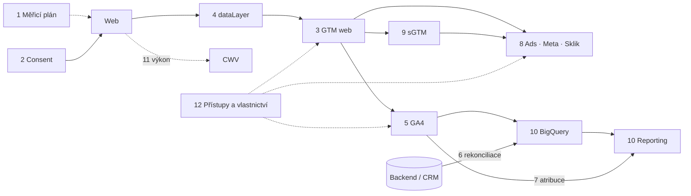

# H2: Co má obsahovat audit měření (+ ukázka výstupu) – brief
> Cluster: H. Audity & rozhodování · URL: /blog/co-obsahuje-audit-mereni · Formát: průvodce s ukázkou reportu · Priorita: měsíc 1 · Cílová LP: /sluzby/audit-mereni · Rozsah: 2 800–3 300 slov

---

## 1. Meta

| Prvek | Návrh |
|---|---|
| H1 | Co obsahuje audit měření: oblasti, postup a ukázka výstupu |
| SEO title (59 zn.) | Audit měření a webové analytiky: co obsahuje \| datalayer.cz |
| Meta description (148 zn.) | Co kontroluje audit měření (GA4, GTM, consent, konverze, server-side), jak probíhá, jak se prioritizují nálezy A/B/C a jak vypadá výstup. S ukázkou. |
| URL | /blog/co-obsahuje-audit-mereni |
| Schema | `BlogPosting` + `FAQPage` + `BreadcrumbList` |

**Klíčová slova** (Ahrefs CZ):

| Typ | Slovo | Objem/měs. | Poznámka |
|---|---|---|---|
| hlavní | audit webové analytiky | 70 | `lp-audit`, komerční |
| vedlejší | audit google analytics / google analytics audit | 10 / 10 | SERP: visibility.cz #1, rajtmajer.cz |
| vedlejší | ga4 audit | – (SERP) | mezinárodní nástroje (ga4auditor, vidi-corp) |
| vedlejší | gtm audit / audit gtm / gtm audity | 10 / 10 / 10 | článek C4 je hlavní – zde jen oblast |
| vedlejší | audit měření webu | – (SERP) | SERP chápe jako obecný audit webu |
| vedlejší | kolik stojí audit webu | 10 | H2 9 |
| související | audit webu (90), audit webu zdarma (70) | | jiný záměr (SEO/UX) → odkaz na technický audit |
| PAA | Does Google do audits? | – | odpovědět v FAQ (Google nabízí nástroje/diagnostiku, ne audit) |

**Záměr:** komerční-informační (MOFU). Čtenář zvažuje audit a chce vědět, co dostane.

**Cílový čtenář:** marketingový manažer / CMO, majitel e-shopu, PPC lead, který „nevěří číslům“; u velkých firem i IT/BI a compliance. Segment: všechny tři.

---

## 2. Analýza SERP a konkurence

**„audit měření webu“ (8. 10. 2026):** strafelda.cz (komplexní audit webu), thewild.cz, feo.cz, websprofiky.cz, tamtomy.cz (technický SEO audit), web-auditor.cz (nástroj zdarma), pajskr.cz, anycoders.cz, webmorava.cz → **Google dotaz chápe jako SEO/UX audit**; žádná stránka o auditu *měření*.
**„audit google analytics“:** visibility.cz #1, rajtmajer.cz, vidi-corp.com (12bodový checklist), trackingauditor.io, ga4auditor.com, causalfunnel, analytify.
**„gtm audit“:** magnas.cz (8 chyb + 2min self-test, bez CTA), stepaneklukas.cz (audit za 45 minut), stape.io, gtm-audit.com…

**Jak to dělají konkurenti (profily):**
- digitalniarchitekti.cz – produktová stránka auditu: oblasti, „co navíc odhalíme“, výstupy; **bez ukázky reportu, bez ceny, bez FAQ**.
- marketingppc.cz – kategorie problémů **A/B/C** u consent auditu, statistiky z 250+ auditů, demo reportu Google Ads auditu.
- gameplan.cz – placený audit (PDF + hodinová prezentace), cena veřejně.
- magnas.cz – proces s časy (kickoff 30 min → analýza 3–5 dní → prezentace 60 min), ale bez konverzního prvku.

**Co chybí všem:** kompletní **mapa oblastí** auditu měření (consent + GTM + GA4 + reklamní konverze + server-side + BigQuery + governance), **metody** (jak se nález dokazuje), **formát nálezu**, **prioritizace**, **co dodá klient**, **realistická délka** a **ukázka reportu**.

**Čím je přeskočíme:** 12 oblastí v tabulce s metodou a typickými nálezy, ukázková osnova reportu a 3 kompletní ukázkové nálezy, matice prioritizace, SQL kontroly, checklist přístupů. Jasně oddělit od SEO/UX auditu (odkaz na technický audit webu).

---

## 3. Otázky, na které musí článek odpovědět

1. Co je audit měření a čím se liší od SEO nebo UX auditu?
2. Kdy audit potřebuji?
3. Jaké oblasti má audit pokrýt?
4. Jak se nálezy dokazují (metody, nástroje)?
5. Jak se nálezy prioritizují?
6. Co dostanu jako výstup?
7. Jak vypadá report a konkrétní nález?
8. Jak dlouho audit trvá?
9. Co musím dodavatelům poskytnout?
10. Kolik audit stojí a z čeho se skládá cena?
11. Stačí audit zdarma nebo automatický nástroj?
12. Co následuje po auditu?

---

## 4. Rychlá odpověď (hotový text, 58 slov)

> Audit měření ověří, zda data v GA4, Google Ads, Meta a dalších nástrojích odpovídají realitě a jsou sbíraná v souladu se souhlasem. Prochází měřicí plán, cookie lištu a Consent Mode, GTM, datovou vrstvu, GA4, konverze, server-side a přístupy. Výstupem je seznam nálezů s prioritou A/B/C, důkazy a akční plán s odhadem pracnosti.

---

## 5. Osnova s obsahem odpovědí

### H2 1: Co je audit měření (a co není)
- **Je:** kontrola celého řetězce sběru dat – od souhlasu přes datovou vrstvu a GTM po GA4, reklamní systémy a reporting – s porovnáním proti zdroji pravdy (backend e-shopu, CRM).
- **Není:** SEO audit, UX audit ani obecný „audit webu“ (ty řeší technický audit webu → odkaz `/sluzby/technicky-audit-webu`); není to ani právní audit – právní posouzení dělá právník.
- Krátká tabulka „Audit měření vs. technický audit webu vs. SEO audit“ (3 řádky: cíl, co se kontroluje, výstup).

### H2 2: Kdy audit potřebujete (symptomy)
**Seznam (kompletní, s piktogramem `audit` u každého):**
1. GA4 ukazuje jiné tržby/leady než backend nebo CRM (D2).
2. Po nasazení cookie lišty spadly konverze v Google Ads nebo Meta.
3. Redesign, migrace platformy, nový web nebo nová doména.
4. Nástup nové agentury / nového marketingového ředitele.
5. Před investicí do server-side, BigQuery nebo dashboardů.
6. Nejistota, zda web neposílá data před souhlasem.
7. Rozšiřování do zahraničí (domény, jazyky, měny).
8. GTM s desítkami tagů, kterým nikdo nerozumí.
9. Akvizice / due diligence (velké firmy).

### H2 3: 12 oblastí auditu měření
**Klíčové sdělení:** Audit, který kontroluje jen GA4, najde polovinu problémů. Chyby vznikají na hranicích systémů.

**Tabulka (kompletní obsah):**

| # | Oblast | Co kontrolujeme | Metoda / nástroj | Typické nálezy |
|---|---|---|---|---|
| 1 | Cíle a měřicí plán | existence a aktuálnost plánu, KPI, definice konverzí | rozhovory, dokumenty | konverze bez vazby na byznys; chybí definice leadu |
| 2 | Cookie lišta a Consent Mode | CMP, výchozí stav, 4 signály, chování po odmítnutí/přijetí, vzhled tlačítek | síťové záznamy ve 3 stavech souhlasu, Tag Assistant | tagy před souhlasem; chybí `ad_user_data`/`ad_personalization`; nerovnocenná tlačítka |
| 3 | GTM kontejner | tagy, spouštěče, proměnné, vlastní HTML, pojmenování, verze, oprávnění, velikost | export kontejneru, náhled | duplicitní tagy; nepoužívané tagy; vlastní HTML s knihovnami; žádné verzování |
| 4 | Datová vrstva | struktura, názvy, hodnoty, načasování, shoda se specifikací | konzole, GTM Preview | chybějící `transaction_id`; hodnota s DPH/bez DPH nejednotně; push po odeslání tagu |
| 5 | Konfigurace GA4 | streamy, retence dat, interní návštěvnost, cross-domain, vyloučení referralů, klíčové události, vlastní dimenze | administrace GA4, DebugView | retence 2 měsíce; platební brána jako zdroj; PII v parametrech |
| 6 | Kvalita dat e-commerce / leadů | rekonciliace s backendem/CRM, duplicity, měna, vratky | BigQuery SQL, export z backendu | GA4 o X % níž/výš než backend; duplicitní nákupy |
| 7 | Atribuce a kampaně | UTM konvence, auto-tagging, propojení GA4–Ads, (not set) / Unassigned | GA4 reporty, BigQuery | nekonzistentní UTM; vysoký podíl Unassigned |
| 8 | Konverze v reklamních systémech | primární/sekundární akce, deduplikace, rozšířené konverze, Meta CAPI (deduplikace, Event Match Quality), Sklik, Heureka | rozhraní Ads/Meta/Sklik, diagnostika | dvojí započtení (GA4 import + tag); CAPI bez `event_id` |
| 9 | Server-side | hosting, vlastní doména, klienti a tagy, logování, náklady, souhlas na serveru | sGTM náhled, Cloud konzole | sGTM bez kontroly souhlasu; data do nepoužívaných platforem |
| 10 | BigQuery a reporting | export, náklady, definice metrik v dashboardu | BigQuery, Data Studio (dříve Looker Studio) | dashboard počítá tržby jinak než účetnictví |
| 11 | Výkon | vliv tagů na Core Web Vitals | Lighthouse, WebPageTest, CrUX (H3) | synchronní skripty v `<head>`; těžké widgety |
| 12 | Přístupy a governance | uživatelé, vlastnictví účtů, cizí účty, dokumentace | administrace všech nástrojů | bývalí dodavatelé s admin přístupem; účty na agentuře |

**Vizuál:** „mapa auditu“ – diagram toku dat s 12 očíslovanými body kontroly (kap. 6).

### H2 4: Jak audit probíhá (metody)
**Klíčové sdělení:** Každý nález musí mít důkaz – síťový požadavek, screenshot, SQL dotaz nebo export. Názor nestačí.

**Obsah odpovědi:**
1. **Síťové záznamy ve 3 stavech souhlasu** – bez interakce s lištou, po odmítnutí, po přijetí (DevTools / HAR, Tag Assistant). Co hledat: požadavky na `google-analytics.com`, `googleadservices.com`, `facebook.com/tr`, `c.seznam.cz` apod.; u Googlu parametry consent mode (např. `gcs`, `gcd` – význam ověřit v dokumentaci před publikací).
2. **Statická analýza exportu GTM** (JSON) – počty, nepoužívané prvky, vlastní HTML, velikost (limit kontejneru 300 KB, varování při 70 % – web.dev).
3. **Testovací scénáře** – nákup / odeslání formuláře / registrace v GTM Preview a GA4 DebugView.
4. **Rekonciliace** – porovnání GA4 (BigQuery) s backendem/CRM za 30 dní podle ID objednávky/leadu.
5. **Administrace** GA4, Ads, Meta, Sklik, CMP – nastavení a diagnostiky (např. diagnostika rozšířených konverzí Google Ads, Event Match Quality v Meta).
6. **Rozhovory** – marketing, IT/vývoj, obchod (definice konverze, plánované změny).

**SQL kontroly (do článku jako ukázka „co audit dělá navíc oproti nástrojům zdarma“):**

```sql
-- 1) Duplicitní nebo prázdné transakce v GA4 exportu (posledních 30 dní)
SELECT
  ecommerce.transaction_id,
  COUNT(*)                                AS pocet_purchase,
  MIN(TIMESTAMP_MICROS(event_timestamp))  AS prvni,
  MAX(TIMESTAMP_MICROS(event_timestamp))  AS posledni,
  MAX(ecommerce.purchase_revenue)         AS trzba
FROM `projekt.analytics_123456789.events_*`
WHERE _TABLE_SUFFIX >= FORMAT_DATE('%Y%m%d', DATE_SUB(CURRENT_DATE(), INTERVAL 30 DAY))
  AND event_name = 'purchase'
GROUP BY 1
HAVING pocet_purchase > 1 OR trzba IS NULL OR trzba = 0
ORDER BY pocet_purchase DESC;

-- 2) Podíl událostí odeslaných bez analytického souhlasu (cookieless pingy Consent Mode)
SELECT
  privacy_info.analytics_storage AS analytics_storage,
  COUNT(*)                       AS udalosti,
  ROUND(100 * COUNT(*) / SUM(COUNT(*)) OVER (), 1) AS podil_pct
FROM `projekt.analytics_123456789.events_*`
WHERE _TABLE_SUFFIX >= FORMAT_DATE('%Y%m%d', DATE_SUB(CURRENT_DATE(), INTERVAL 30 DAY))
GROUP BY 1;
```
> Pro autora: pole `privacy_info.*` a chování chybějícího `transaction_id` ve schématu exportu ověřit (F1, F2).

### H2 5: Prioritizace nálezů A/B/C
**Klíčové sdělení:** Priorita = dopad × riziko, ne „jak snadno se to opraví“. Snadné opravy vyznačíme zvlášť jako quick wins.

**Tabulka (kompletní):**

| Priorita | Definice | Příklady | Kdy řešit |
|---|---|---|---|
| **A – kritické** | právní/reputační riziko nebo data, podle kterých se zásadně chybně rozhoduje či biduje | marketingové tagy před souhlasem; dvojí započtení konverzí v Google Ads; nákupy bez hodnoty | ihned (dny) |
| **B – významné** | zkreslení reportů nebo ztráta části dat, která omezuje optimalizaci | chybějící Consent Mode signály; nekonzistentní UTM; CAPI bez deduplikace; retence 2 měsíce | do 1 měsíce |
| **C – optimalizace** | pořádek, výkon, dokumentace, budoucí rozvoj | nepoužívané tagy; pojmenování; chybí měřicí plán; těžké skripty | v plánu správy |

- **Matice dopad × pracnost** (vizuál) – quick wins = vysoký dopad, nízká pracnost.
- Vzor inspirace: kategorie problémů A/B/C používá na consent LP i marketingppc.cz – formulovat vlastními slovy, necitovat.

### H2 6: Výstupy auditu
**Seznam (kompletní):**
1. **Report** (dokument / PDF): shrnutí pro vedení (1 strana), nálezy podle oblastí, důkazy.
2. **Tabulka nálezů** (Sheets): ID, oblast, priorita, popis, důkaz, dopad, doporučení, odhad pracnosti, vlastník, stav.
3. **Akční plán** v pořadí řešení s odhadem hodin (pro interní tým nebo dodavatele).
4. **Anotovaný export GTM** (co zachovat / upravit / smazat).
5. **Testovací scénáře** pro ověření oprav.
6. **Prezentace** (60 min) s prostorem na otázky.
7. Volitelně: **měřicí plán v1** / specifikace datové vrstvy (C1, C5).

### H2 7: Ukázka reportu
**Osnova reportu (kompletní – v článku jako „obsah dokumentu“):**
1. Shrnutí pro vedení (stav, 3 nejdůležitější nálezy, doporučený další krok)
2. Rozsah a metodika (domény, období, stavy souhlasu, nástroje)
3. Skóre podle oblastí (12 oblastí, semafor)
4. Nálezy A – kritické
5. Nálezy B – významné
6. Nálezy C – optimalizace
7. Rekonciliace dat (GA4 vs. backend/CRM)
8. Akční plán a odhad pracnosti
9. Přílohy: síťové záznamy, export GTM s poznámkami, SQL dotazy, testovací scénáře

**Ukázkové nálezy (kompletní – označit „Ukázkový příklad, fiktivní web“):**

| Pole | Nález A-01 | Nález B-04 | Nález C-07 |
|---|---|---|---|
| Oblast | 2 – Consent | 6 – Kvalita dat e-commerce | 3 – GTM |
| Priorita | A – kritické | B – významné | C – optimalizace |
| Popis | Meta Pixel a konverzní tag Google Ads se spouští při načtení stránky před interakcí s cookie lištou. | GA4 eviduje za září o 14 % méně nákupů než backend; 3 % objednávek jsou v GA4 dvakrát. | 9 tagů vlastního HTML načítá jQuery a starý skript chatu; 23 tagů je pozastavených déle než rok. |
| Důkaz | HAR záznam (stav „bez interakce“): požadavky na `facebook.com/tr` a `googleadservices.com` v 0,8 s; screenshot Tag Assistant | SQL dotaz 1 (H2 4) – 41 duplicitních `transaction_id`; párování s exportem objednávek | export GTM, seznam tagů s posledním upraveným datem |
| Dopad | riziko rozporu s § 89 odst. 3 ZEK; Google Ads data mimo režim Consent Mode | podhodnocený výkon kampaní, ROAS v GA4 nesedí; duplicity nadsazují konverze v importu do Ads | pomalejší načítání, nepřehledný kontejner, riziko chyb při změnách |
| Doporučení | spouštět tagy jen se souhlasem (Consent Settings v GTM), nastavit výchozí stav Consent Mode před GTM | push `purchase` jen 1× (ochrana na děkovací stránce), `transaction_id` povinný, porovnat po opravě | odstranit nepoužívané tagy, vlastní HTML nahradit šablonami |
| Pracnost | 2–4 h | 4–8 h (+ vývoj e-shopu) | 3–5 h |
| Vlastník | dodavatel měření | vývojář e-shopu + dodavatel | dodavatel |
| Ověření | HAR po opravě – žádné marketingové požadavky před souhlasem | rozdíl GA4 vs. backend v toleranci dohodnuté v měřicím plánu | export GTM po úklidu |

> Čísla v ukázce jsou fiktivní. **[DOPLNIT: pokud klient souhlasí, anonymizovaný reálný nález z vlastního auditu]**.

**Vizuál:** mockup první strany reportu + karta nálezu (kap. 6).

### H2 8: Jak dlouho audit trvá a jak probíhá
**Timeline (orientační – [DOPLNIT: klient potvrdí typické délky]):**

| Krok | Délka | Kdo |
|---|---|---|
| Úvodní hovor a rozsah | 30–60 min | klient + auditor |
| Předání přístupů a podkladů | 1–3 pracovní dny | klient |
| Analýza | typicky 5–10 pracovních dnů (podle velikosti webu a počtu systémů) | auditor |
| Report a prezentace | 60 min prezentace + report | auditor + klient |
| Celkem | zpravidla 2–3 týdny včetně čekání na přístupy | |

### H2 9: Co od vás auditor potřebuje
**Checklist (kompletní; role ověřit v aktuální dokumentaci nástrojů):**
- [ ] **GA4:** přístup pro čtení (u kontroly administrace role s viditelností nastavení) – ideálně všech property a streamů.
- [ ] **GTM:** čtení (web i server kontejner).
- [ ] **Google Ads:** přístup jen pro čtení; **Meta Business:** analytik / přístup k datasetu; **Sklik:** čtení.
- [ ] **CMP / cookie lišta:** přístup do administrace nebo export konfigurace.
- [ ] **BigQuery** (pokud je): čtení dat a spouštění dotazů v projektu.
- [ ] **Export objednávek / leadů za 30 dní** (ID, datum, hodnota, stav – bez jmen a kontaktů).
- [ ] Měřicí plán, specifikace dataLayer, dokumentace (pokud existuje).
- [ ] Kontakt na vývojáře a informace o plánovaných změnách webu.
- [ ] Možnost testovací objednávky / odeslání formuláře (a jak je označit, aby nezkreslily data).
- [ ] NDA / zpracovatelská smlouva, pokud auditor uvidí osobní údaje.

### H2 10: Kolik audit stojí a z čeho se skládá cena
- Ceny datalayer.cz neuvádět. Tržní orientace z veřejných ceníků (k 10/2026, anonymně): **cca 4 500–15 000 Kč** bez DPH za samostatné audity měření menšího rozsahu; větší audity (víc domén, server-side, BigQuery, CRM) jsou individuální.
- Co cenu ovlivní: počet domén/jazyků, počet reklamních platforem, e-commerce vs. leady, server-side, BigQuery, požadavek na rekonciliaci, hloubka reportu, prezentace pro vedení.

### H2 11: Audit zdarma, automatický nástroj, nebo placený audit?
**Tabulka (kompletní):**

| | Nástroje zdarma (Tag Assistant, Lighthouse, GA4 diagnostika, Event Match Quality) | Automatické „GA4 auditory“ (SaaS) | Placený audit specialistou |
|---|---|---|---|
| Co najdou | jednotlivé technické chyby | nastavení GA4 podle checklistu | celý řetězec, souvislosti, příčiny |
| Rekonciliace s backendem/CRM | ne | ne | ano |
| Consent a právní kontext | částečně | ne | ano (technicky; právo posoudí právník) |
| Prioritizace a akční plán | ne | obecné | podle vašeho byznysu |
| Kdy | průběžná kontrola | rychlá orientace | před rozhodnutím, po změnách, když nesedí čísla |

- Odpověď na PAA „Does Google do audits?“: Google nabízí diagnostiku a nástroje (Tag Assistant, diagnostika konverzí), ne nezávislý audit vašeho měření.

### H2 12: Co po auditu
- Implementace oprav (interně / dodavatel), re-test podle scénářů, správa měření (monitoring), opakovaný audit po 6–12 měsících nebo po velké změně webu. Odkaz `/sluzby/sprava-webu-a-mereni`.

---

## 6. Vizuály

### Diagram: Mapa auditu – 12 kontrolních bodů (pod H2 3)

**Finální SVG:** stejný styl jako hero (dataLayer → GTM → GA4/CAPI/BigQuery), na každém uzlu kroužek s číslem oblasti 1–12 (oranžový `#ff7400`); po najetí tooltip „co kontrolujeme“. Mobil: svislý seznam 12 oblastí s miniaturou diagramu nahoře.

### Matice dopad × pracnost (pod H2 5)
2×2 mřížka: osa X pracnost (nízká → vysoká), osa Y dopad; kvadranty „Quick wins“, „Strategické“, „Doplňkové“, „Zvážit“; v mřížce 8 teček s ID ukázkových nálezů (A-01, B-04, C-07…) v barvách priorit (A oranžová, B cyan, C šedá).

### Mockupy (HTML/SVG, fiktivní data)
1. **Titulní strana reportu:** logo datalayer.cz, „Audit měření – Ukázka s.r.o.“, datum, semafor 12 oblastí (4 zelené, 5 oranžových, 3 červené), 3 hlavní nálezy.
2. **Karta nálezu A-01** podle tabulky v H2 7: hlavička s prioritou, výřez HAR záznamu (časová osa požadavků se zvýrazněným `facebook.com/tr` před událostí „consent“), doporučení, pracnost.
3. **Tabulka nálezů v Sheets** – 8 řádků, sloupce dle H2 6.

### Tabulky (kompletní obsah v kap. 5)
Audit vs. technický vs. SEO audit (H2 1) · 12 oblastí (H2 3) · Priority A/B/C (H2 5) · Ukázkové nálezy (H2 7) · Timeline (H2 8) · Zdarma vs. SaaS vs. placený (H2 11).

### Lead magnet
„Ukázkový report auditu měření“ (PDF, fiktivní web) ke stažení bez e-mailu – hlavní sales asset (analýza konkurence: demo reporty používá marketingppc.cz). **[DOPLNIT: vytvořit PDF podle mockupu]**.

---

## 7. Fakta a zdroje

| Tvrzení | Zdroj | Ověřeno | Riziko zastarání |
|---|---|---|---|
| Limit velikosti GTM kontejneru 300 KB, varování při 70 %, medián ~50 KB; pozastavení vs. blokace tagů | https://web.dev/articles/tag-best-practices | 10/2026 | nízké |
| Consent Mode – 4 signály, basic vs. advanced | https://developers.google.com/tag-platform/security/concepts/consent-mode | 10/2026 | střední |
| Retence GA4 2/14 měsíců (360 až 50), týká se explorací a trychtýřů | https://support.google.com/analytics/answer/7667196 | 10/2026 | nízké |
| Diagnostika rozšířených konverzí Google Ads (~72 h) | https://support.google.com/google-ads/answer/13258081 | 10/2026 | střední |
| GA4 rozšířené měření – formuláře (možná duplicita s vlastní událostí) | https://support.google.com/analytics/answer/9216061 | 10/2026 | nízké |
| Meta CAPI deduplikace `event_id` | https://developers.facebook.com/docs/marketing-api/conversions-api/parameters/server-event | 10/2026 | střední |
| § 89 odst. 3 ZEK (souhlas s ukládáním do zařízení) | https://www.zakonyprolidi.cz/cs/2005-127 | 10/2026 | nízké |
| Tržní ceny auditů (veřejné ceníky) | `01_konkurence/00_analyza-konkurence.md` kap. 5 | 8. 10. 2026 | vysoké |
| SERP „audit měření webu“, „audit google analytics“, „gtm audit“ | `data/serp/google_serp_organic.tsv` | 8. 10. 2026 | střední |
| Parametry `gcs`/`gcd` v požadavcích Google tagu a pole `privacy_info.*` v exportu GA4 | dokumentace Google (Tag Platform, GA4 BigQuery export schema) | **ověřit při psaní** | střední |

---

## 8. Interní odkazy a CTA

**Cílová LP:** `/sluzby/audit-mereni`.

**Kontextový CTA box** (za H2 7 – po ukázce reportu):
- Nadpis: **Chcete takový report pro svůj web?**
- Text: „Projdeme 12 oblastí vašeho měření, každý nález doložíme a seřadíme podle dopadu. Dostanete report, akční plán s odhadem pracnosti a prezentaci.“
- Tlačítko: `[ Objednat audit měření ]` → /sluzby/audit-mereni

**Související články:** C4 Audit GTM kontejneru · D3 Checklist kvality dat v GA4 · D2 Proč nesedí čísla · A1 Consent Mode v2 · A6 Co se stane po odmítnutí cookies · H1 Jak vybrat dodavatele měření · H3 Měřicí skripty a rychlost webu · F2 SQL pro GA4 v BigQuery · C5 Měřicí plán.

**Slovník:** Tag · Kontejner GTM · Consent Mode · Klíčová událost · (not set) / Unassigned · Interní návštěvnost · Deduplikace (event_id).

**Zkrácený kontaktní blok:** `form_id: blog` · téma `audit` · H2 „Řešíte totéž u sebe?“ · placeholder „Např. nevěříme číslům v GA4 a chceme vědět, kde je chyba…“

---

## 9. FAQ pro schema

**Co je audit měření?**
Audit měření je kontrola celého řetězce sběru dat: cookie lišty a Consent Mode, datové vrstvy, Google Tag Manageru, GA4, konverzí v reklamních systémech, server-side měření a reportingu. Data se porovnají s backendem nebo CRM. Výstupem jsou doložené nálezy seřazené podle priority a akční plán oprav.

**Jak dlouho trvá audit měření?**
Samotná analýza typicky zabere 5 až 10 pracovních dnů podle velikosti webu a počtu napojených systémů. Celý audit včetně úvodního hovoru, předání přístupů, reportu a prezentace obvykle trvá dva až tři týdny. Nejvíc času často stojí čekání na přístupy a exporty z backendu.

**Co musím auditorovi poskytnout?**
Přístupy pro čtení do GA4, Google Tag Manageru, Google Ads, Meta a dalších reklamních systémů, do cookie lišty a případně do BigQuery. Dále export objednávek nebo leadů za 30 dní bez osobních údajů pro porovnání dat, existující dokumentaci a kontakt na vývojáře webu.

**Jak se prioritizují nálezy auditu?**
Nálezy se řadí do tří skupin. A jsou kritické: právní riziko nebo data, podle kterých se zásadně chybně rozhoduje. B jsou významné: zkreslují reporty nebo omezují optimalizaci. C jsou optimalizace: pořádek, výkon a dokumentace. Zvlášť se označují rychlé opravy s velkým dopadem.

**Dělá Google audit měření zdarma?**
Google nabízí nástroje a diagnostiku, například Tag Assistant, diagnostiku konverzí v Google Ads nebo upozornění v GA4. Ty odhalí jednotlivé technické chyby, ale neporovnají data s vaším backendem, neposoudí souvislosti mezi systémy ani nesestaví akční plán podle priorit vašeho byznysu.

---

## 10. Poznámky pro autora

- **Ukázkový report je klíčový prvek článku i LP** – připravit ho jako PDF i jako HTML ukázku; všechna čísla fiktivní a označená.
- Délky a pracnost potvrdit klientem (**[DOPLNIT]**); ceny datalayer.cz neuvádět, tržní rozpětí anonymně.
- Neslibovat právní posouzení – audit je technický, právo posuzuje právník.
- **[DOPLNIT: agregovaná statistika z auditů klienta („X z Y auditovaných webů posílalo data před souhlasem“) – jen pokud je pravdivá a doložitelná]** (analýza konkurence kap. 6 – vzor marketingppc).
- Nepřebírat formulace konkurence (A/B/C je obecný princip – popsat vlastními slovy).
- Revize 1× ročně, ceny 1× za 6 měsíců.
- Recenzent: Vít Novotný.
