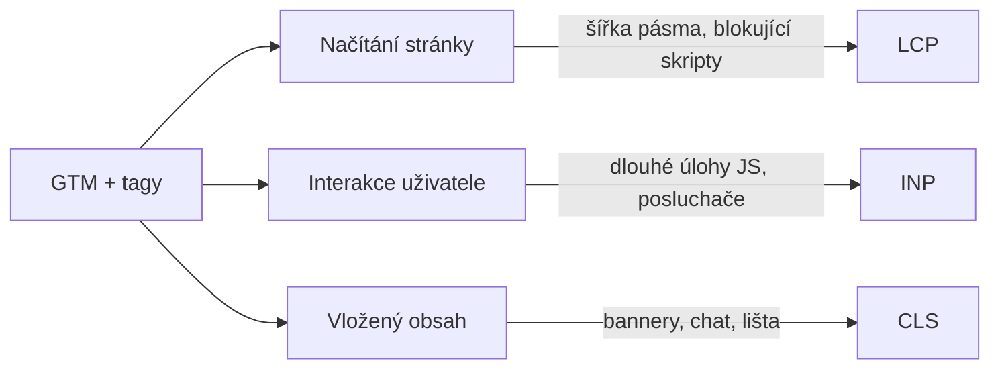
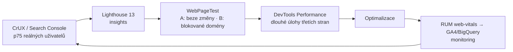

# H3: Měřicí skripty a rychlost webu: jak tagy ovlivňují Core Web Vitals – brief
> Cluster: H. Audity & rozhodování · URL: /blog/tagy-a-rychlost-webu · Formát: technický návod · Priorita: měsíc 3 · Cílová LP: /sluzby/technicky-audit-webu (sekundárně /sluzby/google-tag-manager) · Rozsah: 2 800–3 300 slov (+ kód)

---

## 1. Meta

| Prvek | Návrh |
|---|---|
| H1 | Měřicí skripty a rychlost webu: tagy a Core Web Vitals |
| SEO title (60 zn.) | Tagy, GTM a Core Web Vitals: jak zrychlit web \| datalayer.cz |
| Meta description (149 zn.) | Jak měřicí a marketingové skripty ovlivňují LCP, INP a CLS, jak jejich dopad změřit (CrUX, Lighthouse, WebPageTest) a jak je zrychlit bez ztráty dat. |
| URL | /blog/tagy-a-rychlost-webu |
| Schema | `BlogPosting` + `FAQPage` + `BreadcrumbList` |

**Klíčová slova** (Ahrefs CZ; objemy malé, téma strategické pro technický audit):

| Typ | Slovo | Objem/měs. | Poznámka |
|---|---|---|---|
| hlavní | rychlost webu / core web vitals | 0 (v datech) | obsahový plán: Σ clusteru 50 |
| vedlejší | audit rychlosti webu | 30 | `lp-tech-audit` |
| vedlejší | gtm pagespeed | 10 | |
| vedlejší | search console page speed | 10 | |
| vedlejší | technický audit webu | 20 | SERP: wp-admin.cz, janpospisil.cz… |
| long-tail (0) | google tag manager core web vitals, google tag manager pagespeed insights, facebook pixel pagespeed, cookiebot pagespeed, cookie banner lcp, google analytics web vitals, inp google search console | 0 | H3 a FAQ – každé z nich má samostatnou odpověď |

**Záměr:** problémový/technický („GTM mi zpomaluje web“, „PageSpeed ukazuje třetí strany“).

**Cílový čtenář:** marketingový manažer nebo e-commerce manažer, kterému vývojář/SEO specialista řekl, že „za pomalý web můžou marketingové skripty“; vývojář; SEO specialista. Segment: e-shopy (hlavně), velké firmy, B2B.

---

## 2. Analýza SERP a konkurence

- Pro tento dotaz nemáme sběr SERP z 8. 10. 2026. Příbuzný dotaz **„technický audit webu“**: wp-admin.cz, janpospisil.cz (technický SEO audit – checklist), per4mens.cz, czechia.com, softweb.cz, thewild.cz, studioshark.cz, webklient.cz, tamtomy.cz → SEO/WordPress pohled, **měřicí skripty a GTM nikdo neřeší**.
- Konkurence: magnas.cz („GTM audit“ – rychlost webu jako argument, bez měření dopadu), digitalniarchitekti.cz (PageSpeed jako jedna odrážka analytického auditu). Nikdo nespojuje **měření dopadu tagů** (WebPageTest blokace, RUM) s **optimalizací bez ztráty dat**.
- Anglické zdroje: web.dev (Best practices for tags and tag managers; Third-party JavaScript) – kvalitní, ale bez českého kontextu a bez napojení na Consent Mode / server-side.

**Čím je přeskočíme:** aktuální metriky (INP místo FID, Lighthouse 13 „insights“), postup „změř → zablokuj → porovnej“, kód pro RUM do GA4/BigQuery, tabulka typů skriptů a jejich dopadu, optimalizace se zachováním dat (souhlas, server-side, načasování), **reálný příklad ze stagingu datalayer.cz** (HubSpot 13 domén, celý Font Awesome).

---

## 3. Otázky, na které musí článek odpovědět

1. Jak měřicí a marketingové skripty zpomalují web?
2. Jaké jsou aktuální Core Web Vitals a jejich prahy?
3. Zpomaluje Google Tag Manager web?
4. Jak zjistit, kolik zpomalení způsobují konkrétní tagy?
5. Proč se liší PageSpeed Insights (Lighthouse) a data z Chrome (CrUX)?
6. Proč Lighthouse neukazuje INP?
7. Které typy skriptů jsou nejtěžší?
8. Jak tagy zrychlit bez ztráty dat?
9. Pomůže server-side tracking rychlosti?
10. Zpomaluje web cookie lišta?
11. Jak průběžně hlídat rychlost po nasazení nových tagů?

---

## 4. Rychlá odpověď (hotový text, 59 slov)

> Měřicí skripty zpomalují web třemi způsoby: berou šířku pásma při načítání (LCP), blokují hlavní vlákno při interakcích (INP) a vkládají obsah, který posouvá stránku (CLS). Dopad změříte porovnáním s blokovanými doménami ve WebPageTestu a daty z Chrome (CrUX). Pomáhá odstranit nepoužívané tagy, spouštět nekritické později a přesunout tagy na server.

---

## 5. Osnova s obsahem odpovědí

### H2 1: Core Web Vitals v roce 2026 (krátké připomenutí)
**Klíčové sdělení:** Tři metriky, hodnocené na 75. percentilu reálných návštěv, zvlášť mobil a desktop.

**Tabulka (kompletní):**

| Metrika | Co měří | Dobré | Špatné (ověřit v grafice web.dev) | Jak ji tagy ovlivní |
|---|---|---|---|---|
| **LCP** (Largest Contentful Paint) | kdy se vykreslí největší prvek | ≤ 2,5 s | > 4 s | konkurence o šířku pásma v kritické fázi, blokující skripty/CSS, anti-flicker A/B testů |
| **INP** (Interaction to Next Paint) | odezva na interakce po celou dobu návštěvy | ≤ 200 ms | > 500 ms | dlouhé úlohy JS, posluchače kliků, vyhodnocování spouštěčů GTM, nahrávání relací |
| **CLS** (Cumulative Layout Shift) | posuny obsahu | ≤ 0,1 | > 0,25 | vložené bannery, chaty, cookie lišta, která odsouvá obsah |

- INP se stal stabilní Core Web Vital v roce 2024 a nahradil FID (web.dev/articles/vitals). Neopakovat zastaralé „FID“.
- Lab vs. pole: **Lighthouse INP změřit neumí** (bez skutečného uživatele) – používá TBT jako náhradní ukazatel.

### H2 2: Jak tagy zpomalují web (mechanika)
**Klíčové sdělení:** Tag manager sám o sobě je malý; zpomalují tagy, které spouští, a to, kdy je spouští.

**Obsah odpovědi:**
- web.dev: tag managery ovlivňují Core Web Vitals nepřímo – spotřebou šířky pásma a času hlavního vlákna; LCP je zranitelné konkurencí o pásmo v kritické fázi; CLS způsobují tagy vkládající obsah; autoři pozorují **korelaci mezi velikostí tag manageru a horším INP**.
- „Čím dřív se tag spustí, tím víc ovlivní výkon“ – nekritické tagy spouštět po `Window Loaded` nebo na vlastní událost.
- Výpadek dodavatele: když třetí strana nedoručí zdroj a skript je blokující, vykreslení může čekat až do timeoutu (web.dev uvádí 10–80 s).
- A/B testovací skripty obvykle blokují zobrazení obsahu, dokud nedoběhnou.
- **Tabulka typů skriptů (kompletní; dopad typický, záleží na implementaci):**

| Typ skriptu | LCP | INP | CLS | Doporučení |
|---|---|---|---|---|
| GTM + GA4 + Google Ads | nízký–střední | střední (velký kontejner, hodně spouštěčů) | – | úklid kontejneru, šablony místo vlastního HTML, server-side |
| Meta Pixel, TikTok, LinkedIn, Sklik | nízký–střední | nízký–střední | – | se souhlasem, po načtení; CAPI na serveru |
| Heatmapy a nahrávání relací | střední | **vysoký** (posluchače, serializace DOM) | – | jen na vybraných stránkách / vzorek / dočasně |
| Chat widget | **vysoký** | střední | **střední** | načíst až po interakci (fasáda) nebo po načtení stránky |
| Cookie lišta (CMP) | střední, pokud je LCP prvkem | nízký | **vysoký**, pokud odsouvá obsah | překryv (`position: fixed`), lehký skript, inline výchozí stav Consent Mode |
| A/B testování (client-side) | **vysoký** (anti-flicker skryje stránku) | střední | střední | krátký timeout, testy na serveru |
| Vložené formuláře v iframe (HubSpot apod.) | střední–vysoký (desítky požadavků) | nízký–střední | střední (výška iframe) | nativní formulář (E1) |
| Ikonové fonty / celé CSS knihovny z CDN | střední (render-blocking CSS) | – | nízký–střední (FOIT/FOUT) | inline SVG, self-host, jen použité styly |

### H2 3: Jak dopad změřit (postup)
**Klíčové sdělení:** Nejdřív data z reálných návštěv, pak laboratorní experiment se zablokovanými doménami, nakonec průběžný monitoring.

**Postup (5 kroků – kompletní):**
1. **Pole (CrUX):** PageSpeed Insights (sekce „Discover what your real users are experiencing“), Search Console – přehled Core Web Vitals. Data za klouzavých 28 dní (ověřit) → změny se projeví se zpožděním.
2. **Lab – Lighthouse 13:** od října 2025 používá „insights“; relevantní jsou `third-parties-insight` (dříve *third-party-summary*), `render-blocking-insight`, `legacy-javascript-insight`, `duplicated-javascript-insight`, `network-dependency-tree-insight`, `cls-culprits-insight`. Audit *third-party-facades* byl odstraněn bez náhrady (developer.chrome.com/blog/lighthouse-13-0).
3. **Experiment ve WebPageTestu:** stejná stránka, stejný profil (mobil, 4G), 5–9 běhů; varianta A = beze změny, varianta B = **zablokované domény tagů** (např. `googletagmanager.com`, `connect.facebook.net`, `*.hotjar.com`, `js.hs-scripts.com`). Rozdíl mediánů LCP/TBT/CLS a počtu požadavků = odhad dopadu. Porovnat i filmstrip.
4. **DevTools → Performance:** dlouhé úlohy s odznakem třetí strany; při interakci (klik na „Přidat do košíku“) zjistit, které skripty běží.
5. **RUM (vlastní měření):** knihovna `web-vitals` s atribucí → dataLayer → GA4 / BigQuery; ukáže, **který prvek** zhoršuje INP/LCP u skutečných uživatelů.

- Pozor: časování z náhledového režimu GTM se nedá srovnávat s produkcí (web.dev).

**Kód – RUM Core Web Vitals do dataLayeru:**

```js
// rum-web-vitals.js – bundlovat s webem (npm i web-vitals; připnout verzi)
import { onLCP, onINP, onCLS } from 'web-vitals/attribution';

function target(a) {
  // názvy atributů se mezi verzemi knihovny liší – ověřit v README použité verze
  return a && (a.target || a.element || a.interactionTarget || a.largestShiftTarget) || '';
}

function send(metric) {
  window.dataLayer = window.dataLayer || [];
  window.dataLayer.push({
    event: 'web_vitals',
    metric_name: metric.name,                                   // LCP | INP | CLS
    metric_value: metric.name === 'CLS'
      ? Math.round(metric.value * 1000)                         // CLS ×1000 (celé číslo pro GA4)
      : Math.round(metric.value),                               // ms
    metric_rating: metric.rating,                               // good | needs-improvement | poor
    metric_id: metric.id,                                       // pro agregaci v BigQuery
    metric_target: String(target(metric.attribution)).slice(0, 100)
  });
}

onLCP(send);
onINP(send);
onCLS(send);
```
- GTM: Custom Event `web_vitals` → GA4 událost s parametry; v BigQuery 75. percentil podle šablony stránky a zařízení.
- Odesílání do GA4 podléhá analytickému souhlasu – stejně jako ostatní měření.

**SQL – 75. percentil INP podle stránky (BigQuery, GA4 export):**

```sql
SELECT
  (SELECT value.string_value FROM UNNEST(event_params) WHERE key = 'page_location') AS stranka,
  device.category                                                                  AS zarizeni,
  APPROX_QUANTILES(
    (SELECT value.int_value FROM UNNEST(event_params) WHERE key = 'metric_value'), 100
  )[OFFSET(75)]                                                                    AS inp_p75_ms,
  COUNT(*)                                                                         AS mereni
FROM `projekt.analytics_123456789.events_*`
WHERE _TABLE_SUFFIX >= FORMAT_DATE('%Y%m%d', DATE_SUB(CURRENT_DATE(), INTERVAL 28 DAY))
  AND event_name = 'web_vitals'
  AND (SELECT value.string_value FROM UNNEST(event_params) WHERE key = 'metric_name') = 'INP'
GROUP BY 1, 2
HAVING mereni >= 50
ORDER BY inp_p75_ms DESC;
```

**Vizuál:** diagram postupu (kap. 6) + mockup WebPageTest srovnání.

### H2 4: Optimalizace bez ztráty dat
**Klíčové sdělení:** Cílem není méně měřit, ale měřit levněji: stejná data, méně JavaScriptu v prohlížeči a ve správnou chvíli.

**Obsah odpovědi – 10 opatření (kompletní; každé 2–4 věty + „dopad na data“):**

1. **Inventura a odstranění** – pozastavit/odstranit nepoužívané tagy; web.dev: pozastavení nebo odstranění kód z kontejneru odebere, blokace (blocking trigger) ne. Po odstranění zkontrolovat osiřelé spouštěče a proměnné. *Data: žádná ztráta.*
2. **Žádní duplicitní dodavatelé** – dvě heatmapy, dva chaty, dva tag managery; web.dev: víc kontejnerů na stránce může způsobit výrazné problémy s výkonem. *Data: žádná ztráta.*
3. **Velikost kontejneru** – GTM limit 300 KB (varování při 70 %), medián kolem 50 KB; velký kontejner = varovný signál (web.dev). Vlastní HTML s vloženými knihovnami nahradit odkazem na externí soubor nebo šablonou. *Data: žádná ztráta.*
4. **Načasování spouštěčů** – analytika a konverze na události datové vrstvy; nekritické (heatmapy, chat, remarketing bez konverze) po `Window Loaded` nebo na interakci. *Data: minimální dopad; ověřit, že konverzní tagy zůstávají na své události.*
5. **Souhlas jako přirozený filtr** – marketingové tagy se bez souhlasu nenačítají (Consent Mode / CMP); u lidí, kteří odmítli, je stránka lehčí. Ne jako „trik“, ale správné nastavení (A1). *Data: odpovídá souhlasu.*
6. **Šablony a pixely místo vlastního HTML** – web.dev: šablony mají menší riziko výkonových i bezpečnostních problémů, pixely jsou nejvýkonnější typ tagu. *Data: žádná ztráta.*
7. **Server-side přesun** – server-side tagging odstraňuje kód dodavatelů z prohlížeče a přesouvá zpracování na server; funguje jen pro tagy, které to umožňují (web.dev). Typicky GA4, Google Ads, Meta CAPI (s deduplikací), Sklik. Některé funkce dál potřebují klientský skript (ověřit u každého dodavatele). Odkaz B1, B2. *Data: stejná nebo lepší (first-party), vždy podle souhlasu.*
8. **Servírování z vlastní domény** – `gtm.js`/`gtag.js` přes Google tag gateway nebo server-side GTM na vlastní subdoméně: méně cizích domén (DNS, TLS spojení), first-party kontext. Funkce typu „custom loader“ u hostingů sGTM používat kvůli výkonu a správě, **ne jako způsob, jak obejít volbu uživatele** (B4, A5). *Data: podle souhlasu.*
9. **Fasády a líné načítání widgetů** – chat, video, mapa: zobrazit náhled a skutečný skript načíst po kliknutí / po načtení stránky. (Lighthouse 13 audit fasád zrušil, technika ale dál snižuje zátěž v kritické fázi.) *Data: chat analytika až po interakci.*
10. **INP: lehké posluchače** – `dataLayer.push` při kliku spouští vyhodnocení spouštěčů GTM synchronně; ve vlastním kódu nejdřív aktualizovat UI, push odložit (např. `setTimeout(…, 0)` nebo `scheduler.yield()` – ověřit podporu prohlížečů); omezit spouštěče „Všechny prvky“ s mnoha podmínkami; heatmapy jen na vybraných stránkách. *Data: stejná.*

**Vedlejší opatření mimo měření (ze stagingu):** self-host fontů (méně řezů), inline SVG místo ikonového fontu, knihovny jen tam, kde se používají.

### H2 5: Příklad ze stagingu datalayer.cz (ilustrace)
**Klíčové sdělení:** I web specialisty na měření měl na stagingu klasické problémy – a jejich řešení je zároveň lepší měření.

**Tabulka „před → po“ (stav ze stagingu 8. 10. 2026; „po“ = plán; čísla po nasazení doplnit):**

| Zdroj | Stav na stagingu | Dopad | Řešení | Po nasazení |
|---|---|---|---|---|
| HubSpot formulář (iframe) | **13 hostů** (`*.hubspot.com`, `*.hsforms.net`, `hsappstatic.net`), cca **25 z 51 požadavků** homepage, iframe 776 px, skripty bez souhlasu | LCP/síť, CLS (výška iframe), soukromí | nativní formulář + `generate_lead` (E1) | **[DOPLNIT: počet požadavků/domén]** |
| Font Awesome 6.0 (celý, cdnjs) | render-blocking CSS z cizí domény + webfont | LCP, FOUT | inline SVG piktogramy (architektura webu, kap. 5) | **[DOPLNIT]** |
| Bootstrap 5.3 CSS+JS (jsDelivr) | render-blocking z cizí domény | LCP | self-host, jen použité části | **[DOPLNIT]** |
| highlight.js theme | na všech stránkách | LCP (CSS) | jen na blogu s kódem | **[DOPLNIT]** |
| Google Fonts (Inter 7 řezů + Roboto Mono 2) | render-blocking CSS z cizí domény | LCP | self-host Inter 400/600/800 + Roboto Mono 400 | **[DOPLNIT]** |
| GTM / GA4 / consent | na stagingu chybí | – | nasadit s Consent Mode v2 a sGTM; hlídat INP | **[DOPLNIT]** |

- **[DOPLNIT: WebPageTest před/po (mobil, 4G, medián 9 běhů): LCP, TBT, CLS, počet požadavků, počet domén; CrUX po 28 dnech]**.
- Zdroj stavu: `07_audit-webu-klienta/audit-stagingu.md`, kap. 3.4 a 3.6.

**Vizuál:** „waterfall“ před/po (kap. 6).

### H2 6: Cookie lišta a rychlost
- Lišta je často LCP prvkem na mobilu (velký text přes obrazovku) – vhodný design: kompaktní, systémové fonty nebo stejné fonty jako web, bez obrázků; skript CMP načíst co nejdřív, ale malý; výchozí stav Consent Mode inline před GTM.
- CLS: lišta jako překryv, ne vložená nad obsah, který odsune.
- Odkaz A4 (výběr lišty) – „vlastní lišta vs. CMP“ i z pohledu výkonu.

### H2 7: Monitoring a výkonnostní rozpočet
- Rozpočet pro třetí strany (např. max. počet domén, KB JS, TBT v labu) – web.dev doporučuje performance budgets zahrnující kód třetích stran; konkrétní čísla stanovit podle výchozího stavu webu.
- Proces: každý nový tag = záznam v měřicím plánu + test dopadu (krok 3 z H2 3) + vlastník.
- Dashboard RUM (Data Studio, dříve Looker Studio) s p75 LCP/INP/CLS podle šablony stránky; alert při zhoršení.
- Odkaz `/sluzby/sprava-webu-a-mereni`.

### H2 8: Nejčastější chyby
1. Hodnocení podle jednoho běhu Lighthouse.
2. Zaměňování lab TBT za INP.
3. Odstranění „pomalého“ tagu bez náhrady → ztráta konverzí v reklamních systémech.
4. Blokace tagů místo odstranění (kód zůstává v kontejneru).
5. Přesun na server-side bez deduplikace a bez souhlasu.
6. Anti-flicker snippet s dlouhým timeoutem.
7. Heatmapa a nahrávání relací na celém webu natrvalo.
8. Srovnávání časů z náhledu GTM s produkcí.

---

## 6. Vizuály

### Diagram 1: Kde tagy ovlivňují LCP, INP a CLS (pod H2 2)

**Finální SVG:** časová osa návštěvy zleva doprava (načítání → interakce → scroll), nad ní tři „měřáky“ LCP/INP/CLS (piktogram gauge z technického auditu), pod osou ikony typů skriptů (GTM, pixel, heatmapa, chat, CMP) se šipkami do fáze, kterou ovlivňují. Mobil: tři karty pod sebou.

### Diagram 2: Postup měření dopadu (pod H2 3)

**Finální SVG:** kruhový cyklus 5 kroků s mono štítky nástrojů; mobil svisle.

### Waterfall „před → po“ (pod H2 5)

```mermaid
gantt
  title Ilustrace: kritická fáze načítání (ms, ukázka – ne naměřená data)
  dateFormat x
  axisFormat %S.%L s
  section Před
  HTML                  :0, 300
  Google Fonts CSS      :300, 650
  Font Awesome CSS      :300, 700
  Bootstrap CSS         :300, 600
  HubSpot (13 domén)    :700, 2200
  section Po
  HTML                  :0, 300
  vlastní CSS + fonty   :300, 500
  GTM (po souhlasu)     :900, 1100
```

**Finální SVG:** dva vodopády nad sebou, cizí domény oranžově, vlastní cyan; štítek „Ilustrace – naměřená data doplníme“ dokud nebude **[DOPLNIT]** z WebPageTestu; pak nahradit skutečnými hodnotami.

### Tabulky (kompletní obsah v kap. 5)
Core Web Vitals (H2 1) · Typy skriptů a dopad (H2 2) · Staging před → po (H2 5).

### Mockupy
1. **WebPageTest srovnání** (H2 3): dvě sloupcové karty „A – se všemi tagy“ / „B – blokované domény“ s fiktivními mediány (LCP 3,1 s vs. 2,4 s; TBT 640 ms vs. 210 ms; požadavky 112 vs. 64) – štítek „Ukázkový příklad“.
2. **Lighthouse 13 – Third parties insight** (H2 3): stylizovaný seznam domén s velikostí a časem hlavního vlákna (fiktivní).

---

## 7. Fakta a zdroje

| Tvrzení | Zdroj | Ověřeno | Riziko zastarání |
|---|---|---|---|
| LCP ≤ 2,5 s, INP ≤ 200 ms, CLS ≤ 0,1 na 75. percentilu (mobil/desktop zvlášť); INP stabilní od 2024 místo FID; Lighthouse INP neměří (TBT) | https://web.dev/articles/vitals | 10/2026 | nízké |
| Prahy „špatné“ (LCP > 4 s, INP > 500 ms, CLS > 0,25) | https://web.dev/articles/vitals (grafika) – **ověřit při psaní** | – | nízké |
| Tag managery ovlivňují CWV nepřímo; korelace velikosti a INP; dřívější spouštění = větší dopad; Window Loaded pro nekritické; šablony/pixely; server-side jen pro některé tagy; 1 kontejner na stránku; limit 300 KB, medián ~50 KB; náhled GTM nesrovnávat s produkcí | https://web.dev/articles/tag-best-practices | 10/2026 | nízké |
| Výpadek třetí strany může blokovat 10–80 s; A/B skripty blokují zobrazení; výkonnostní rozpočty | https://web.dev/articles/third-party-javascript | 10/2026 | nízké |
| Lighthouse 13 (10. 10. 2025): insights audity, `third-parties-insight`, zrušený `third-party-facades` | https://developer.chrome.com/blog/lighthouse-13-0 | 10/2026 | střední |
| Knihovna web-vitals pro měření v produkci | https://web.dev/articles/vitals ; https://github.com/GoogleChrome/web-vitals | 10/2026 – názvy atributů ověřit dle verze | střední |
| Google tag gateway – servírování z vlastní domény | https://developers.google.com/tag-platform/tag-manager/gateway/setup-guide | 10/2026 | střední |
| Stav stagingu (HubSpot 13 hostů, ~25 z 51 požadavků, Font Awesome, Bootstrap, highlight.js, Google Fonts) | `07_audit-webu-klienta/audit-stagingu.md` kap. 3.4 | 8. 10. 2026 | vysoké (po nasazení nového webu aktualizovat) |
| CrUX 28denní okno; `scheduler.yield()` podpora | dokumentace Chrome / web.dev | **ověřit při psaní** | střední |

---

## 8. Interní odkazy a CTA

**Cílová LP:** `/sluzby/technicky-audit-webu` (sekundárně `/sluzby/google-tag-manager`).

**Kontextový CTA box** (za H2 4):
- Nadpis: **Zrychlíme web bez ztráty dat**
- Text: „Změříme dopad každého tagu na LCP, INP a CLS, uklidíme GTM, přesuneme vhodné tagy na server a nastavíme monitoring – konverze zůstanou změřené.“
- Tlačítko: `[ Technický audit webu ]` → /sluzby/technicky-audit-webu

**Související články:** C4 Audit GTM kontejneru · C3 Google Tag Manager – průvodce · B1 Server-side tracking – průvodce · B4 Google Tag Gateway · A4 Jak vybrat cookie lištu · A5 Server-side a souhlas · H2 Co obsahuje audit měření · E1 Měření formulářů a leadů (nativní formulář místo iframe).

**Slovník:** Tag · Kontejner GTM · Spouštěč · Server-side tagging · First-party cookie · Google Tag Gateway.

**Zkrácený kontaktní blok:** `form_id: blog` · téma `audit` · H2 „Řešíte totéž u sebe?“ · placeholder „Např. PageSpeed ukazuje, že web zpomalují skripty třetích stran, a nevíme, které můžeme vypnout…“

---

## 9. FAQ pro schema

**Zpomaluje Google Tag Manager web?**
Samotný kontejner GTM bývá malý, zpomalují hlavně tagy, které spouští, a to, kdy je spouští. Velký kontejner s mnoha vlastními HTML tagy podle web.dev koreluje s horším INP. Pomáhá odstranit nepoužívané tagy, nekritické spouštět po načtení stránky a nahradit vlastní HTML šablonami.

**Jak zjistím, které skripty zpomalují můj web?**
Začněte daty reálných uživatelů v PageSpeed Insights nebo Search Console. Pak ve WebPageTestu porovnejte stránku se všemi skripty a se zablokovanými doménami tagů, ideálně v pěti až devíti bězích. V Chrome DevTools v panelu Performance najdete dlouhé úlohy označené jako kód třetích stran.

**Proč Lighthouse neukazuje INP?**
INP měří odezvu na skutečné interakce uživatele během celé návštěvy. Lighthouse načítá stránku v simulovaném prostředí bez uživatele, takže INP změřit nemůže a jako náhradní ukazatel používá Total Blocking Time. INP proto sledujte v datech z Chrome (CrUX) nebo vlastním měřením přes knihovnu web-vitals.

**Pomůže server-side tracking rychlosti webu?**
Může. Server-side tagging odstraní část kódu dodavatelů z prohlížeče a přesune zpracování na server, takže stránka načítá méně JavaScriptu. Funguje ale jen pro tagy, které mají serverovou variantu, například GA4, Google Ads nebo Meta Conversions API. Souhlas uživatele platí i pro serverové měření.

**Zpomaluje web cookie lišta?**
Může ovlivnit LCP, pokud je na mobilu největším prvkem stránky, a CLS, pokud odsouvá obsah. Vhodná je kompaktní lišta jako překryv, lehký skript a výchozí stav Consent Mode vložený přímo před GTM. Zároveň platí, že bez souhlasu se marketingové tagy nenačítají, takže stránka je pro tyto návštěvníky lehčí.

---

## 10. Poznámky pro autora

- Všechna čísla v mockupech a waterfallu označit „ukázka“, dokud nebudou naměřená data ze stagingu/produkce (**[DOPLNIT]**). Po spuštění nového webu nahradit reálným před/po – silný důkaz pro LP technického auditu.
- Nepoužívat „obcházení blokátorů“; u custom loaderu výslovně uvést, že nejde o obcházení volby uživatele.
- Lighthouse a web-vitals se vyvíjejí – před publikací ověřit názvy insights a atributy knihovny; revize 1× za 6 měsíců.
- Kód RUM otestovat (bundling, GTM, GA4 DebugView); u GA4 pozor na limit vlastních dimenzí/metrik.
- Recenzent: Vít Novotný; volitelně frontend vývojář klienta.
